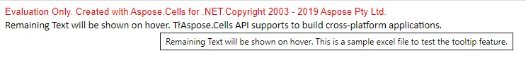

## **Convert Excel to HTML with tooltip**

There might be cases where the text is cut off in the generated HTML and you want to display the complete text as a tooltip on the hover event. Aspose.Cells supports this by providing [**HtmlSaveOptions.AddTooltipText**](https://reference.aspose.com/cells/java/com.aspose.cells/htmlsaveoptions#AddTooltipText) property. Setting the [**HtmlSaveOptions.AddTooltipText**](https://reference.aspose.com/cells/java/com.aspose.cells/htmlsaveoptions#AddTooltipText) property to **true** will add the complete text as a tooltip in the generated HTML.

The following image shows the tooltip in the generated HTML file.

The following code sample loads the [source excel file](AddTooltipToHtmlSample.xlsx) and generates the [output HTML file](AddTooltipToHtmlSample_out.zip) with the tooltip.

## Sample Code


