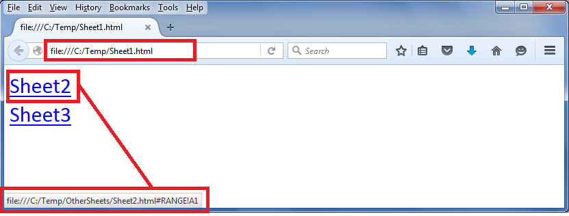

## **Possible Usage Scenarios**
Suppose you have an Excel file with multiple sheets and you want to export each sheet to an individual HTML file. If any of your sheets have links to other sheets, then those links will be broken in the exported HTML. To deal with this problem, Aspose.Cells provides the [IFilePathProvider](https://reference.aspose.com/cells/java/com.aspose.cells/IFilePathProvider) interface which you can implement to fix the broken links.

## **Provide exported worksheet HTML file path via IFilePathProvider interface**
Please download the [sample Excel file](5473417.zip) used in the following code and its exported HTML files. All these files are inside the *Temp* directory. You should extract it to the C: drive. Then it will become the *C:\Temp* directory. Then you will open the *Sheet1.html* file in the browser and click the two links inside it. These links refer to the two exported HTML worksheets which are inside the *C:\Temp\OtherSheets* directory.



file:///C:/Temp/OtherSheets/Sheet2.html#RANGE!A1

file:///C:/Temp/OtherSheets/Sheet3.html#RANGE!A1



The following screenshot shows how *C:\Temp\Sheet1.html* and its links look:

The following screenshot shows the HTML source. As you can see, the links are now referring to the *C:\Temp\OtherSheets* directory. This was achieved using the [IFilePathProvider](https://reference.aspose.com/cells/java/com.aspose.cells/IFilePathProvider) interface.

## **Sample Code**
Please note that the *C:\Temp* directory is just for illustration purposes. You can use any directory of your choice and place the [sample Excel file](5473414.xlsx) inside it and execute the provided sample code. It will then create an *OtherSheets* sub‑directory inside your directory and export the second and third worksheets as HTML inside it. Please change the *dirPath* variable inside the provided code and refer it to the directory of your choice before execution.

{} 

The sample code will only work when you set the Aspose.Cells license. If you try to run the code without setting the license, it will go into an infinite loop. Therefore, we have added a check to print a message and stop execution when the license is not set. You can either purchase a license or request a 30‑day temporary license from the Aspose purchase team.

{} 

Please note that commenting out these lines in the code will break the links in *Sheet1.html*, and *Sheet2.html* or *Sheet3.html* will not open when their links are clicked in *Sheet1.html*.



// If you comment this line, the hyperlinks will be broken
options.setFilePathProvider(new FilePathProvider());



Here is the complete sample code which you can execute with the provided [sample Excel file](5473414.xlsx).





