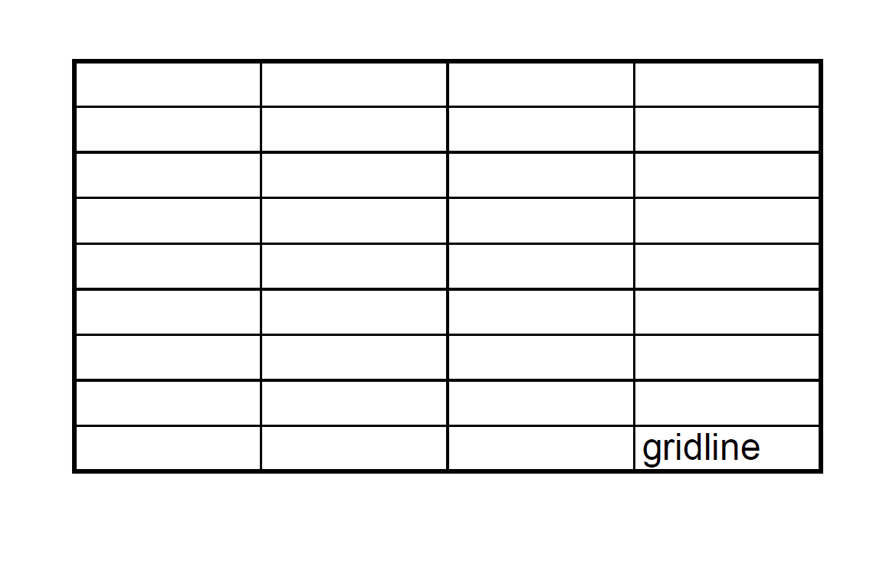

For compatibility with older versions, Aspose.Cells renders gridlines as dotted lines by default while converting Excel to PDF. However, modern Excel renders gridlines as solid lines nowadays.

With option [PdfSaveOptions.GridlineTypes](https://reference.aspose.com/cells/java/com.aspose.cells/pdfsaveoptions/#setGridlineType-int-), Aspose.Cells can also render gridlines as solid lines. 




