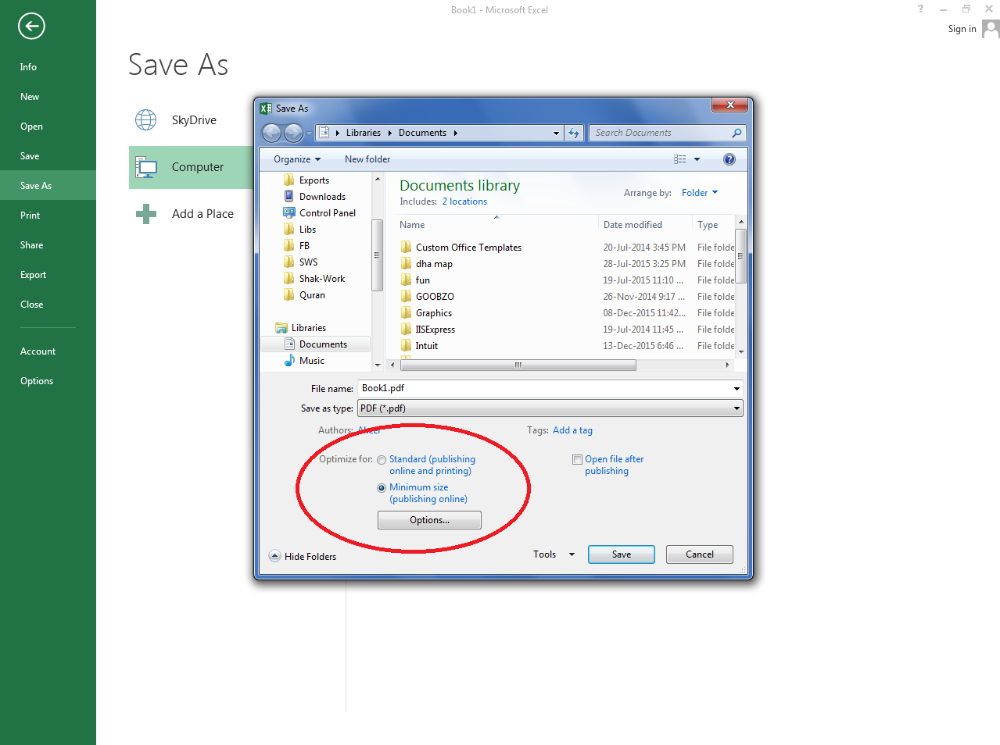

{} 

By default, Aspose.Cells saves Excel into PDF with Standard size. However you can also save it with Minimum size using the [PdfSaveOptions.OptimizationType](https://reference.aspose.com/cells/java/com.aspose.cells/pdfsaveoptions#setOptimizationType-int-) property. It accepts the following values

- [PdfOptimizationType.STANDARD](https://reference.aspose.com/cells/java/com.aspose.cells/pdfoptimizationtype#STANDARD)
- [PdfOptimizationType.MINIMUM_SIZE](https://reference.aspose.com/cells/java/com.aspose.cells/pdfoptimizationtype#MINIMUM-SIZE)

{} 
## **Save Excel into PDF with Standard or Minimum Size using Microsoft Excel**
The following screenshot shows how to save Excel into PDF with Standard or Minimum size using Microsoft Excel.

## **Save Excel into PDF with Standard or Minimum Size using Aspose.Cells**
The following sample code shows how you can save Excel into PDF with Standard or Minimum size using [PdfSaveOptions.OptimizationType](https://reference.aspose.com/cells/java/com.aspose.cells/pdfsaveoptions#setOptimizationType-int-) property.



