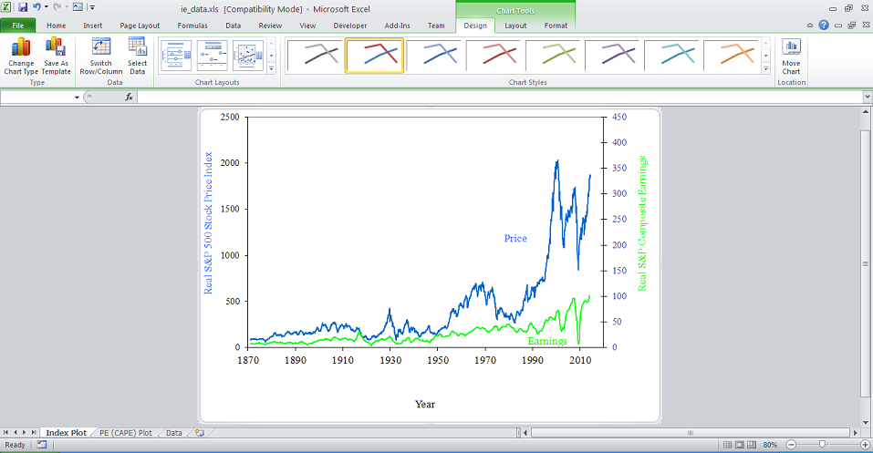
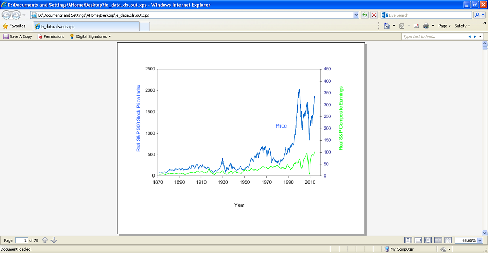

## **About XPS**

||The [XML Paper Specification](https://en.wikipedia.org/wiki/XML_Paper_Specification) is a page description language and a fixed-document format originally developed by Microsoft. Like PDF, XPS is a fixed-layout document format designed to preserve document fidelity and provide device-independent document appearance.|
| :- | :- |
## **XPS in Aspose.Cells**
Any document loaded into Aspose.Cells can be converted to XPS.

Aspose.Cells uses the same high-fidelity page layout and rendering engine to produce output in all its supported fixed-layout formats e.g PDF, XPS etc.

**The images below show the high degree of fidelity with which Aspose.Cells has converted a document from XLS to XPS.**


