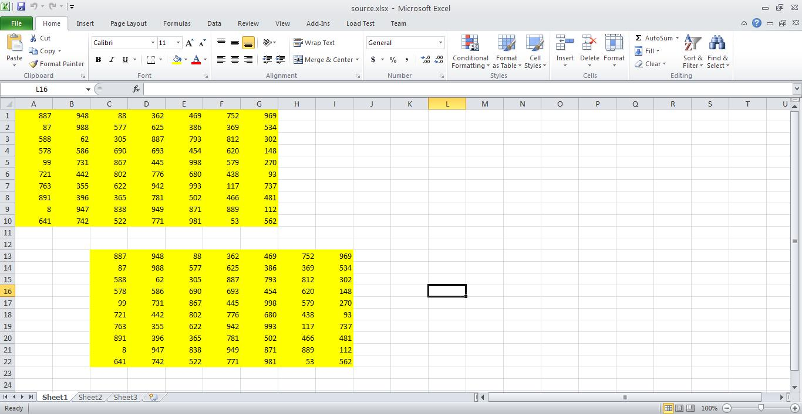
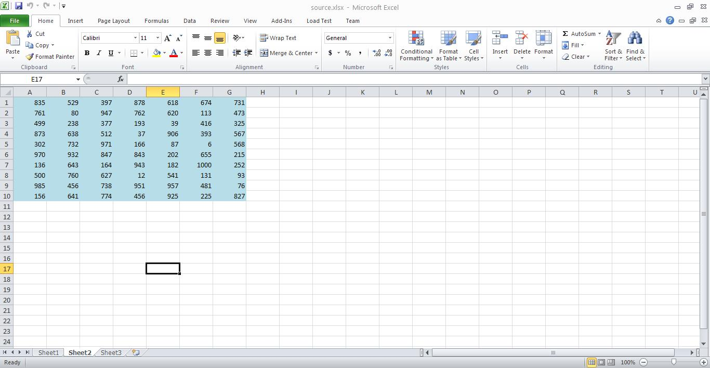
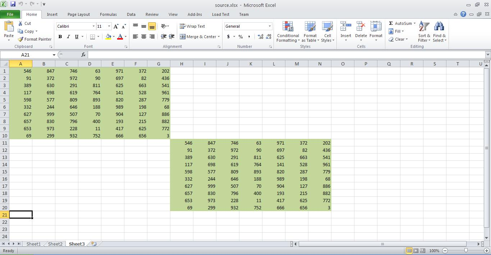
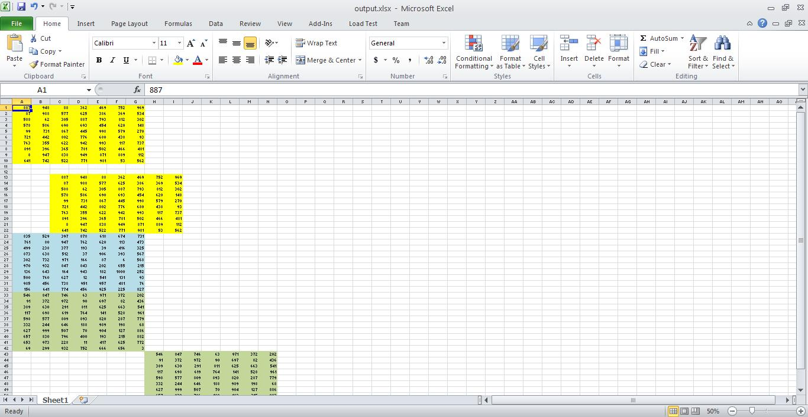

{}

Sometimes, you need to combine multiple worksheets into a single worksheet. This can easily be achieved using Aspose.Cells API. This article will show you a code example that reads a source workbook and combines the data of all source worksheets into a single worksheet inside a destination workbook.

{}

## **How to Combine Worksheets**

The sample below uses the [**Range.copy()**](https://reference.aspose.com/cells/java/com.aspose.cells/range#copy-com.aspose.cells.Range-) method to copy all source worksheets into a single sheet inside a destination workbook.

### **Source Workbook**

You can use any source workbook. For this example, we are using a source workbook which has three worksheets.

**Worksheet 1**

**Worksheet 2**

**Worksheet 3**

### **Output Workbook**

Running the following code provides a workbook with a single worksheet containing the data of all three worksheets.

**The output worksheet now contains the data of all 3 source worksheets**

## **Download Source Workbook and Output Workbook**

- [Source Workbook](5473078.xlsx)
- [Output Workbook](5473079.xlsx)

### **Sample Code for Merging Multiple Worksheets into a Single Worksheet**

The following code snippet shows how to combine multiple worksheets into a single worksheet.



## **Additional Resources**

{}

You may find the [Combine Multiple Workbooks into a Single Workbook](/cells/java/combine-multiple-workbooks-into-a-single-workbook/) article useful for more information.

{}
