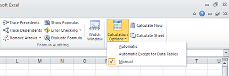

{}

Microsoft Excel allows you to set the formula calculation mode, that is, the way formulas are calculated. There are three possible values:

- Automatic - recalculate whenever something is changed, and every time a workbook is opened.
- Automatic except for data tables - recalculate whenever something is changed, but leaving out data tables.
- Manual - recalculate only when the user explicitly requests it by pressing F9 or CTRL+ALT+F9, or when the workbook is saved.

{}

To set the formula calculation mode in Microsoft Excel:

1. Select **Formulas** and then **Calculation Options**.
1. Select one of the options.

Aspose.Cells also allows you to set the **Formula Calculation Mode** using the [**FormulaSettings.CalculationMode**](https://reference.aspose.com/cells/java/com.aspose.cells/formulasettings#setCalculationMode-int-) property. You can assign it the [**CalcModeType**](https://reference.aspose.com/cells/java/com.aspose.cells/CalcModeType) enumeration which has one of the following values:

- [**CalcModeType.AUTOMATIC**](https://reference.aspose.com/cells/java/com.aspose.cells/calcmodetype#AUTOMATIC)
- [**CalcModeType.AUTOMATIC_EXCEPT_TABLE**](https://reference.aspose.com/cells/java/com.aspose.cells/calcmodetype#AUTOMATIC-EXCEPT-TABLE)
- [**CalcModeType.MANUAL**](https://reference.aspose.com/cells/java/com.aspose.cells/calcmodetype#MANUAL)

The following sample code first creates a workbook, then it sets the formula calculation mode to **Manual** and saves the workbook as output Excel file on disk.

**The output file. Note the formula calculation mode.**



