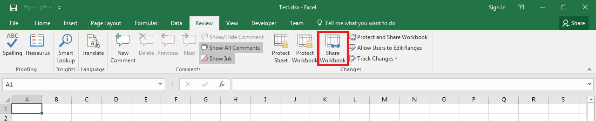

## **Possible Usage Scenarios**

Microsoft Excel allows you to share the workbook as shown in the following screenshot. When you share the workbook, then more than one user can edit the workbook on the network. Aspose.Cells enables you to create a shared workbook with [**Workbook.Settings.Shared**](https://reference.aspose.com/cells/java/com.aspose.cells/workbooksettings#Shared) property.

## **Create Shared Workbook with Aspose.Cells**

The following sample code creates a shared workbook by setting [**Workbook.Settings.Shared**](https://reference.aspose.com/cells/java/com.aspose.cells/workbooksettings#Shared) property as **true**. When you will open the [output Excel file](55541801.xlsx) in Microsoft Excel, you will see *Shared* with the output workbook name as shown in this screenshot.

## **Sample Code**


