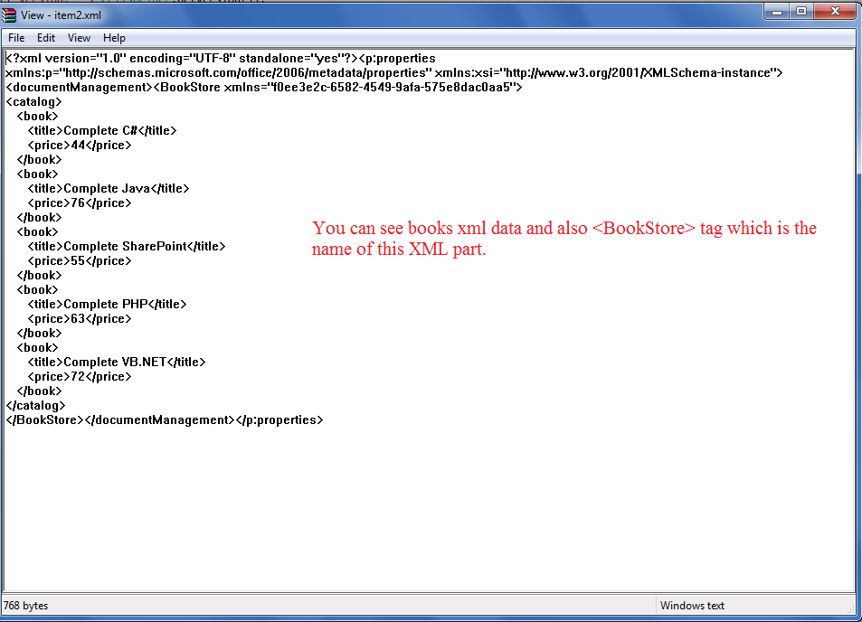

{} 

Custom XML Parts are the XML data which is stored by different applications like SharePoint etc inside the excel file. This data is consumed by different applications that need it. Microsoft Excel does not make use of this data so there is no GUI to add it. You can view this data by changing the extension of **.xlsx** into **.zip** and then by opening it using **WinRAR**. The data is present inside the **customXml** folder as shown in this image.

You can add custom XML parts using Aspose.Cells via the [Workbook.getContentTypeProperties().add()](https://reference.aspose.com/cells/java/com.aspose.cells/contenttypepropertycollection#add-java.lang.Object-) method.

{} 
## **Using Custom Xml Parts in Aspose.Cells**
The following sample code makes use of [Workbook.getContentTypeProperties().add()](https://reference.aspose.com/cells/java/com.aspose.cells/contenttypepropertycollection#add-java.lang.Object-) method and adds the **Book Catalog Xml** and its name is **BookStore**. The following image shows the result of this code. As you can see Book Catalog Xml is added inside the BookStore node which is the name of this property.


## **Related Article**
{} 

- [Adding Custom Properties visible inside Document Information Panel](/cells/java/adding-custom-properties-visible-inside-document-information-panel/)

{}

