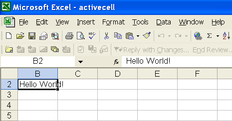

{}

Sometimes, you need a specific worksheet to be active and displayed when a user opens a Microsoft Excel file in Excel. Similarly, you might want to activate a specific cell and set the scrollbars to show the active cell. Aspose.Cells is capable of doing all these tasks as demonstrated below.

- An **active sheet** is a sheet you're working on: the active sheet's name on the tab is bold by default.
- An **active cell** is a selected cell, the cell into which data is entered when you begin typing. Only one cell is active at a time. The active cell is highlighted by a heavy border.

{}

## **Activating Sheets and Activating a Cell**

Aspose.Cells provides specific API calls for activating a sheet and a cell. For Example, the [**WorksheetCollection.ActiveSheetIndex**](https://reference.aspose.com/cells/java/com.aspose.cells/worksheetcollection#ActiveSheetIndex) property is useful for setting the active sheet in a workbook. Similarly, the [**Worksheet.ActiveCell**](https://reference.aspose.com/cells/java/com.aspose.cells/worksheet#ActiveCell) property can be used to set and get an active cell in the worksheet.

To make sure that the horizontal or vertical scrollbars are at the row and column index position you want to show specific data, use the [**Worksheet.FirstVisibleRow**](https://reference.aspose.com/cells/java/com.aspose.cells/worksheet#FirstVisibleRow) and [**Worksheet.FirstVisibleColumn**](https://reference.aspose.com/cells/java/com.aspose.cells/worksheet#FirstVisibleColumn) properties.

The following example shows how to activate a worksheet and make an active cell in it. The following output is generated when executing the code. The scrollbars are scrolled to make the 2nd row and 2nd column as their first visible row and column.

**Setting B2 cell as an active cell**

## Java code to set an active worksheet in Excel



{}

In **evaluation** mode, that is; without setting a valid license, the active worksheet will always be the one containing the evaluation watermark. This behavior can only be overridden by setting the license at the start of the application.

{}
