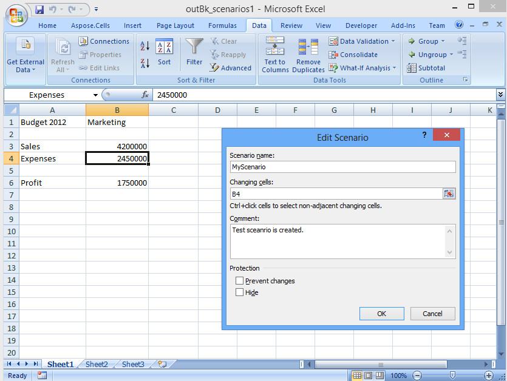

{}

Sometimes, you need to create, manipulate or delete scenarios in spreadsheets. A scenario is a named what-if model that includes variable input cells linked together by one or more formulas. Before creating a scenario, design a worksheet so that it contains at least one formula that depends on cells into which different values can be inserted. The following example shows how to create and remove scenarios from a worksheet using the Aspose.Cells APIs.

{}

Aspose.Cells provides some useful classes, for example [**ScenarioCollection**](https://reference.aspose.com/cells/java/com.aspose.cells/ScenarioCollection), [**Scenario**](https://reference.aspose.com/cells/java/com.aspose.cells/Scenario), [**ScenarioInputCellCollection**](https://reference.aspose.com/cells/java/com.aspose.cells/ScenarioInputCellCollection) and [**ScenarioInputCell**](https://reference.aspose.com/cells/java/com.aspose.cells/ScenarioInputCell). It also provides the [**Worksheet.Scenarios**](https://reference.aspose.com/cells/java/com.aspose.cells/worksheet#Scenarios) property. The sample code below opens an XLSX Excel file (that contains some scenarios) and removes an existing scenario from the worksheet. It also adds a new scenario before saving the Excel file. It uses a very simple template file that contains a scenario.

After executing the code, an existing scenario is removed and a new scenario is added to the worksheet.

**The output file**



