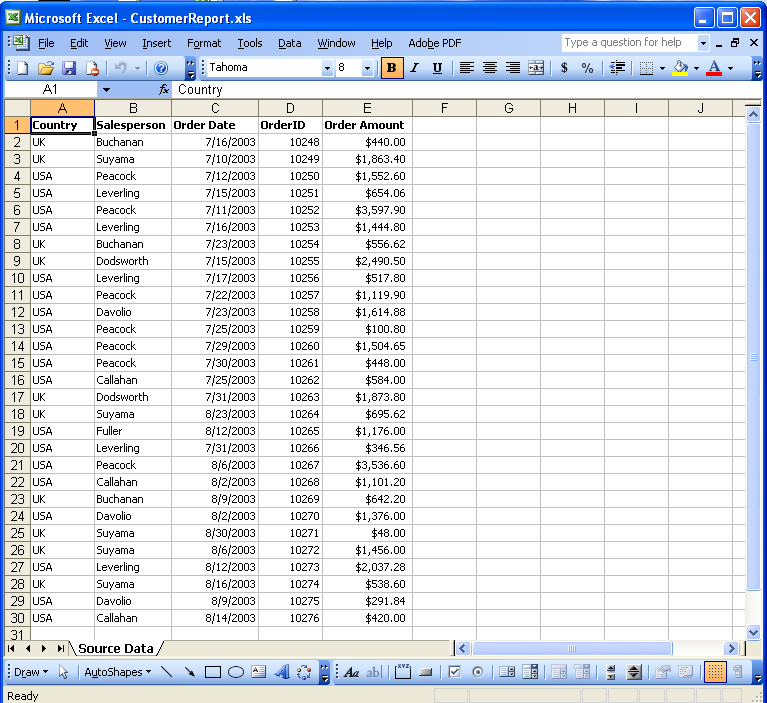

{}

Sometimes, developers need to configure page setup and print settings to control the printing process. Page setup and print settings offer various options and are fully supported in Aspose.Cells.

This article shows how to create a console application and apply page setup and printing options to a worksheet with a few simple lines of code using the Aspose.Cells API.

{}

## **Working with Page and Print Settings**

For this example, we created a workbook in Microsoft Excel and use Aspose.Cells to set page setup and print options.

### **Setting Page Setup Options**

First create a simple worksheet in Microsoft Excel. Then apply page setup options to it. Executing the code changes the Page Setup options as in the screenshot below.

**Output file** 

1. Create a worksheet with some data in Microsoft Excel:
   1. Open a new workbook in Microsoft Excel.
   1. Add some data.
      Below is a screenshot of the file.

      **Input file**

1. Set page setup options:
   Apply page setup options to the file. Below is a screenshot of the default options, before the new options are applied.

   **Default page setup options**

1. Download and install Aspose.Cells:
   1. [Download](https://downloads.aspose.com/cells/java) Aspose.Cells for Java.
   1. Unzip it on your development computer.
      All [Aspose](http://www.aspose.com/) components, when installed, work in evaluation mode. The evaluation mode has no time limit and it only injects watermarks into produced documents.
1. Create a project.
   Either create a project using a Java editor, for example Eclipse, or create a simple program using a text editor.
1. Add a class path.
   1. Extract the Aspose.Cells.jar and dom4j_1.6.1.jar from Aspose.Cells.zip.
   1. Set the classpath of project in Eclipse:
   1. Select your project in Eclipse and then click **Project** followed by **Properties**.
   1. Select **Java Build Path** to the left of the dialog.
   1. Select the Libraries tab, click **Add JARs** or **Add External JARs** to select Aspose.Cells.jar and dom4j_1.6.1.jar and add them to the build paths.
      Or you may set it at runtime at a DOS prompt in Windows:



 javac \-classpath %classpath%;e:\Aspose.Cells.jar; ClassName .javajava \-classpath %classpath%;e:\Aspose.Cells.jar; ClassName



1. Write the application that invokes APIs:
   Below is the code used by the component in this example.



### **Setting Print options**

Page setup settings also provide several print options (also called sheet options) that allow users to control how worksheet pages are printed. They allow users to:

- Select a specific print area of a worksheet.
- Print titles.
- Print gridlines.
- Print row/column headings.
- Achieve draft quality.
- Print comments.
- Print cell errors.
- Define page ordering.

The example that follows applies print options to the file created in the example above (PageSetup.xls). The screenshot below shows the default print options before new options are applied.
**Input document**

Executing the code changes the print options.
**Output file**



## **Summary**

{}

This article shows how to set page setup and sheet print options using Aspose.Cells. Hopefully, it will give you some insight, and you can use these options in your own scenarios.

Aspose.Cells benefits from years of research, design and careful tuning. We heartily welcome your queries, comments and suggestions at [Aspose.Cells Forum](https://forum.aspose.com/c/cells/9). We warranty a prompt reply.

{}
