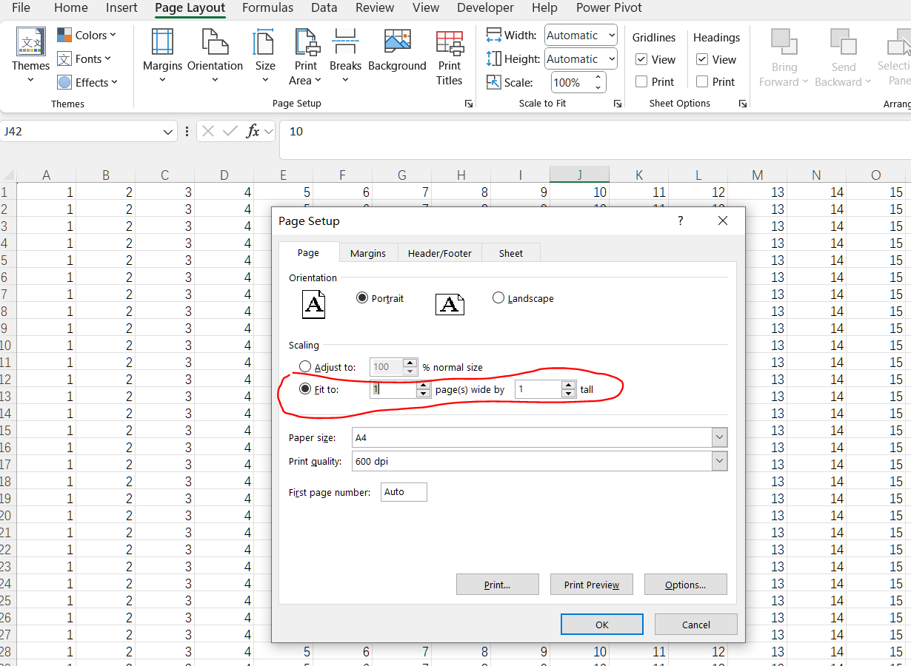

## **Introduction**

The FitToPagesWide and FitToPagesTall settings are used in spreadsheet applications (like Microsoft Excel) to control how a spreadsheet is scaled when printing. These settings help ensure that your printed output fits within a specified number of pages, both horizontally and vertically. Here's a breakdown of each setting:

1. FitToPagesWide: This setting specifies the number of pages wide that the printed output should fit into. For example, setting FitToPagesWide to 1 means the content will be scaled to fit within a single page width, no matter how wide the spreadsheet is.
1. FitToPagesTall: This setting specifies the number of pages tall that the printed output should fit into. For example, setting FitToPagesTall to 1 means the content will be scaled to fit within a single page height, regardless of the number of rows.

## **Why Use FitToPagesWide and FitToPagesTall**
Here are some reasons to set FitToPagesWide and FitToPagesTall:
1. Control Over Printed Layout: By specifying the number of pages wide and tall, you can ensure that your printed document is easy to read and well-organized, without any columns or rows being split awkwardly across pages.
1. Consistency: If you're printing multiple sheets or reports, using these settings helps maintain a consistent format, making it easier to compare and analyze printed documents.
1. Professional Presentation: Properly scaling and fitting content to a specified number of pages can result in a more professional and polished presentation of your data.

## **How to Set FitToPagesWide and FitToPagesTall in Excel**

To set the FitToPagesWide and FitToPagesTall settings in Microsoft Excel, follow these steps:

1. Open your Excel workbook and go to the sheet you want to print.
1. Go to the Page Layout tab on the Ribbon.
1. In the Page Setup group, click the small arrow in the bottom-right corner to open the Page Setup dialog box.
1. In the Page Setup dialog box, go to the Page tab.
1. Under Scaling, select the option "Fit to" and then specify the number of pages wide and tall you want: Enter the number of pages wide you want in the first box (Fit to x pages wide). Enter the number of pages tall you want in the second box (Fit to y pages tall).
 

1. Click OK to apply the settings.

## **How to Set FitToPagesWide and FitToPagesTall Using Aspose.Cells**

To set FitToPagesWide and FitToPagesTall in a specified worksheet: First, load the [sample file](input.xlsx), and then you need to modify the [**Worksheet.PageSetup.FitToPagesTall**](https://reference.aspose.com/cells/net/aspose.cells/pagesetup/fittopagestall/) and [**Worksheet.PageSetup.FitToPagesWide**](https://reference.aspose.com/cells/net/aspose.cells/pagesetup/fittopageswide/) properties of the [**PageSetup**](https://reference.aspose.com/cells/net/aspose.cells/pagesetup/) object for the desired worksheet. Here is an example in Java:



The output result:
 

