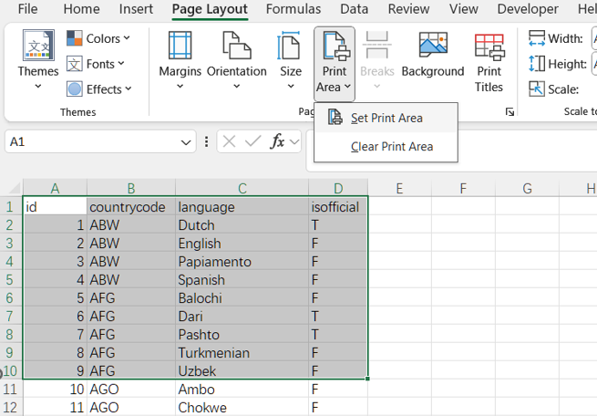
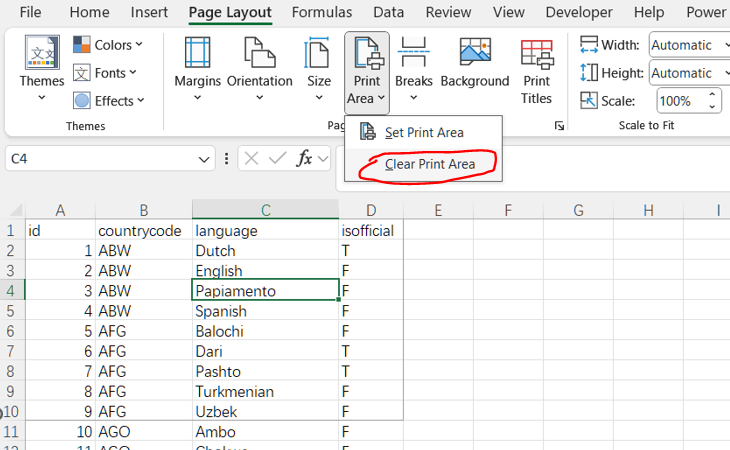
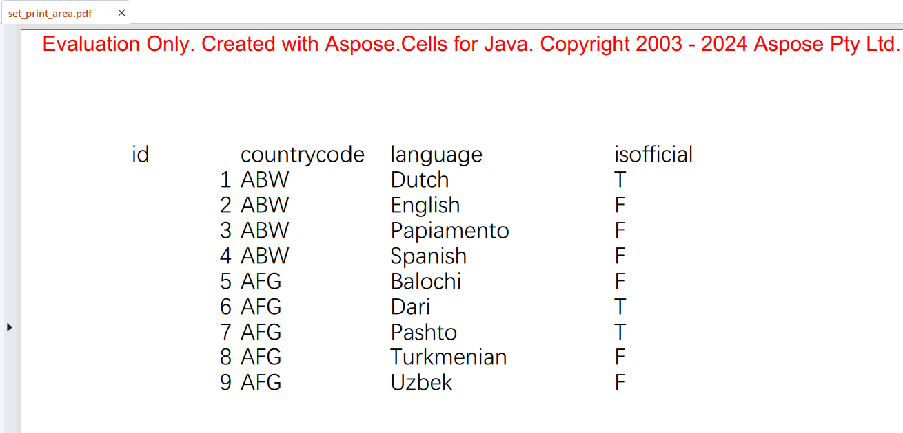
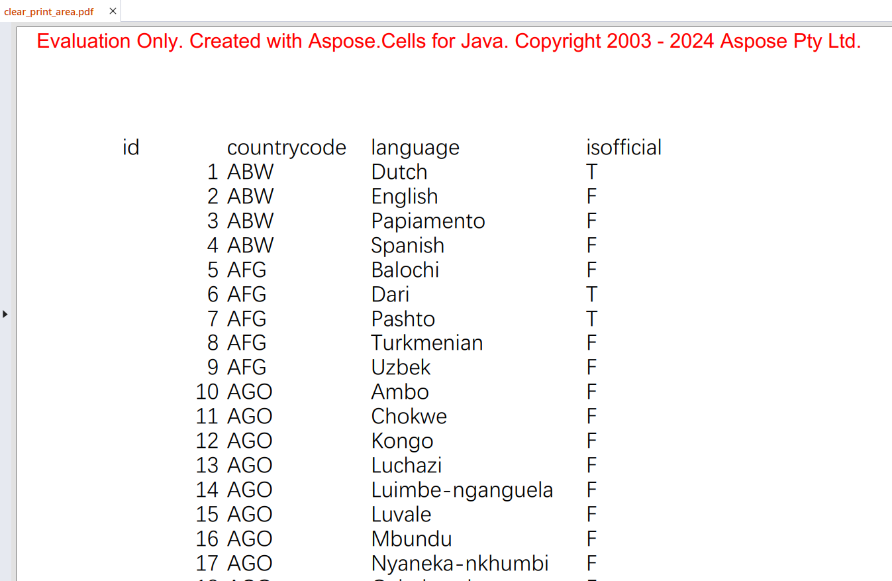

## **Possible Usage Scenarios**

Setting a print area in a document, such as an Excel spreadsheet, helps control what content is included when printing. Here are some reasons to set a print area:

1. Focus on Specific Data: You can print only the most relevant sections, avoiding unnecessary content.
1. Improved Layout: It helps in organizing and fitting the content neatly on the printed pages, avoiding splits or unwanted page breaks.
1. Save Resources: By limiting the print area, you can reduce the amount of paper and ink used.
1. Professional Presentation: It ensures that only the polished and final version of data is printed, which is particularly important for reports or presentations.
1. Consistency: When printing the same document multiple times, having a set print area ensures consistency in the output.

 
Setting a print area is especially useful in larger documents where only a portion needs to be shared or reviewed in printed form.

## **How to Set Print Area in Excel**

To set a print area in Excel, follow these steps:

1. Select the Cells: Click and drag to select the range of cells you want to set as the print area.
1. Open the Page Layout Tab: Go to the "Page Layout" tab in the ribbon at the top of the Excel window.
1. Set Print Area: In the "Page Setup" group, click "Print Area". From the drop-down menu, select "Set Print Area".
 

1. Adding to the Print Area: If you want to add more cells to the existing print area, select the additional cells, go to "Print Area" in the "Page Layout" tab, and choose "Add to Print Area".

 
This action will define the selected cells as the print area. When you print the worksheet, only this defined area will be printed.

## **How to Clear Print Area in Excel**

To clear the print area in Excel, follow these steps:

1. Open the Page Layout Tab: Click on the "Page Layout" tab in the ribbon at the top of the Excel window.
1. Clear Print Area: In the "Page Setup" group, click "Print Area". From the drop-down menu, select "Clear Print Area".
 

 
This action will remove any previously set print area, allowing the entire worksheet to be printed.

## **What Happens After Clearing the Print Area**

Clearing the print area in a spreadsheet application like Excel using Aspose.Cells will result in the entire worksheet being included when you print the document. If a print area is set, only the specified range of cells will be printed. By clearing the print area, you ensure that no specific range is defined, and the default printing behavior, which includes the entire sheet, will take effect.

1. Default Printing Behavior: The entire worksheet will be considered for printing. This means all cells with data or formatting will be printed.
1. No Print Area Limits: Previously defined print area limits will be removed. If there were specific rows and columns designated for printing, they will no longer be constrained to those limits.
1. Full Content Print: All content, including headers, footers, and any other data within the worksheet, will be included in the print job.

## **How to Set Print Area Using Aspose.Cells**

To set print area in a specified worksheet: First, load the [sample file](input.xlsx), and then you need to modify the [**Worksheet.getPageSetup().setPrintArea()**](https://reference.aspose.com/cells/java/com.aspose.cells/pagesetup/#setPrintArea-java.lang.String-) property of the [**PageSetup**](https://reference.aspose.com/cells/java/com.aspose.cells/pagesetup/) object for the desired worksheet. Setting this property to a range string will set the print area.



The output result:
 

## **How to Clear Print Area Using Aspose.Cells**

To clear the print area in a specified worksheet: First, load the [sample file](input.xlsx), and then you need to modify the [**Worksheet.getPageSetup().setPrintArea()**](https://reference.aspose.com/cells/java/com.aspose.cells/pagesetup/#setPrintArea-java.lang.String-) property of the [**PageSetup**](https://reference.aspose.com/cells/java/com.aspose.cells/pagesetup/) object for the desired worksheet. Setting this property to an empty string will clear the print area.



The output result:
 

