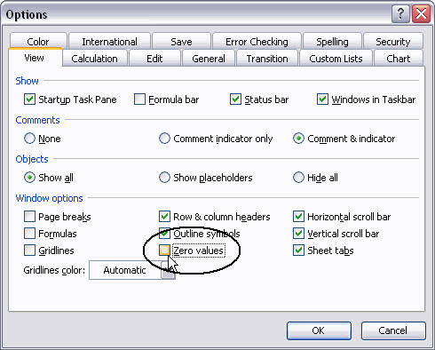

{} 

Sometimes, you need to hide zero values in a spreadsheet. It might be personal preference, or a formatting standard.

{} 

To hide zero values in a worksheet in Microsoft Excel (for example Microsoft Excel 2003):

1. From the **Tools** menu, select **Options**, and then select the **View** tab.
1. Deselect the **Zero values** option.
1. Click **OK**.

   **Hiding zero values in Microsoft Excel** 

Please see the following sample code that demonstrates how to hide zeros using Aspose.Cells.


