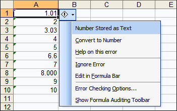

{} 

Microsoft Excel allows users to define error checking options and rules. Users often see error checks when creating formulas, a small triangle at the top right corner of a cell highlights when there's a problem with a cell. Excel provides information that helps users correct common problems.

{} 
## **Types of Errors**
Errors that mean that the formula cannot return a result - such as dividing a number by zero - require immediate attention and an error value is displayed in the cell. Clicking on the green triangle shows an exclamation mark, clicking this opens list of options. 

The error can be resolved using the options, or be ignored. Ignoring an error means that that error will not appear in further error checks.

Aspose.Cells provides error checking option features. The ErrorCheckOptions class manages different types of errors checks, for example numbers stored as text, formula calculation errors and validation errors. Use the ErrorCheckType enumeration to set the desired error checking.
## **Numbers Stored as Text**
Occasionally, numbers might be formatted and stored in cells as text. This can cause problems with calculations or produce confusing sort orders. Numbers that are formatted as text are left-aligned instead of right-aligned in the cell. If a formula that should perform a mathematical operation on cells doesn't return a value, check the alignment in the cells that the formula refers to – some or all of those cells might be numbers formatted as text.

You can use the error checking options to quickly convert numbers stored as text to real numbers. In Microsoft Excel 2003:

1. On the **Tools** menu, click **Options**.
1. Select the Error Checking tab.
   **Number stored as text** option is checked by default. 
1. Disable it.
   See the below picture on how the green triangle is displayed for the data in MS Excel.

The following sample code shows how to disable the numbers stored as text error checking option for a worksheet in the template XLS file using the Aspose.Cells APIs. 

**Java**



 //Create a workbook and opening a template spreadsheet

Workbook workbook = new Workbook("d:\\files\\Book1.xls");

//Get the first worksheet

Worksheet sheet = workbook.getWorksheets().get(0);

//Instantiate the error checking options

ErrorCheckOptionCollection opts = sheet.getErrorCheckOptions();

int index = opts.add();

ErrorCheckOption opt = opts.get(index);

//Disable the numbers stored as text option

opt.setErrorCheck(ErrorCheckType.TEXT_NUMBER, false);

//Set the range

opt.addRange(CellArea.createCellArea(0, 0, 65535, 255));

//Save the Excel file

workbook.save("d:\\files\\out_test.xls");


