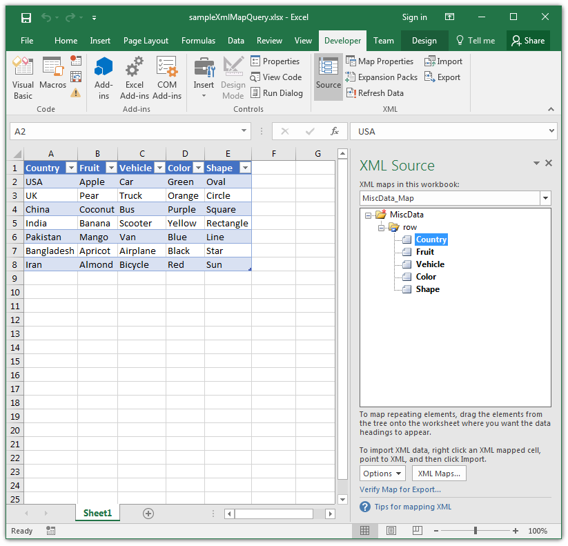

## **Possible Usage Scenarios**

You can query cell areas mapped to XML map path with Aspose.Cells using the [**Worksheet.xmlMapQuery()**](https://reference.aspose.com/cells/java/com.aspose.cells/worksheet#xmlMapQuery-java.lang.String-com.aspose.cells.XmlMap-) method. If the path exists, it will return the list of cell areas related to that path inside the XML map. The first parameter of [**Worksheet.xmlMapQuery()**](https://reference.aspose.com/cells/java/com.aspose.cells/worksheet#xmlMapQuery-java.lang.String-com.aspose.cells.XmlMap-) method specifies the XML element path and the second parameter specifies an XML map you want to query.

## **Query Cell Areas Mapped to XML Map Path using Worksheet.XmlMapQuery method**

The following screenshot shows the Microsoft Excel displaying XML Map inside the [sample Excel file](55541818.xlsx) used in the code. The code queries the XML map two times and prints the list of cell areas returned by the [**Worksheet.xmlMapQuery()**](https://reference.aspose.com/cells/java/com.aspose.cells/worksheet#xmlMapQuery-java.lang.String-com.aspose.cells.XmlMap-) method on the console as shown below.

## **Sample Code**



## **Console Output**



Query Xml Map from Path - /MiscData

Aspose.Cells.CellArea(A1:A8)[0,0,7,0]

Aspose.Cells.CellArea(B1:B8)[0,1,7,1]

Aspose.Cells.CellArea(C1:C8)[0,2,7,2]

Aspose.Cells.CellArea(D1:D8)[0,3,7,3]

Aspose.Cells.CellArea(E1:E8)[0,4,7,4]

Query Xml Map from Path - /MiscData/row/Color

Aspose.Cells.CellArea(D1:D8)[0,3,7,3]



## **Get XML path from List Object/Table**

XML data can be imported to worksheets. Sometimes XML path is required from the ListObjects of the worksheet. This feature is available in Excel by using an expression like Sheet1.ListObjects(1).XmlMap.DataBinding. The same feature is available in Aspose.Cells by calling [**ListObject.getXmlMap().getDataBinding().getUrl()**](https://reference.aspose.com/cells/java/com.aspose.cells/xmldatabinding#getUrl--) .  Following example demonstrates this feature. Template file and other source files can be downloaded from the following links:

1. [XMLData.xlsx](XMLData.xlsx)
1. [CountryList.xml](CountryList.xml)
1. [FoodList.xml](FoodList.xml)



