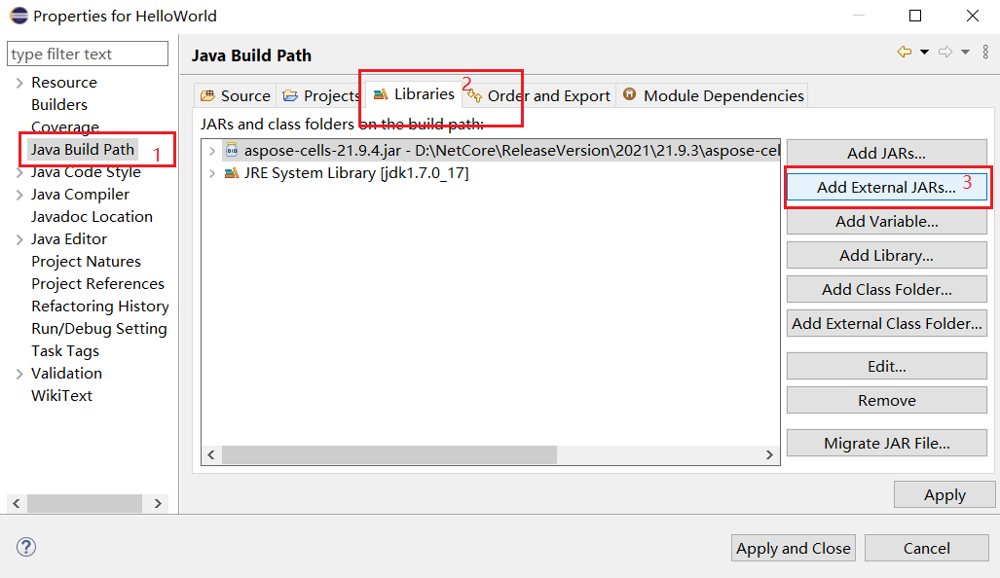
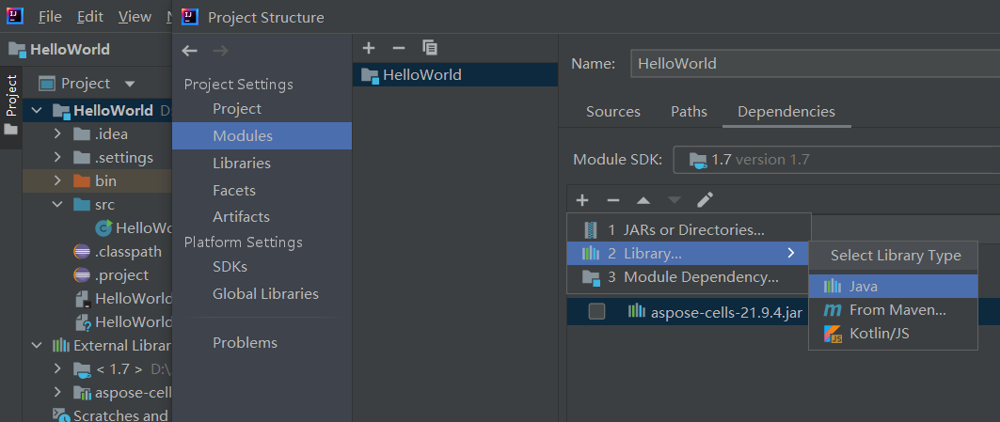

{} 

This page will show you how to install Aspose Cells for Java, and create a Hello World application.

{}

## **System Requirements**

Aspose.Cells for Java supports the following Java versions:

- J2SE 6.0 (1.6)
- J2SE 7.0 (1.7)
- or above

[More details](/cells/java/system-requirements/)

## **Installation**

### **Install Aspose Cells for Java from Maven Repository**

Maven is the easiest way to download and install Aspose.Cells for Java. 

1. Specify Aspose Maven Repository configuration/location in your Maven pom.xml. 
2. Define Aspose.Cells for Java API dependency in your pom.xml. 

[More step for details](/cells/java/installation/)

### **Install Aspose Cells for Java manually**

1. [Download aspose-cells-{version}-java.zip](https://downloads.aspose.com/cells/java/)
1. Unzip the package, enter the \JDK 1.6\ directory, unzip aspose-cells-{version}-java.zip.
1. Enter the \JDK 1.6\aspose-cells-{version}-java\lib\ directory, install the JAR packages manually with Eclipse or Intellij.

Install Aspose Cells for Java with Eclipse:

****

Install Aspose Cells for Java with Intellij:

****

## **Creating the Hello World Application**

The steps below creates the Hello World application using the Aspose.Cells API:



