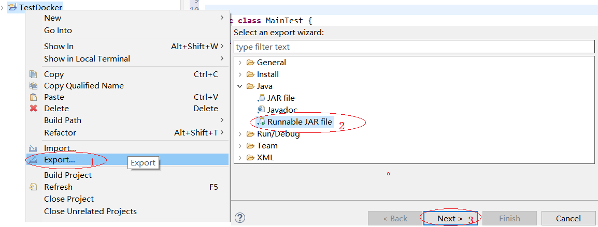

Microservices, in conjunction with containerization, **makes** it possible to easily combine technologies. Docker allows you to easily integrate Aspose.Cells functionality into your application, regardless of the technology in your development stack.

In case you are targeting microservices, or if the main technology in your stack is not .NET, C++ **or** Java, but you need Aspose.Cells functionality, or if you already use Docker in your stack, then you may be interested in utilizing Aspose.Cells for Java in a Docker container.

## Prerequisites

- Docker must be installed on your system. 

## Create a Java Application

In this example, you create a Java application that makes a simple xlsx file, saves it and reads it. The application can then be built and run in Docker.

### Creating the Java Application

Create the Java Application in Eclipse using the following code. In this example, we use Aspose.Cells for Java **to create** a new xlsx worksheet and set its sheet name and cell values, then read them and output them.



### Make the Java Application into a **JAR** package

The following figure shows a way to make a JAR package using the "Export" menu in Eclipse.

****

Now that we **have written** a Java program using Aspose.Cells for Java, we **have** a **JAR** package. Next we'll make a **Dockerfile**.

### Configuring a Dockerfile

The next step is to create and configure the Dockerfile.

1. Create the Dockerfile and place it next to the JAR package. Keep this file name without extension (the default).
2. In the Dockerfile, specify:


   FROM williamyeh/java8:latest

   VOLUME /tmp

   ADD TestDocker.jar app.jar

   ENTRYPOINT ["java","-Djava.security.egd=file:/dev/./urandom","-jar","/app.jar"]


### Building and Running the Application in Docker

Now the application can be built and run in Docker. Open your favorite command prompt, change directory to the folder with the Dockerfile and run the following command:


docker build -t java-app .


After executing the above command, you will see the output of the XLSX worksheet **on** the command line. At this point, a Java program has been successfully run in Linux Docker.

