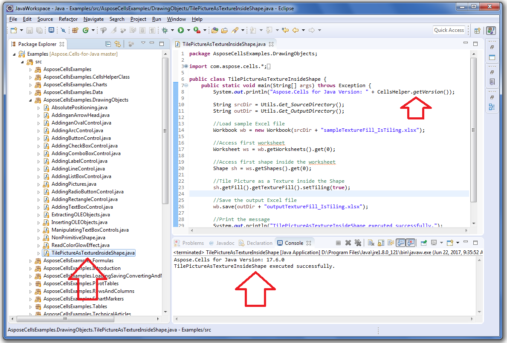

## **Download from GitHub**
All examples of Aspose.Cells for Java are hosted on [GitHub](https://github.com/aspose-cells/Aspose.Cells-for-java). You can either clone the repository using your favorite GitHub client or download the ZIP file from [here](https://github.com/aspose-cells/Aspose.Cells-for-java/archive/master.zip).

Extract the contents of the ZIP file to any folder on your computer. All the examples are located in the **Examples** folder.

The **Resources** folder contains input documents or files used in the examples.

You can run/execute these examples with any IDE **of your** choice; however, for demonstration purposes, we are using **Eclipse**. Use the **File -> Import** option to import the example of your choice and specify the path.

Add the required jar files (Libraries) **to** the project.

Each example is provided as a separate runnable class. Right-click the file and choose Run File.

{} 

Examples are in the form of **an** Eclipse Project. Please open the Examples in Eclipse using the **File > Open Projects from File System...** menu command and follow the steps. **You should now be able to run the examples successfully.**

{} 
## **Run the Example**
Once you open the Examples in the Eclipse IDE, then select any .java file. For example, select **TilePictureAsTextureInsideShape.java**, found inside the

Examples>src>AsposeCellsExamples>DrawingObjects directory

or inside the package

AsposeCellsExamples.DrawingObjects,

and run it.
## **Screenshot**
Please see the following screenshot and its highlighted areas for more help.

## **Contribute**
If you **would** like to add or improve an example, we encourage you to contribute to the project. All examples and showcase projects in this repository are open source and can be freely used in your own applications.

To contribute, you can fork the repository, edit the source code and create a pull request. We will review the changes and include them in the repository if **they are** found helpful.


