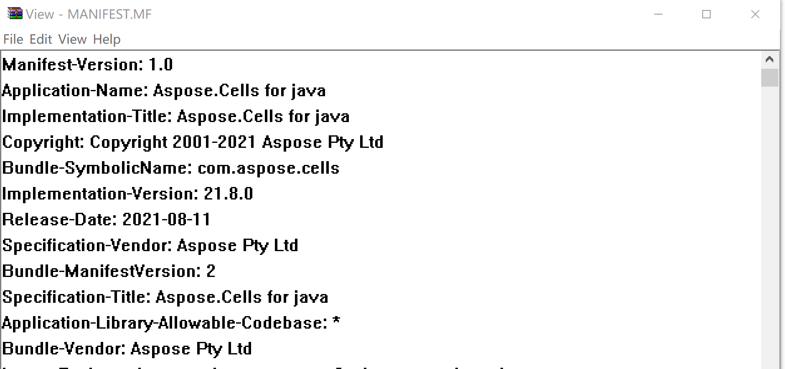

{} 

In some cases, you might wonder what version of the product you have. Often we build new fixes (bug fixes for the user scenarios they point out) and post them in the forums promptly to meet their urgent needs. The version number consists of a major version number, a minor version number, and a hotfix version number. All defined components must be integers greater than or equal to 0. The format of the version number is as follows:

`major.minor.hotfix` – we may increase any part by 1 to create a new version. Normally, we increase the last part by 1 and build a new fix to post it into the forums for the users.

This document describes some ways to check which version of the component is installed on your system.

{} 
## **Checking the version number**
### **1) Manual Way**
If you have a Java version/fix (Aspose.Cells for Java), you can unzip the Aspose.Cells library JAR file, open the MANIFEST file with Notepad, and search for the string, e.g., `Specification-Version:` to check its value.

**Figure:** Checking the version number of the Java fix
### **2) Using the APIs**
You may also use the following APIs to get the version number of the product.




