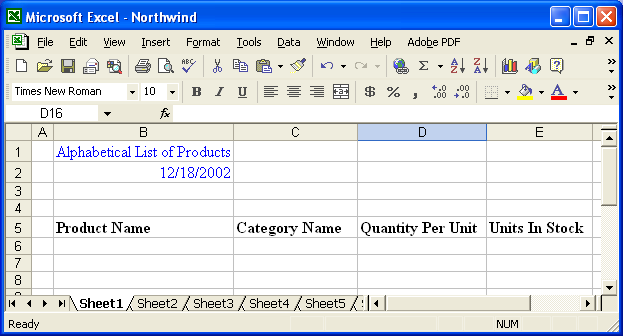

## **Do You Want to Speed Up Development?**

{}

You can use Aspose.Cells to create Excel files from scratch with the help of its flexible API. One of the most common uses for Aspose.Cells is to create and populate Excel files with data, which may come from an existing database, a user, or other sources, dynamically. As well as adding data to Excel files, you'll also need to write code to apply formatting (look and feel).

Formatting takes time. What could speed up development?

{}

## **The Solution – Designer Spreadsheets**

To speed up your development, Aspose.Cells offers the exciting feature **Designer Spreadsheet**.

### **What is a Designer Spreadsheet?**

A Designer Spreadsheet is an Excel file created using Microsoft Excel in which all formatting is already applied and the content can be decided at design time. It's more like a template file that doesn't contain any data but just the formatting, as shown below:

**Designer spreadsheet**

### **How to Use It?**

After creating a Designer Spreadsheet, use Aspose.Cells to read the file and add data to its specified positions (according to the pre‑defined format settings) at runtime. For example, in the screenshot above, you can see that we have already decided at design time to add **Product Name**, **Category Name**, **Quantity Per Unit**, and **Units In Stock** columns. They don't have any data yet; this will be added at runtime. The above figure shows a very simple spreadsheet, but Designer Spreadsheets save you time even on complex spreadsheets.

### **Smart Markers**

Additionally, Aspose.Cells lets you add [smart markers](/cells/java/smart-markers/). Smart markers are processed at runtime using the **WorkbookDesigner** class's `process` method. This can help you write less code and still achieve great results.

[Find out more about smart markers](/cells/java/smart-markers/).

