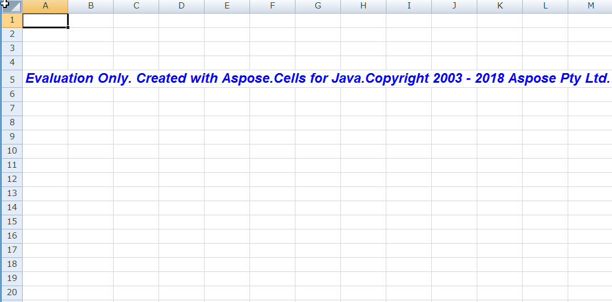

{} 

You can download an evaluation version of **Aspose.Cells** for Java from [its download page](https://repository.aspose.com/webapp/#/artifacts/browse/tree/General/repo/com/aspose/aspose-cells) @ Maven repos. The evaluation version provides absolutely the same capabilities as the licensed version of the product. Furthermore, evaluation version simply becomes licensed when you purchase a license and add a couple of lines of code to apply the license.

Once you are happy with your evaluation of **Aspose.Cells**, you can [purchase a license](https://purchase.aspose.com) at the Aspose website. Make yourself familiar with the different subscription types offered. If you have any questions, do not hesitate to contact the Aspose sales team.

Every Aspose license carries a one-year subscription for free upgrades to any new versions or fixes that come out during this time. Technical support is free and unlimited and provided both to licensed and evaluation users.

{} {} 

If you want to test **Aspose.Cells** without evaluation version limitations, request a 30-day temporary license. Please refer to [How to get a Temporary License?](https://purchase.aspose.com/temporary-license) for more information.

{}

## **Evaluation Version Limitations**

Evaluation version of **Aspose.Cells** product (without a license specified) provides full product functionality, but it is limited to open 100 files in one program and an extra worksheet with evaluation watermark.

The limitations are shown below:

### **1st Limitation: Number of Opened Files**

When running your program, you can only open 100 Excel files. If your application exceeds this number, an exception will be thrown.

### **2nd Limitation: Worksheet with Evaluation Watermark**

This worksheet will always show as the active worksheet. Only in licensed version, you can set the active worksheet to other worksheets.

## **Setting a License**

The license is a plain text XML file that contains details such as the product name, number of developers it is licensed to, subscription expiry date and so on. The file is digitally signed, so do not modify the file; even the inadvertent addition of an extra line break into the file will invalidate it.

You need to set a license before utilizing Aspose.Cells if you want to avoid its evaluation limitations. You are only required to set a license once per application or process.

The license can be loaded from a stream or file in the following locations:

1. Explicit path.
1. The folder that contains the Aspose.Cells.jar.

Use the [License.setLicense](https://reference.aspose.com/cells/java/com.aspose.cells/license#setLicense(java.io.InputStream)) method to license the component. Often the easiest way to set a license is to put the license file in the same folder as Aspose.Cells.jar and specify just the file name without path as shown in the following example:

### **Example 1**

In this example **Aspose.Cells** will attempt to find the license file in the folder that contain the JARs of your application.



com.aspose.cells.License license = new com.aspose.cells.License();

license.setLicense("Aspose.Cells.Java.lic");



### **Example 2**

Initializes a license from a stream.



com.aspose.cells.License license = new com.aspose.cells.License();

license.setLicense(new java.io.FileInputStream("Aspose.Cells.Java.lic"));



### **Notes on Applying a License in Aspose.Cells.GridWeb**

It's recommended to put the licensing code at a place in your web application where it should be processed first.



//Instantiate an instance of license and set the license file through its path

com.aspose.gridweb.License lic = new com.aspose.gridweb.License();

lic.setLicense("Aspose.Cells.lic");



## **Applying Metered License**

Aspose.Cells allows developers to to apply metered key. It is a new licensing mechanism. The new licensing mechanism will be used along with the existing licensing method. Those customers who want to be billed based on the usage of the API features can use the metered licensing. For more details, please refer to [Metered Licensing FAQ](https://purchase.aspose.com/faqs/licensing/metered) section.

A new class [Metered](https://reference.aspose.com/cells/java/com.aspose.cells/Metered) has been introduced to apply metered key. Following is the sample code demonstrating how to set metered public and private key.



//Set metered public and private keys

Metered metered = new Metered();

//Access the setMeteredKey property and pass public and private keys as parameters

metered.setMeteredKey("************", "************");

//Instantiate a new Workbook

Workbook workbook = new Workbook();

//Check if the license is set

System.out.println(workbook.isLicensed());

//Get the Consumption quantity

double amountBefore = Metered.getConsumptionQuantity();

System.out.println(amountBefore);

Workbook workbook2 = new Workbook("Book1.xlsx");

workbook2.save("out1.xlsx");

//Get the Consumption quantity again which should be greater a bit

double amountAfter = Metered.getConsumptionQuantity();

System.out.println(amountAfter);


