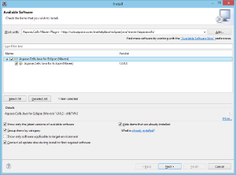
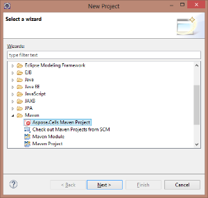
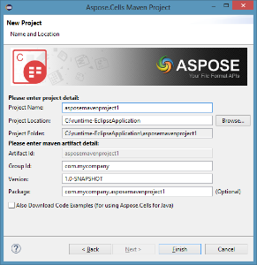
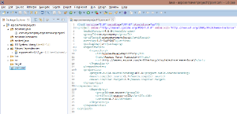
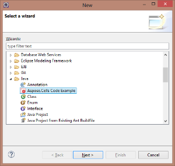
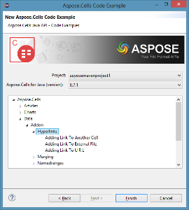
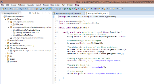

## **Installing**

**Aspose.Cells Java for Eclipse (Maven)** plugin can be easily installed from the available **Plugins** tab in the Plugin dialog.

- To open it, select **Plugins** from the **Tools** menu in Eclipse.  

- This adds the **Aspose.Cells Maven Project** in the New Project wizard and **Aspose.Cells Code Example** in the New Other wizard of the Eclipse IDE.  

## **Using**

### **Aspose.Cells Maven Project (wizard)**

To create a **Maven Project** using the wizard for Aspose.Cells for Java API:

1. Select **New → Project**.  
2. Select **Aspose.Cells Maven Project** in the **Maven** category.  
3. Click **Next**.  

4. Provide **Project Name, Location, GroupId, ArtifactId**, and **Version** for your Maven Project and click **Finish**.  

5. This will retrieve the latest **Aspose.Cells for Java** Maven dependency reference from the **Aspose Cloud Maven Repository** and configure it in **pom.xml**. If you have opted for **Also Download Code Examples**, downloading of the **Code Examples** will also begin from the **Aspose.Cells for Java API Examples Repository**.  

6. The following Maven Project will be created in your **Eclipse IDE** upon completion of the wizard:  

7. The created **Maven Project** is configured to use **Aspose.Cells for Java API**, and it is ready to be enhanced according to your project requirements. If you have opted to download **Code Examples**, you can use the **Aspose.Cells Code Example (wizard)** for importing the needed code examples of the Aspose.Cells for Java API into your project.

### **Aspose.Cells Code Example (wizard)**

**Aspose.Cells Code Example wizard** allows you to try out many samples provided for Aspose.Cells for Java API.

{}

To use the **Aspose.Cells Code Example wizard** comfortably, it is recommended to always select **Also Download Code Examples** when creating the Maven Project using the **Aspose.Cells Maven Project** wizard.

{}

To use examples, just:

1. Click **New → Other** in **Eclipse**.  
2. Select **Aspose.Cells Code Example** in the **Java** category.  
3. Click **Next**.  

4. Choose your project, expand the tree to select the **Code Example** category, and click **Finish**.  

5. This will copy the selected **Code Examples** Java files into the project under the **com.aspose.cells.examples** package. Any required resources needed by the code examples will also be copied into the **src/main/resources** folder, as shown below:

6. Review the example code, compile, and run.  
7. You can now test other examples and start building your own application using **Aspose.Cells for Java API**.
