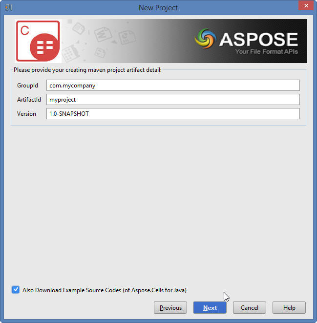
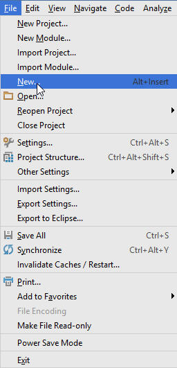
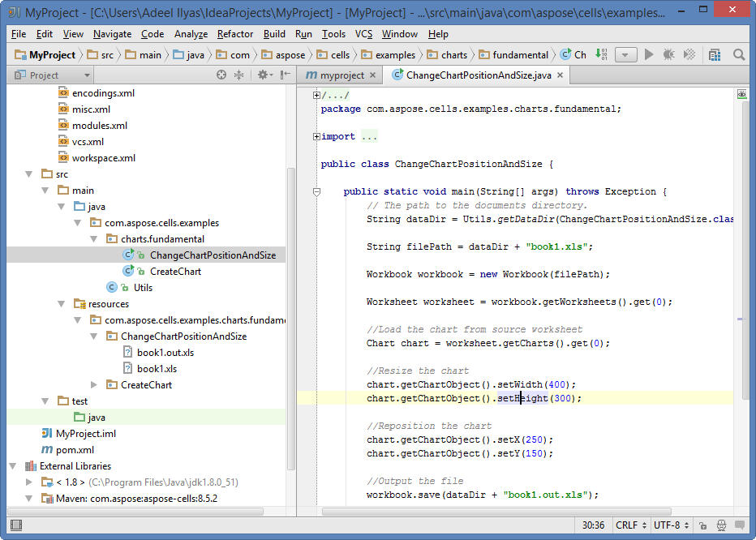

## **Installing**
### **How to Install Aspose.Cells Java for IntelliJ IDEA (Maven)**
Steps below demonstrate how to install **Aspose.Cells Java for IntelliJ IDEA (Maven)** plugin.

The plugin is listed on IntelliJ IDEA’s CE [official plugin website](https://goo.gl/R4pysl) – plugin repository as **Aspose.Cells Java for IntelliJ IDEA Maven**, so you don’t need to download it manually and install it from disk, but this extra option still exists in IntelliJ IDEA.

**Aspose.Cells Java for IntelliJ IDEA (Maven)** plugin can be easily installed (without manual downloading) from within IntelliJ IDEA. To do it:

1. Select **Settings** from the **File** menu.  
2. Click **Plugins**, then browse the repositories in IntelliJ IDEA.  

### **Aspose.Cells Maven Project Wizard**
Installing this plugin will introduce a new project type –  

**Aspose.Cells Maven Project** – into IntelliJ IDEA, which will enable you to create an Aspose.Cells Maven‑based project for using [Aspose.Cells for Java API](http://goo.gl/c1eSD2).  

### **Aspose.Cells Examples Wizard**
An option for creating [Source Code Examples of using Aspose.Cells for Java API](https://github.com/aspose-cells/Aspose.Cells-for-Java/tree/master/Examples) inside the project will also appear after the installation under the **New** menu (using Right Click → New **OR** File menu → New) –  

**Aspose.Cells Examples**

## **Using**
### **Aspose.Cells Maven Project Wizard**
To create an Aspose.Cells Maven project for using [Aspose.Cells for Java API](http://goo.gl/c1eSD2) within IntelliJ IDEA, you need to have an Internet connection.

Then follow the steps below:

1. Select **New Project**.  
2. Select **Aspose.Cells Maven Project**.  
3. Click **Next**.  

4. Provide a **GroupId, ArtifactId**, and **Version** for your Maven project and click **Next**.  

   You can select the **"Also Download Examples Source Code"** checkbox to download the sample usage examples of the API (as shown in the snapshot above).

5. Provide a **Project Name** and **Location**, just like when creating any Java application.  

6. Click **Finish**.  
   This will retrieve the [Aspose.Cells for Java API](http://goo.gl/c1eSD2) latest Maven dependency reference from the Aspose Cloud Maven Repository and configure it in `pom.xml`.  
   If you have selected the **"Also Download Examples Source Code"** checkbox, downloading of the examples will also begin from the [Aspose.Cells for Java API GitHub Repository](https://github.com/aspose-cells/Aspose.Cells-for-Java/tree/master/Examples).  

Congratulations!  You have successfully created an Aspose.Cells Maven project for using [Aspose.Cells for Java API](http://goo.gl/c1eSD2).

The created Aspose.Cells for Java API Maven project is ready to be modified as per your project’s requirements.

If you have opted to download [Examples Source Codes](https://github.com/aspose-cells/Aspose.Cells-for-Java/tree/master/Examples), you can use the Aspose.Cells Examples Wizard to copy/create the downloaded examples into your project.

### **Aspose.Cells Examples Wizard**
To create/copy [Examples Source Codes](https://github.com/aspose-cells/Aspose.Cells-for-Java/tree/master/Examples) into the project using **Aspose.Cells Examples Wizard**, you need to first download the examples by selecting the **"Also Download Examples Source Code"** option on the Aspose.Cells Maven Project Wizard.

Then follow the steps below in IntelliJ IDEA:

1. Select **File → New** – as shown below:  

   

   -or- **Right‑click** (on the project window) → **New** – as shown below:  

   

2. Select the **Aspose.Cells Example** option from the menu – as shown below:  

   

3. The wizard will refresh/check for the latest available [Aspose.Cells for Java API Examples](https://github.com/aspose-cells/Aspose.Cells-for-Java/tree/master/Examples).  

   

4. The **Aspose.Cells Examples Wizard** dialog will appear, where you can select any example category to create/copy the examples into your project.  
   Select any examples category and click **Create**:  

   

5. This will create/copy the selected category examples into the project under the **com.aspose.cells.examples** package.  
   Any required resources for the execution of the examples will also be copied to the **src/main/resources** folder – as shown below:

   

Congratulations!  You have successfully done the following:

1. You have created an Aspose.Cells Maven Project using the Aspose.Cells Maven Project Wizard.  
2. You have downloaded [Aspose.Cells for Java API Examples Source Codes](https://github.com/aspose-cells/Aspose.Cells-for-Java/tree/master/Examples).  
3. You have created/copied the Examples Source Codes into your project by using the Aspose.Cells Examples Wizard.
