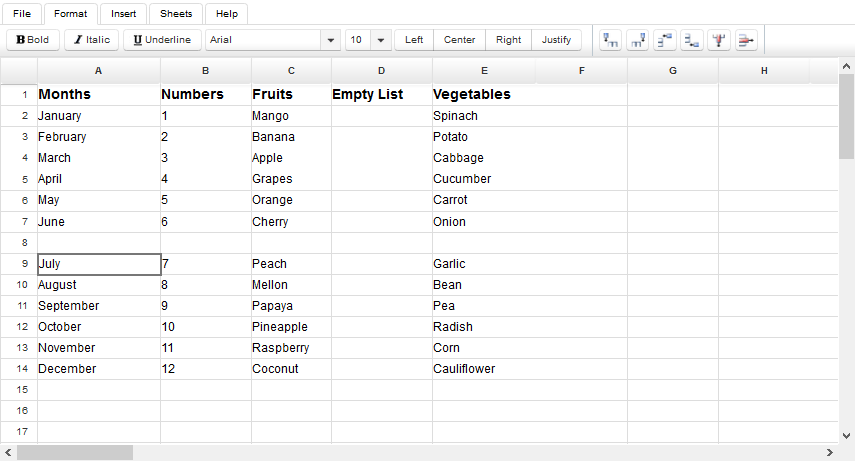

**Table of Contents**

- [Add a Row](#SpreadsheetEditor-WorkingwithRowsandColumns-AddaRow) 
  - WorksheetView.addRowAbove
  - WorksheetView.addRowBelow
- [Add a Column](#SpreadsheetEditor-WorkingwithRowsandColumns-AddaColumn) 
  - WorksheetView.addColumnBefore
  - WorksheetView.addColumnAfter
- [Delete a Row](#SpreadsheetEditor-WorkingwithRowsandColumns-DeleteaRow) 
  - WorksheetView.deleteRow
- [Delete a Column](#SpreadsheetEditor-WorkingwithRowsandColumns-DeleteaColumn) 
  - WorksheetView.deleteColumn
- [Column Width and Row Height](#SpreadsheetEditor-WorkingwithRowsandColumns-ColumnWidthandRowHeight) 
  - WorksheetView.setCurrentRowHeight
  - WorksheetView.setCurrentColumnWidth
- [Insert a Cell](#SpreadsheetEditor-WorkingwithRowsandColumns-InsertaCell) 
  - WorksheetView.addCellShiftRight
  - WorksheetView.addCellShiftDown

### **Add a Row**
To add a new row:

1. Click on a cell where you want to add a row.  
2. Switch to **the Format tab**.  
3. Click **Add Row above** to add a row above the selected cell.  
4. Click **Add Row below** to add a row below the selected cell.

The editor will add a new row at the selected location.

**How it works?**

The **Add Row above** and **Add Row below** are handled by JSF backend bean **WorksheetView**. The source code of the respective methods is as follows:
#### **WorksheetView.addRowAbove**


     public void addRowAbove() {

        try {

            getAsposeWorksheet().getCells().insertRows(currentRowId, 1, true);

        } catch (com.aspose.cells.CellsException cx) {

            msg.sendMessage("Could not add row", cx.getMessage());

            return;

        }

        purge();

        reloadRowHeight(currentRowId);

    }



#### **WorksheetView.addRowBelow**


     public void addRowBelow() {

        if (getCurrentRowId() < 0) {

            msg.sendMessage("No cell selected", null);

            return;

        }

        int newRowId = currentRowId + 1;

        try {

            getAsposeWorksheet().getCells().insertRows(newRowId, 1, true);

        } catch (com.aspose.cells.CellsException cx) {

            msg.sendMessage("Could not add row", cx.getMessage());

            return;

        }

        purge();

        reloadRowHeight(newRowId);

    }



### **Add a Column**
To add a new column:

1. Click on a cell where you want to add a column.  
2. Switch to **the Format tab**.  
3. Click **Add Column Before** to add a column before the selected cell.  
4. Click **Add Column After** to add a column after the selected cell.

The editor will add a new column at the selected location.

**How it works?**

The **Add Column Before** and **Add Column After** are handled by JSF backend bean **WorksheetView**. The source code of the respective methods is as follows:
#### **WorksheetView.addColumnBefore**


     public void addColumnBefore() {

        try {

            getAsposeWorksheet().getCells().insertColumns(getCurrentColumnId(), 1, true);

        } catch (com.aspose.cells.CellsException cx) {

            msg.sendMessage("Could not add column", cx.getMessage());

            return;

        }

        reloadColumnWidth(currentColumnId);

        purge();

    }



#### **WorksheetView.addColumnAfter**


     public void addColumnAfter() {

        int newColumnId = currentColumnId + 1;

        try {

            getAsposeWorksheet().getCells().insertColumns(newColumnId, 1, true);

        } catch (com.aspose.cells.CellsException cx) {

            msg.sendMessage("Could not add column", cx.getMessage());

            return;

        }

        reloadColumnWidth(newColumnId);

        purge();

    }



### **Delete a Row**
To delete a row:

1. Click on a cell in the row you want to delete.  
2. Switch to **the Format tab**.  
3. Click **Delete Row** button.

The editor will delete the row which includes the selected cell.

**How it works?**

The **Delete Row** button is handled by JSF backend bean **WorksheetView** using method **WorksheetView.deleteRow**:
#### **WorksheetView.deleteRow**


     public void deleteRow() {

        try {

            getAsposeWorksheet().getCells().deleteRows(currentRowId, 1, true);

        } catch (com.aspose.cells.CellsException cx) {

            msg.sendMessage("Could not delete row", cx.getMessage());

            return;

        }

        cells.getRows(workbook.getCurrent()).remove(currentRowId);

        getRowHeight().remove(currentRowId);

        purge();

    }



### **Delete a Column**
To delete a column:

1. Click on a cell in the column you want to delete.  
2. Switch to **the Format tab**.  
3. Click **Delete Column** button.

The editor will delete the column which includes the selected cell.

**How it works?**

The **Delete Column** button is handled by JSF backend bean **WorksheetView** using method **WorksheetView.deleteColumn**:
#### **WorksheetView.deleteColumn**


     public void deleteColumn() {

        try {

            getAsposeWorksheet().getCells().deleteColumns(currentColumnId, 1, true);

        } catch (com.aspose.cells.CellsException cx) {

            msg.sendMessage("Could not delete column", cx.getMessage());

            return;

        }

        cells.getColumns(workbook.getCurrent()).remove(currentColumnId);

        getRowHeight().remove(currentColumnId);

        purge();

    }



### **Column Width and Row Height**
To change the width of a column:

1. Click on any cell inside the column.  
2. Switch to **the Format tab**.  
3. Click **Column Width** button to open **Column Width** dialog.  
4. Enter a new value in the dialog box.  
5. Click **Close**.

The editor will change the width of the column.

**How to change row height?**

To change the height of a row:

1. Click on any cell inside the row.  
2. Switch to **the Format tab**.  
3. Click **Row Height** button to open **Row Height** dialog.  
4. Enter a new value in the dialog box.  
5. Click **Close**.

The editor will change the height of the row.

**How it works?**

When the user submits the width and height values, they are handled on the server side by the **setCurrentRowHeight** and **setCurrentColumnWidth** methods of JSF backend bean **WorksheetView**.
#### **WorksheetView.setCurrentRowHeight**


     public void setCurrentRowHeight(int height) {

        if (!isLoaded()) {

            return;

        }

        getAsposeWorksheet().getCells().setRowHeightPixel(currentRowId, height);

        reloadRowHeight(currentRowId);

        RequestContext.getCurrentInstance().update("sheet");

    }



#### **WorksheetView.setCurrentColumnWidth**


     public void setCurrentColumnWidth(int width) {

        if (!isLoaded()) {

            return;

        }

        getAsposeWorksheet().getCells().setColumnWidthPixel(currentColumnId, width);

        reloadColumnWidth(currentColumnId);

        RequestContext.getCurrentInstance().update("sheet");

    }



### **Insert a Cell**
To add a new cell:

1. Click on a cell where you want to add a new cell.  
2. Switch to **Insert tab**.  
3. Click **Cell** button.  
4. Choose **Shift Cells Right** or **Shift Cells Down** button.

The editor will add a new cell at the selected location. The adjacent cells will be automatically shifted either horizontally or vertically to create space for the new one.

**How it works?**

The **Shift Cells Right** and **Shift Cells Down** are handled by JSF backend bean **WorksheetView**. The source code of the respective methods is as follows:
#### **WorksheetView.addCellShiftRight**


     public void addCellShiftRight() {

        if (!isLoaded()) {

            return;

        }

        com.aspose.cells.CellArea a = new com.aspose.cells.CellArea();

        a.StartColumn = a.EndColumn = currentColumnId;

        a.StartRow = a.EndRow = currentRowId;

        getAsposeWorksheet().getCells().insertRange(a, com.aspose.cells.ShiftType.RIGHT);

        purge();

    }



#### **WorksheetView.addCellShiftDown**


     public void addCellShiftDown() {

        if (!isLoaded()) {

            return;

        }

        com.aspose.cells.CellArea a = new com.aspose.cells.CellArea();

        a.StartColumn = a.EndColumn = currentColumnId;

        a.StartRow = a.EndRow = currentRowId;

        getAsposeWorksheet().getCells().insertRange(a, com.aspose.cells.ShiftType.DOWN);

        purge();

    }



