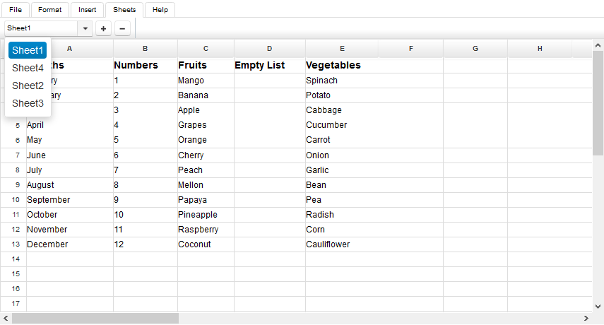

**Table of Contents**

- [Add and Remove Sheets](#SpreadsheetEditor-WorkingwithSheets-AddandRemoveSheets) 
  - WorksheetView.onAddNewSheet
  - WorksheetView.onRemoveActiveSheet
- [Rename Sheets](#SpreadsheetEditor-WorkingwithSheets-RenameSheets) 
  - WorksheetView.setActiveSheet
- [Switch between Sheets](#SpreadsheetEditor-WorkingwithSheets-SwitchbetweenSheets) 
  - WorksheetView.setActiveSheet

### **Add and Remove Sheets**
Microsoft Excel allows multiple sheets in a single file. The HTML5 Spreadsheet Editor allows the user to add and remove sheets. On the Sheets tab we have a drop‑down list of sheets. The selected sheet is the one that is opened by the editor.

To add a new sheet:

1. Switch to **Sheets tab**.
2. Click **+** (plus) button.

A new sheet will be added and the editor will switch to it.

To remove the currently selected sheet:

1. Switch to **Sheets tab**.
2. Click **-** (minus) button.

The currently selected sheet will be removed and the editor will switch to the last selected one.

**How it works**

When the user clicks the **+** (plus) or **-** (minus) button, the JSF backend bean **WorksheetView** handles the events using **WorksheetView.onAddNewSheet** and **WorksheetView.onRemoveActiveSheet** methods.

#### **WorksheetView.onAddNewSheet**


     public void onAddNewSheet() {

        if (isLoaded()) {

            try {

                int i = getAsposeWorksheets().add();

                getAsposeWorksheets().setActiveSheetIndex(i);

                purge();

            } catch (com.aspose.cells.CellsException cx) {

                msg.sendMessage("New Worksheet", cx.getMessage());

            }

        }

    }



#### **WorksheetView.onRemoveActiveSheet**


     public void onRemoveActiveSheet() {

        if (isLoaded()) {

            try {

                int i = getAsposeWorksheets().getActiveSheetIndex();

                getAsposeWorksheets().removeAt(i);

                if (getAsposeWorksheets().getCount() == 0) {

                    int j = getAsposeWorksheets().add();

                    getAsposeWorksheets().setActiveSheetIndex(j);

                }

                purge();

            } catch (com.aspose.cells.CellsException cx) {

                msg.sendMessage("Could not remove sheet", cx.getMessage());

            }

        }

    }



### **Rename Sheets**
To rename a sheet:

1. Switch to **Sheets tab**.
2. Click on the sheet name in the text box to edit it.
3. Change the name of the sheet.
4. When finished, press **ENTER** key, or click anywhere outside the box.

The sheet will be renamed.

**How it works**

When the text box value is changed, the event is handled on the server by the JSF backend bean **WorksheetView** using the method **WorksheetView.setActiveSheet**.

#### **WorksheetView.setActiveSheet**


     public void setActiveSheet(String name) {

        com.aspose.cells.Worksheet w = getAsposeWorksheets().get(name);

        if (w != null) {

            int i = w.getIndex();

            getAsposeWorksheets().setActiveSheetIndex(i);

        } else {

            getAsposeWorksheet().setName(name);

        }

        purge();

    }



### **Switch between Sheets**
To switch to another sheet:

1. Switch to **Sheets tab**.
2. Select a sheet from the drop‑down menu.

The editor will switch to the selected sheet.

**How it works**

When the drop‑down selector's value is changed, the event is handled on the server by the JSF backend bean **WorksheetView** using the method **WorksheetView.setActiveSheet**.

#### **WorksheetView.setActiveSheet**


     public void setActiveSheet(String name) {

        com.aspose.cells.Worksheet w = getAsposeWorksheets().get(name);

        if (w != null) {

            int i = w.getIndex();

            getAsposeWorksheets().setActiveSheetIndex(i);

        } else {

            getAsposeWorksheet().setName(name);

        }

        purge();

    }




