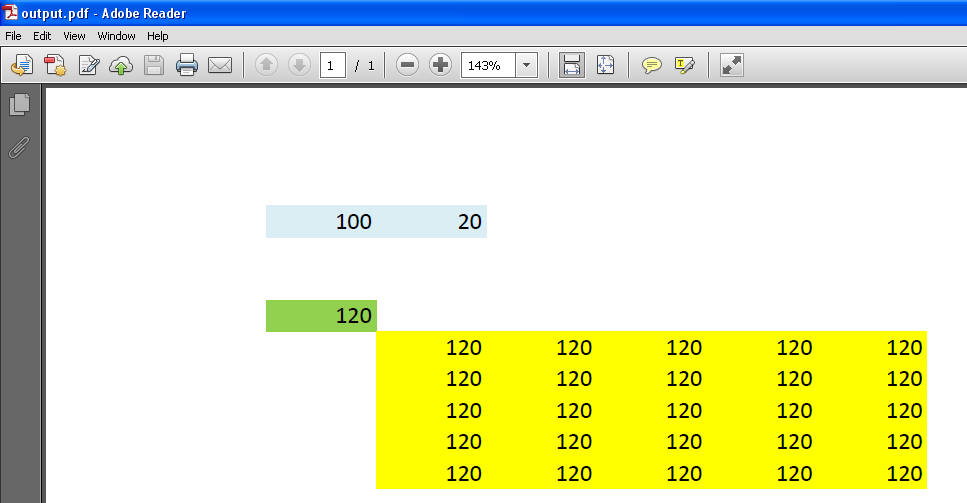

{}

You can create a Data Table in Microsoft Excel using **Data > What‑If Analysis > Data Table**. Aspose.Cells now allows you to calculate the array formula of a data table. Please use [**Workbook.calculateFormula()**](https://reference.aspose.com/cells/javascript-cpp/workbook/#calculateFormula--) as usual for calculating any type of formulas.

{}

In the following sample code, we used the **source Excel file** (`5115535.xlsx`). If you change the value of cell **B1** to **100**, the values of the Data Table cells that are filled with yellow color will become **120**, as shown in the following images. The sample code generates the **output PDF** (`5115538.pdf`).




```html
<!DOCTYPE html>
<html>
    <head>
        <title>Aspose.Cells Example</title>
    </head>
    <body>
        <h1>DataTable Calculation Example</h1>
        <input type="file" id="fileInput" accept=".xls,.xlsx,.csv" />
        <button id="runExample">Run Example</button>
        <a id="downloadLink" style="display: none;">Download Result</a>
        <div id="result"></div>
    </body>

    <script src="aspose.cells.js.min.js"></script>
    <script type="text/javascript">
        const { Workbook, SaveFormat } = AsposeCells;
        
        AsposeCells.onReady({
            license: "/lic/aspose.cells.enc",
            fontPath: "/fonts/",
            fontList: [
                "arial.ttf",
                "NotoSansSC-Regular.ttf"
            ]
        }).then(() => {
            console.log("Aspose.Cells initialized");
        });

        document.getElementById('runExample').addEventListener('click', async () => {
            const fileInput = document.getElementById('fileInput');
            if (!fileInput.files.length) {
                document.getElementById('result').innerHTML = '<p style="color: red;">Please select an Excel file.</p>';
                return;
            }

            const file = fileInput.files[0];
            const arrayBuffer = await file.arrayBuffer();

            // Creating a Workbook from the uploaded file
            const workbook = new Workbook(new Uint8Array(arrayBuffer));

            // Access first worksheet
            const worksheet = workbook.worksheets.get(0);

            // When you put 100 in B1, all Data Table values formatted in yellow will become 120
            const cell = worksheet.cells.get("B1");
            cell.putValue(100);

            // Calculate formula, now it also calculates Data Table array formula
            workbook.calculateFormula();

            // Save the workbook in PDF format
            const outputData = workbook.save(SaveFormat.Pdf);
            const blob = new Blob([outputData], { type: "application/pdf" });
            const downloadLink = document.getElementById('downloadLink');
            downloadLink.href = URL.createObjectURL(blob);
            downloadLink.download = 'output.pdf';
            downloadLink.style.display = 'block';
            downloadLink.textContent = 'Download PDF File';

            document.getElementById('result').innerHTML = '<p style="color: green;">Operation completed successfully! Click the download link to get the PDF file.</p>';
        });
    </script>
</html>
```