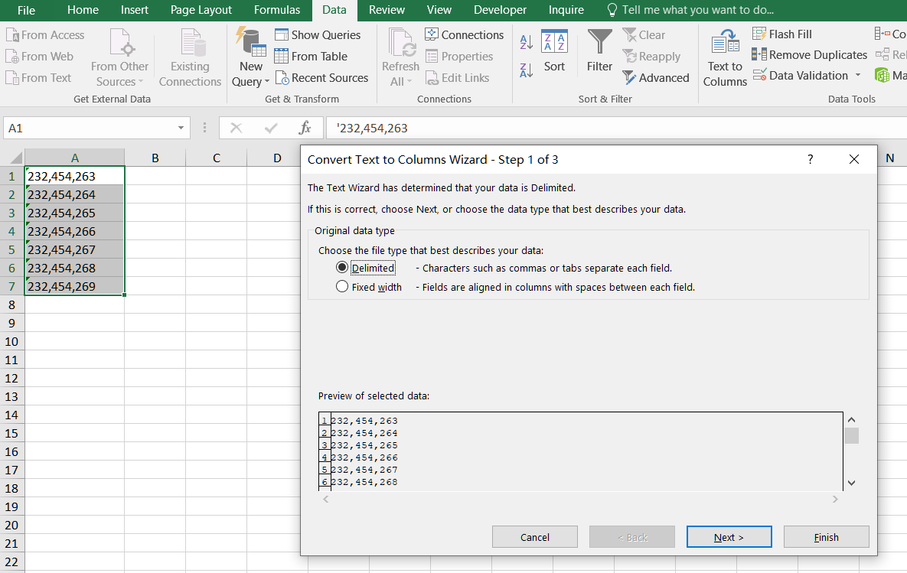

## **Possible Usage Scenarios**
Sometimes, you want to convert numeric data entered as text to numbers. You can enter numbers as text in Microsoft Excel by putting an apostrophe before a number, for example **'12345**. Excel then treats the number as a string. Aspose.Cells for JavaScript via C++ allows you to convert strings to numbers.


## How to Convert numbers stored as text to numbers in Excel
You can convert numbers stored as text to numbers by following a few simple steps.
1. Select any single cell or range of cells that has an error indicator in the upper-left corner.
1. Next to the selected cell or range of cells, click the error button that appears. On the menu, click Convert to Number. 
<br>

1. If the alert button is not available, Select a column with this problem. If you don't want to convert the whole column, you can select one or more cells instead. Just be sure the cells you select are in the same column, otherwise this process won't work. The Text to Columns button is typically used for splitting a column, but it can also be used to convert a single column of text to numbers. On the Data tab, click Text to Columns.
<br>

1. Click the Finish button in the pop-up box.
<br>

1. The numbers stored as text are transformed into numbers.
<br>


## How to Convert numbers stored as text to numbers using Aspose.Cells for JavaScript via C++
Aspose.Cells for JavaScript via C++ provides the [**Cells.convertStringToNumericValue()**](https://reference.aspose.com/cells/javascript-cpp/cells/#convertStringToNumericValue--) method which can be used to convert all string or text numeric data into numbers.

The following screenshot shows string numbers in cells **A1:A17**. String numbers are aligned to the left.
<br>


These string numbers have been converted to numbers using [**Cells.convertStringToNumericValue()**](https://reference.aspose.com/cells/javascript-cpp/cells/#convertStringToNumericValue--) in the following screenshot. As you can see, they are now right-aligned.
<br>


## JavaScript code to convert string numeric data to actual numbers

The following sample code illustrates how to convert all string numeric data to actual numbers in all worksheets.

```html
<!DOCTYPE html>
<html>
    <head>
        <title>Aspose.Cells Example</title>
    </head>
    <body>
        <h1>Convert Strings to Numeric Values in All Sheets</h1>
        <input type="file" id="fileInput" accept=".xls,.xlsx,.csv" />
        <button id="runExample">Run Example</button>
        <a id="downloadLink" style="display: none;">Download Result</a>
        <div id="result"></div>
    </body>

    <script src="aspose.cells.js.min.js"></script>
    <script type="text/javascript">
        const { Workbook, SaveFormat } = AsposeCells;
        
        AsposeCells.onReady({
            license: "/lic/aspose.cells.enc",
            fontPath: "/fonts/",
            fontList: [
                "arial.ttf",
                "NotoSansSC-Regular.ttf"
            ]
        }).then(() => {
            console.log("Aspose.Cells initialized");
        });

        document.getElementById('runExample').addEventListener('click', async () => {
            const fileInput = document.getElementById('fileInput');
            if (!fileInput.files.length) {
                document.getElementById('result').innerHTML = '<p style="color: red;">Please select an Excel file.</p>';
                return;
            }

            const file = fileInput.files[0];
            const arrayBuffer = await file.arrayBuffer();

            // Instantiate workbook object with the uploaded Excel file
            const workbook = new Workbook(new Uint8Array(arrayBuffer));

            // Access worksheets collection
            const sheets = workbook.worksheets;
            const sheetcount = sheets.count;

            // Iterate through all worksheets and convert strings to numeric values
            for (let i = 0; i < sheetcount; i++) {
                const sheet = sheets.get(i);
                sheet.cells.convertStringToNumericValue();
            }

            // Save the modified workbook and provide a download link
            const outputData = workbook.save(SaveFormat.Xlsx);
            const blob = new Blob([outputData]);
            const downloadLink = document.getElementById('downloadLink');
            downloadLink.href = URL.createObjectURL(blob);
            downloadLink.download = 'output_out.xlsx';
            downloadLink.style.display = 'block';
            downloadLink.textContent = 'Download Excel File';

            document.getElementById('result').innerHTML = '<p style="color: green;">Conversion completed successfully! Click the download link to get the modified file.</p>';
        });
    </script>
</html>
```