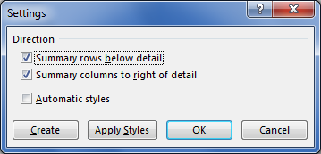

{}

This article explains how to apply a subtotal to data and change the direction of outline summary rows below detail.

You can apply a subtotal to data using the [**Worksheet.cells.subtotal()**](https://reference.aspose.com/cells/javascript-cpp/cells/#subtotal-cellarea-number-consolidationfunction-numberarray-boolean-boolean-boolean-) method. It takes the following parameters.

- **CellArea** – The range to which the subtotal is applied.  
- **GroupBy** – The field to group by, as a zero‑based integer offset.  
- **Function** – The subtotal function.  
- **TotalList** – An array of zero‑based field offsets indicating the fields to which the subtotals are added.  
- **Replace** – Indicates whether to replace the current subtotals.  
- **PageBreaks** – Indicates whether to add a page break between groups.  
- **SummaryBelowData** – Indicates whether to add a summary below the data.

You can also control the direction of **Outline Summary rows below detail** as shown in the following screenshot by using the `Worksheet.outline.summaryRowBelow` property. This setting can be opened in Microsoft Excel via **Data > Outline > Settings**.



{}

## Images of source and output files

The following screenshot shows the source Excel file used in the sample code below, which contains data in columns A and B.


The following screenshot shows the output Excel file generated by the sample code. As you can see, a subtotal has been applied to range **A2:B11**, and the outline direction is set to summary rows below detail.


## JavaScript to apply subtotal and change the direction of outline summary rows

```html
<!DOCTYPE html>
<html>
    <head>
        <title>Aspose.Cells Subtotal Example</title>
    </head>
    <body>
        <h1>Apply Subtotal Example</h1>
        <input type="file" id="fileInput" accept=".xls,.xlsx,.csv" />
        <button id="runExample">Run Example</button>
        <a id="downloadLink" style="display: none;">Download Result</a>
        <div id="result"></div>
    </body>

    <script src="aspose.cells.js.min.js"></script>
    <script type="text/javascript">
        const { Workbook, SaveFormat, CellArea, ConsolidationFunction, Utils } = AsposeCells;
        
        AsposeCells.onReady({
            license: "/lic/aspose.cells.enc",
            fontPath: "/fonts/",
            fontList: [
                "arial.ttf",
                "NotoSansSC-Regular.ttf"
            ]
        }).then(() => {
            console.log("Aspose.Cells initialized");
        });

        document.getElementById('runExample').addEventListener('click', async () => {
            const fileInput = document.getElementById('fileInput');
            if (!fileInput.files.length) {
                document.getElementById('result').innerHTML = '<p style="color: red;">Please select an Excel file.</p>';
                return;
            }

            const file = fileInput.files[0];
            const arrayBuffer = await file.arrayBuffer();

            // Create a workbook from the uploaded Excel file
            const workbook = new Workbook(new Uint8Array(arrayBuffer));

            // Access the first worksheet
            const worksheet = workbook.worksheets.get(0);

            // Get the Cells collection in the first worksheet
            const cells = worksheet.cells;

            // Create a cell area, i.e., A2:B11
            const ca = CellArea.createCellArea("A2", "B11");

            // Apply subtotal; the consolidation function is Sum and it will be applied to the second column (B) in the list
            cells.subtotal(ca, 0, ConsolidationFunction.Sum, [1], true, false, true);

            // Set the direction of outline summary
            worksheet.outline.summaryRowBelow = true;

            // Save the Excel file
            const outputData = workbook.save(SaveFormat.Xlsx);
            const blob = new Blob([outputData]);
            const downloadLink = document.getElementById('downloadLink');
            downloadLink.href = URL.createObjectURL(blob);
            downloadLink.download = 'output_out.xlsx';
            downloadLink.style.display = 'block';
            downloadLink.textContent = 'Download Modified Excel File';

            document.getElementById('result').innerHTML = '<p style="color: green;">Subtotal applied successfully! Click the download link to get the modified file.</p>';
        });
    </script>
</html>
```