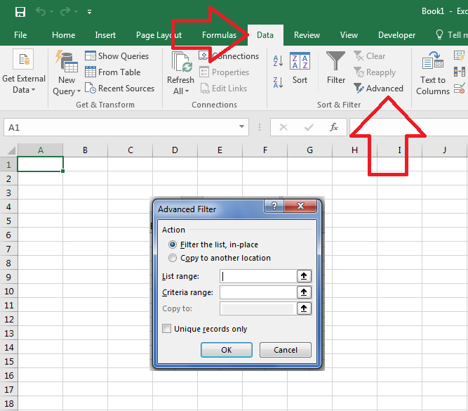

## **Possible Usage Scenarios**  

Microsoft Excel allows you to apply *Advanced Filter* on worksheet data to display records that meet complex criteria. You can apply Advanced Filter with Microsoft Excel via its *Data > Advanced* command as shown in this screenshot.  

  

Aspose.Cells for JavaScript via C++ also allows you to apply the Advanced Filter using the [**Worksheet.advanced_Filter()**](https://reference.aspose.com/cells/javascript-cpp/worksheet/#advanced_Filter-boolean-string-string-string-boolean-) method. Just like Microsoft Excel, it accepts the following parameters.  

**isFilter**  

Indicates whether filtering the list in place.  

**listRange**  

The list range.  

**criteriaRange**  

The criteria range.  

**copyTo**  

The range where copying data to.  

**uniqueRecordOnly**  

Only displaying or copying unique rows.  

## **Apply Advanced Filter of Microsoft Excel to Display Records Meeting Complex Criteria**  

The following sample code applies the advanced filter on the [Sample Excel File](48496692.xlsx) and generates the [Output Excel File](48496691.xlsx). The screenshot shows both files for comparison. As you can see inside the screenshot, data has been filtered inside the output Excel file according to complex criteria.  

  

## **Sample Code**  

```html
<!DOCTYPE html>
<html>
    <head>
        <title>Aspose.Cells Advanced Filter Example</title>
    </head>
    <body>
        <h1>Advanced Filter Example</h1>
        <input type="file" id="fileInput" accept=".xls,.xlsx" />
        <button id="runExample">Run Advanced Filter</button>
        <a id="downloadLink" style="display: none;">Download Result</a>
        <div id="result"></div>
    </body>

    <script src="aspose.cells.js.min.js"></script>
    <script type="text/javascript">
        const { Workbook, SaveFormat } = AsposeCells;
        
        AsposeCells.onReady({
            license: "/lic/aspose.cells.enc",
            fontPath: "/fonts/",
            fontList: [
                "arial.ttf",
                "NotoSansSC-Regular.ttf"
            ]
        }).then(() => {
            console.log("Aspose.Cells initialized");
        });

        document.getElementById('runExample').addEventListener('click', async () => {
            const fileInput = document.getElementById('fileInput');
            if (!fileInput.files.length) {
                document.getElementById('result').innerHTML = '<p style="color: red;">Please select an Excel file (sampleAdvancedFilter.xlsx).</p>';
                return;
            }

            const file = fileInput.files[0];
            const arrayBuffer = await file.arrayBuffer();

            const wb = new Workbook(new Uint8Array(arrayBuffer));

            const ws = wb.worksheets.get(0);

            // Apply advanced filter on range A5:D19 with criteria A1:D2, filter in place, include all records (not unique)
            ws.advanced_Filter(true, "A5:D19", "A1:D2", "", false);

            const outputData = wb.save(SaveFormat.Xlsx);
            const blob = new Blob([outputData]);
            const downloadLink = document.getElementById('downloadLink');
            downloadLink.href = URL.createObjectURL(blob);
            downloadLink.download = 'outputAdvancedFilter.xlsx';
            downloadLink.style.display = 'block';
            downloadLink.textContent = 'Download Filtered Excel File';

            document.getElementById('result').innerHTML = '<p style="color: green;">Advanced filter applied successfully! Click the download link to get the modified file.</p>';
        });
    </script>
</html>
```