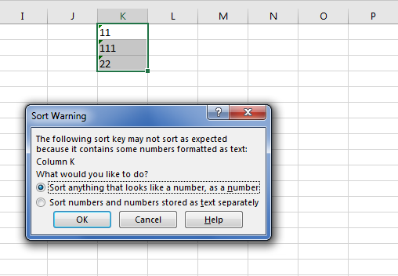

## **Possible Usage Scenarios**

Please consider this textual data i.e. {11, 111, 22}. This textual data is sorted because, in terms of text, 111 comes before 22. But, if you want to sort this data not as text but as numbers, then it will become {11, 22, 111} because numerically 111 comes after 22. Aspose.Cells for JavaScript via C++ provides {0} property to deal with this issue. Please set this property **true** and your textual data will be sorted as numerical data. The following screenshot shows the sort warning shown by Microsoft Excel when textual data which looks like numerical data is sorted.



## **Sample Code**

The following sample code illustrates the usage of [**DataSorter.sortAsNumber**](https://reference.aspose.com/cells/javascript-cpp/datasorter/#sortAsNumber-boolean-) property as explained earlier. Please check its [sample Excel file](43352075.xlsx) and [output Excel file](43352076.xlsx) for more help.

```html
<!DOCTYPE html>
<html>
    <head>
        <title>Aspose.Cells Sort As Number Example</title>
    </head>
    <body>
        <h1>Sort As Number Example</h1>
        <input type="file" id="fileInput" accept=".xls,.xlsx,.csv" />
        <button id="runExample">Run Example</button>
        <a id="downloadLink" style="display: none;">Download Result</a>
        <div id="result"></div>
    </body>

    <script src="aspose.cells.js.min.js"></script>
    <script type="text/javascript">
        const { Workbook, SaveFormat, CellsHelper, CellArea, SortOrder } = AsposeCells;
        
        AsposeCells.onReady({
            license: "/lic/aspose.cells.enc",
            fontPath: "/fonts/",
            fontList: [
                "arial.ttf",
                "NotoSansSC-Regular.ttf"
            ]
        }).then(() => {
            console.log("Aspose.Cells initialized");
        });

        document.getElementById('runExample').addEventListener('click', async () => {
            const fileInput = document.getElementById('fileInput');
            if (!fileInput.files.length) {
                document.getElementById('result').innerHTML = '<p style="color: red;">Please select an Excel file.</p>';
                return;
            }

            const file = fileInput.files[0];
            const arrayBuffer = await file.arrayBuffer();
            
            // Instantiating a Workbook object from the uploaded file
            const workbook = new Workbook(new Uint8Array(arrayBuffer));
            
            // Accessing the first worksheet in the Excel file
            const worksheet = workbook.worksheets.get(0);
            
            // Create your cell area.
            const ca = AsposeCells.CellArea.createCellArea("A1", "A20");
            
            // Create your sorter.
            const sorter = workbook.dataSorter;
            
            // Find the index for column A.
            const idx = CellsHelper.columnNameToIndex("A");
            
            // Add key in sorter, it will sort in Ascending order.
            sorter.addKey(idx, SortOrder.Ascending);
            
            // Set sort as number
            sorter.sortAsNumber = true;
            
            // Perform sort.
            sorter.sort(worksheet.cells, ca);
            
            // Saving the modified Excel file
            const outputData = workbook.save(SaveFormat.Xlsx);
            const blob = new Blob([outputData]);
            const downloadLink = document.getElementById('downloadLink');
            downloadLink.href = URL.createObjectURL(blob);
            downloadLink.download = 'outputSortAsNumber.xlsx';
            downloadLink.style.display = 'block';
            downloadLink.textContent = 'Download Modified Excel File';
            
            document.getElementById('result').innerHTML = '<p style="color: green;">Sort completed successfully! Click the download link to get the modified file.</p>';
        });
    </script>
</html>
```