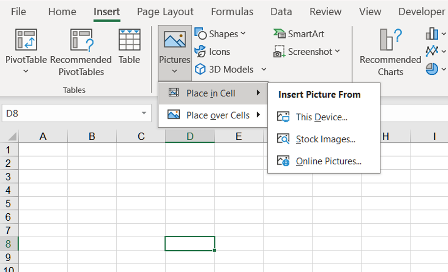
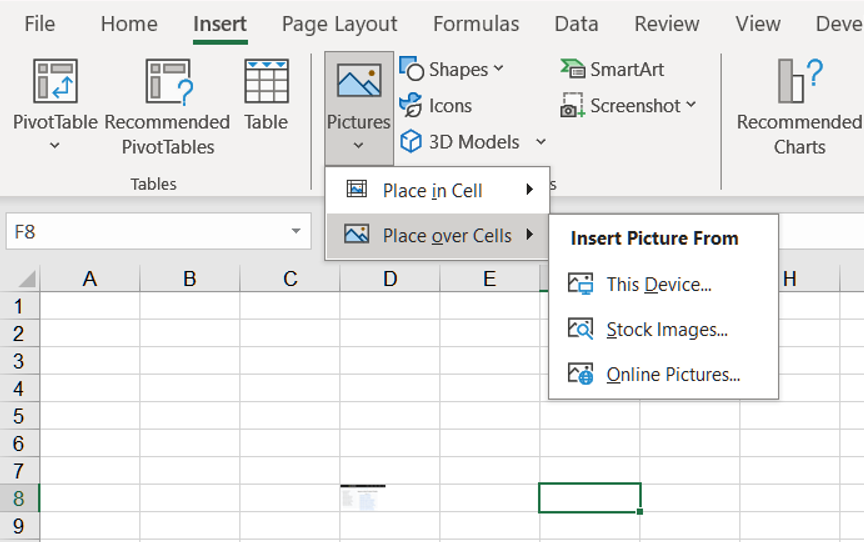
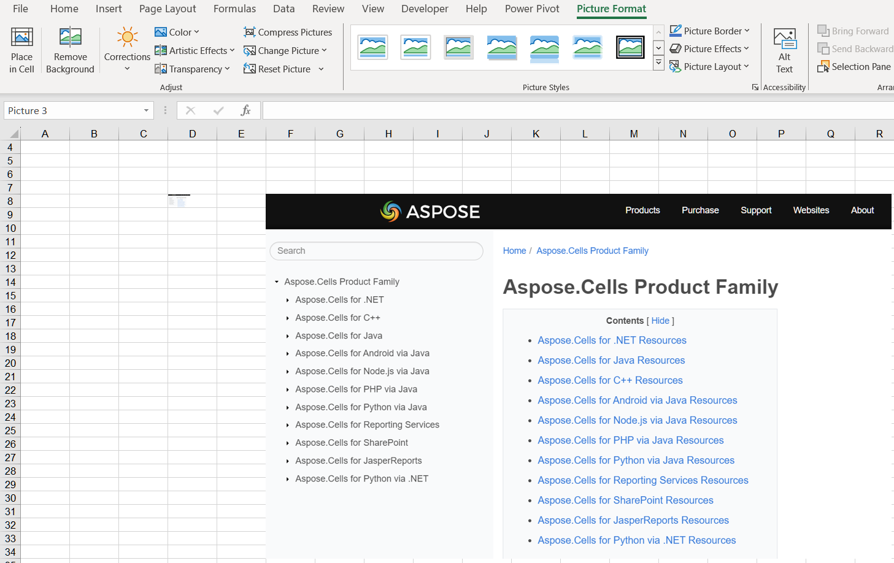
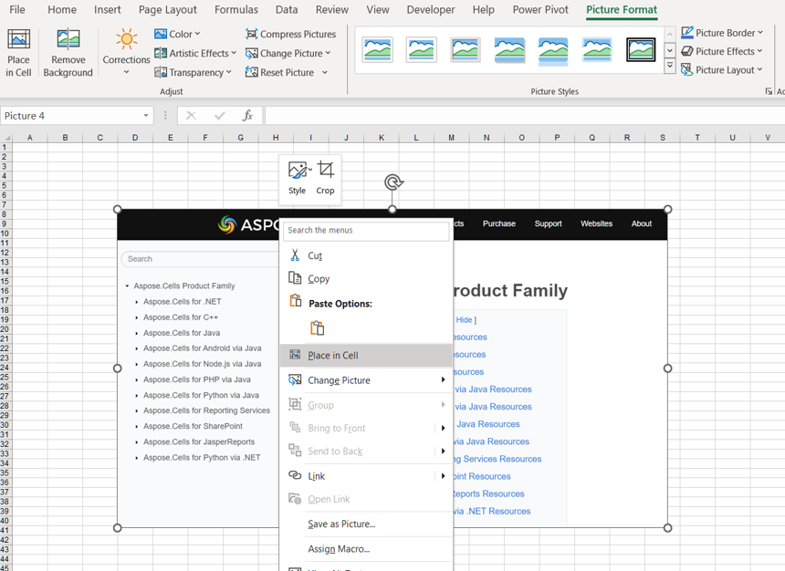

## **Possible Usage Scenarios**
The image adds a touch of brightness to your worksheet and provides a visual representation of the content. They also make it easier for you to understand the data and derive insights. Although you have been able to use images in Excel for many years, Excel has only recently enabled the feature that allows images to become actual cell values. Even if the layout of the drawing is modified, it will still be attached to the data. You can use it in tables, sorting, filtering, including in formulas, and so on!

## **How to Insert Picture in Cell Using Excel**
To insert a picture into a cell in Excel, follow these steps:

1. Go to the **Insert** tab and click on the **Pictures** option.  
2. Select **Place in Cell**. Choose one of the following sources from the **Insert Picture From** dropdown menu (**This Device**, **Stock Images**, and **Online Pictures**).  
   * **This Device** – insert a picture from your device.  
   * **Stock Images** – insert a picture from the stock image collection.  
   * **Online Pictures** – insert a picture from the web.  
   <br>
   
3. Select the picture and insert it into a cell.  
   <br>
   

## **How to Insert Picture over Cells Using Excel**
To insert a picture over cells in Excel, follow these steps:

1. Go to the **Insert** tab and click on the **Pictures** option.  
2. Select **Place over Cells**. Choose one of the following sources from the **Insert Picture From** dropdown menu (**This Device**, **Stock Images**, and **Online Pictures**).  
   * **This Device** – insert a picture from your device.  
   * **Stock Images** – insert a picture from the stock image collection.  
   * **Online Pictures** – insert a picture from the web.  
   <br>
   
3. Select the picture and insert it over the cells.  
   <br>
   

## **How to Switch from Picture in Cell to Picture over Cells Using Excel**
You can easily switch from **Picture in Cell** to **Picture over Cells**. Please follow these steps:

1. Right‑click on the cell and select **Picture in Cell** → **Place over Cells**.  
   <br>
   
2. The result after switching is as follows:  
   <br>
   

## **How to Switch from Picture over Cells to Picture in Cell Using Excel**
You can easily switch from **Picture over Cells** to **Picture in Cell**. Please follow these steps:

1. Right‑click on the picture and select **Place in Cell**.  
   <br>
   
2. The result after switching is as follows:  
   <br>
   

## **How to Insert Picture in Cell Using Aspose.Cells for JavaScript via C++**
Insert a picture in a cell using Aspose.Cells. Please see the following sample code. After executing the example code, a picture will be inserted into a cell.

1. Instantiate a **Workbook** object.  
2. Get the cell where you want to insert the picture.  
3. Set the cell’s **EmbeddedImage** property.  
4. Finally, save the workbook in the [output XLSX](out.xlsx) format.  

## **Sample Code**

```html
<!DOCTYPE html>
<html>
    <head>
        <title>Aspose.Cells Example</title>
    </head>
    <body>
        <h1>Embed Image into New Workbook</h1>
        <p>Select an image file to embed into cell D8. A new workbook will be created with "Apple" in A2.</p>
        <input type="file" id="imageInput" accept="image/*" />
        <button id="runExample">Run Example</button>
        <a id="downloadLink" style="display: none;">Download Result</a>
        <div id="result"></div>
    </body>

    <script src="aspose.cells.js.min.js"></script>
    <script type="text/javascript">
        const { Workbook, SaveFormat } = AsposeCells;
        
        AsposeCells.onReady({
            license: "/lic/aspose.cells.enc",
            fontPath: "/fonts/",
            fontList: [
                "arial.ttf",
                "NotoSansSC-Regular.ttf"
            ]
        }).then(() => {
            console.log("Aspose.Cells initialized");
        });

        document.getElementById('runExample').addEventListener('click', async () => {
            const imageInput = document.getElementById('imageInput');
            const resultDiv = document.getElementById('result');

            // Create a new workbook
            const workbook = new Workbook();
            const cells = workbook.worksheets.get(0).cells;

            // Set A2 value to "Apple"
            const a2 = cells.get("A2");
            a2.value = "Apple";

            // Get D8 cell
            const d8 = cells.get("D8");

            // If an image file is selected, read it and embed into D8
            if (imageInput.files.length) {
                const file = imageInput.files[0];
                const arrayBuffer = await file.arrayBuffer();
                const imgBuf = new Uint8Array(arrayBuffer);
                d8.embeddedImage = imgBuf;
            }

            // Save workbook and provide download link
            const outputData = workbook.save(SaveFormat.Xlsx);
            const blob = new Blob([outputData]);
            const downloadLink = document.getElementById('downloadLink');
            downloadLink.href = URL.createObjectURL(blob);
            downloadLink.download = 'out.xlsx';
            downloadLink.style.display = 'block';
            downloadLink.textContent = 'Download Excel File';

            resultDiv.innerHTML = '<p style="color: green;">Workbook created successfully! Click the download link to get the file.</p>';
        });
    </script>
</html>
```