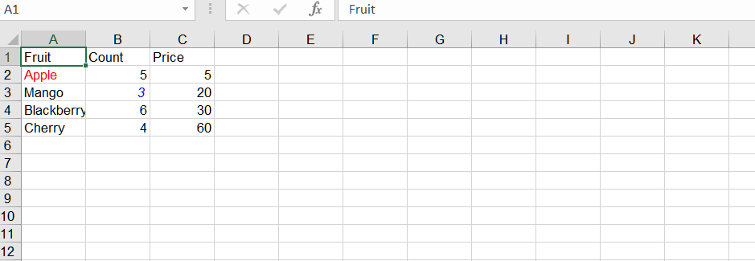

## **Possible Usage Scenarios**
When you want to highlight certain data, you can change the style of the cells.

## **How to change the format of a cell in Excel**

To change the format of a single cell in Excel, follow these steps:

1. Open Excel and open the workbook that contains the cell you want to format.

2. Locate the cell you want to format.

3. Right‑click on the cell and select **“Format Cells”** from the context menu. Alternatively, you can select the cell and go to the Home tab in the Excel ribbon, click on the **“Format”** dropdown in the **“Cells”** group, and select **“Format Cells.”**

4. The **“Format Cells”** dialog box will appear. Here, you can choose various formatting options to apply to the selected cell. For example, you can change the font style, font size, font color, number format, borders, background color, etc. Explore the different tabs in the dialog box to access various formatting options.

5. After making the desired formatting changes, click the **“OK”** button to apply the formatting to the selected cell.

## **How to change the format of a cell using JavaScript**

To change the format of a cell using Aspose.Cells, you can use the following methods:
1. [Cell.style(Style)](https://reference.aspose.com/cells/javascript-cpp/cell/#style-style-)
2. [Cell.style(Style, explicitFlag)](https://reference.aspose.com/cells/javascript-cpp/cell/#style-style-boolean-)
3. [Cell.style(Style, StyleFlag)](https://reference.aspose.com/cells/javascript-cpp/cell/#style-style-styleflag-)

## **Sample Code**
In this example, we create an Excel workbook, add some sample data, access the first worksheet, and get two cells ("A2" and "B3"). Then, we get the style of the cell, set various formatting options (e.g., font color, bold), and apply the format to the cell. Finally, we save the workbook to a new file.  


```html
<!DOCTYPE html>
<html>
    <head>
        <title>Aspose.Cells Example</title>
    </head>
    <body>
        <h1>Aspose.Cells Example</h1>
        <input type="file" id="fileInput" accept=".xls,.xlsx,.csv" />
        <button id="runExample">Run Example</button>
        <a id="downloadLink" style="display: none;">Download Result</a>
        <div id="result"></div>
    </body>

    <script src="aspose.cells.js.min.js"></script>
    <script type="text/javascript">
        const { Workbook, SaveFormat, Worksheet, Cell } = AsposeCells;
        
        AsposeCells.onReady({
            license: "/lic/aspose.cells.enc",
            fontPath: "/fonts/",
            fontList: [
                "arial.ttf",
                "NotoSansSC-Regular.ttf"
            ]
        }).then(() => {
            console.log("Aspose.Cells initialized");
        });

        document.getElementById('runExample').addEventListener('click', async () => {
            const fileInput = document.getElementById('fileInput');
            if (!fileInput.files.length) {
                document.getElementById('result').innerHTML = '<p style="color: red;">Please select an Excel file.</p>';
                return;
            }

            const file = fileInput.files[0];
            const arrayBuffer = await file.arrayBuffer();

            // Instantiating a Workbook object by opening the uploaded file
            const workbook = new Workbook(new Uint8Array(arrayBuffer));

            // Get the first worksheet
            const ws = workbook.worksheets.get(0);
            const cells = ws.cells;

            // Setting the value to the cells
            let cell = cells.get("A1");
            cell.value = "Fruit";
            cell = cells.get("B1");
            cell.value = "Count";
            cell = cells.get("C1");
            cell.value = "Price";

            cell = cells.get("A2");
            cell.value = "Apple";
            cell = cells.get("A3");
            cell.value = "Mango";
            cell = cells.get("A4");
            cell.value = "Blackberry";
            cell = cells.get("A5");
            cell.value = "Cherry";

            cell = cells.get("B2");
            cell.value = 5;
            cell = cells.get("B3");
            cell.value = 3;
            cell = cells.get("B4");
            cell.value = 6;
            cell = cells.get("B5");
            cell.value = 4;

            cell = cells.get("C2");
            cell.value = 5;
            cell = cells.get("C3");
            cell.value = 20;
            cell = cells.get("C4");
            cell.value = 30;
            cell = cells.get("C5");
            cell.value = 60;

            // Access the worksheet
            const worksheet = workbook.worksheets.get(0);

            const a2 = worksheet.cells.get("A2");

            // Get style of A2
            const style = a2.style;

            // Change the format
            style.font.color = AsposeCells.Color.Red;
            style.font.isBold = true;

            const flag = new AsposeCells.StyleFlag();
            flag.fontColor = true;
            // Apply style (assignment per conversion rules)
            a2.style = style;

            const b3 = worksheet.cells.get("B3");
            // Get style of B3
            const style2 = b3.style;

            // Change the format
            style2.font.color = AsposeCells.Color.Blue;
            style2.font.isItalic = true;
            b3.style = style2;

            // Saving the modified workbook and offering it for download
            const outputData = workbook.save(SaveFormat.Xlsx);
            const blob = new Blob([outputData]);
            const downloadLink = document.getElementById('downloadLink');
            downloadLink.href = URL.createObjectURL(blob);
            downloadLink.download = 'output.xlsx';
            downloadLink.style.display = 'block';
            downloadLink.textContent = 'Download Excel File';

            document.getElementById('result').innerHTML = '<p style="color: green;">Operation completed successfully! Click the download link to get the modified file.</p>';
        });
    </script>
</html>
```