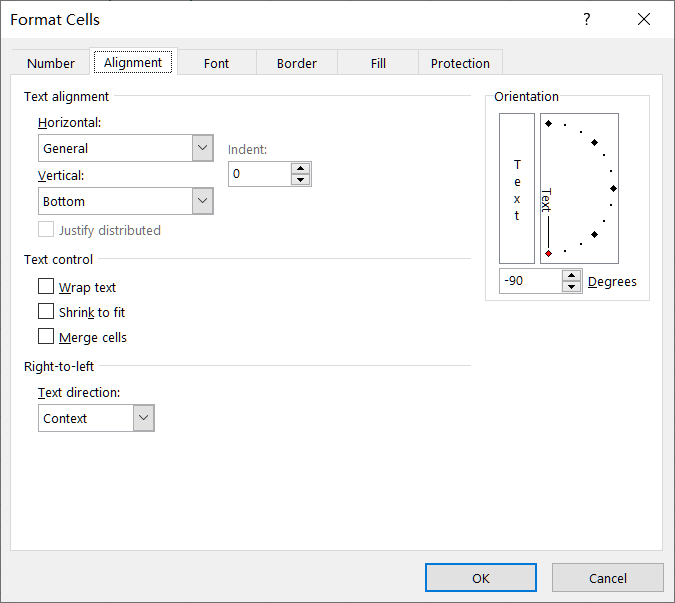

## **Rotate Text of Cell in Aspose.Cells for JavaScript via C++**

Aspose.Cells is a powerful JavaScript component that enables developers to work with Excel spreadsheets programmatically. One of the features provided by Aspose.Cells is the ability to rotate cells, allowing you to customize the orientation of text and improve the visual presentation of your data. In this document, we will explore how to rotate cells using Aspose.Cells.

## **How to Rotate Text of Cell in Excel**
To rotate a cell in Excel, you can use the following steps:
1. Open Excel and select the cell or range of cells that you want to rotate.
1. Right-click on the selected cell(s) and choose "Format Cells" from the context menu. Alternatively, you can go to the "Home" tab in the Excel ribbon, click on the "Format" dropdown in the "Cells" group, and select "Format Cells."
1. In the "Format Cells" dialog box, navigate to the "Alignment" tab.
1. Under the "Orientation" section, you will see the options to rotate the text. You can directly input the desired rotation angle in degrees in the "Degrees" box. Positive values rotate the text counterclockwise, and negative values rotate it clockwise.
<br>

1. Once you have selected the desired rotation, click "OK" to apply the changes. The selected cell(s) will now be rotated based on your chosen rotation angle or orientation.

## **How to Rotate Text of Cell using Aspose.Cells API**

[**Style.rotationAngle(number)**](https://reference.aspose.com/cells/javascript-cpp/style/#rotationAngle-number-) property makes it convenient to rotate cells. To rotate cells in Aspose.Cells, you need to follow these steps:
1. Load the Excel Workbook  
<br>
First, you need to load the Excel workbook using Aspose.Cells. You can use the Workbook class to open an existing Excel file or create a new one. 

1. Access the Worksheet  
<br>
Once the workbook is loaded, you need to access the worksheet where you want to rotate the cells. You can either access the worksheet by its index or name. 

1. Rotate the text of Cell  
<br>
Now that you have access to the worksheet, you can rotate the cells by modifying the Style object of the desired cells. The Style object allows you to set various formatting options, including rotation. 

1. Save the Workbook  
<br>
After rotating the cells, you can save the modified workbook back to a file or stream using the Save method.

## **JavaScript Sample Code**

Please see the following code, it creates a workbook object and sets different rotation angles for several cells. The screenshot shows the result after the execution of the sample code.
<br>


```html
<!DOCTYPE html>
<html>
    <head>
        <title>Aspose.Cells Example</title>
    </head>
    <body>
        <h1>Rotate Text in Cells Example</h1>
        <input type="file" id="fileInput" accept=".xls,.xlsx,.csv" />
        <button id="runExample">Run Example</button>
        <a id="downloadLink" style="display: none;">Download Result</a>
        <div id="result"></div>
    </body>

    <script src="aspose.cells.js.min.js"></script>
    <script type="text/javascript">
        const { Workbook, SaveFormat, Utils } = AsposeCells;
        
        AsposeCells.onReady({
            license: "/lic/aspose.cells.enc",
            fontPath: "/fonts/",
            fontList: [
                "arial.ttf",
                "NotoSansSC-Regular.ttf"
            ]
        }).then(() => {
            console.log("Aspose.Cells initialized");
        });

        document.getElementById('runExample').addEventListener('click', async () => {
            // Creating a new Workbook (blank)
            const workbook = new Workbook();

            // Obtaining the reference of the first worksheet
            const worksheet = workbook.worksheets.get(0);

            // Row index of the cell
            let row = 0;
            // Column index of the cell
            let column = 0; 

            let a1 = worksheet.cells.get(row, column);
            a1.putValue("a1 rotate text");
            let a1Style = a1.style;

            // Set the rotation angle in degrees
            a1Style.rotationAngle = 45; 
            a1.style = a1Style;

            // set Column index of the cell
            column = 1;
            let b1 = worksheet.cells.get(row, column);
            b1.putValue("b1 rotate text");
            let b1Style = b1.style;

            // Set the rotation angle in degrees
            b1Style.rotationAngle = 255;
            b1.style = b1Style;

            // set Column index of the cell
            column = 2;
            let c1 = worksheet.cells.get(row, column);
            c1.putValue("c1 rotate text");
            let c1Style = c1.style;

            // Set the rotation angle in degrees
            c1Style.rotationAngle = -90;
            c1.style = c1Style;

            // set Column index of the cell
            column = 3;
            let d1 = worksheet.cells.get(row, column);
            d1.putValue("d1 rotate text");
            let d1Style = d1.style;

            // Set the rotation angle in degrees
            d1Style.rotationAngle = -90;
            d1.style = d1Style;

            // Saving the modified Excel file
            const outputData = workbook.save(SaveFormat.Xlsx);
            const blob = new Blob([outputData]);
            const downloadLink = document.getElementById('downloadLink');
            downloadLink.href = URL.createObjectURL(blob);
            downloadLink.download = 'out.xlsx';
            downloadLink.style.display = 'block';
            downloadLink.textContent = 'Download Excel File';

            document.getElementById('result').innerHTML = '<p style="color: green;">Operation completed successfully! Click the download link to get the modified file.</p>';
        });
    </script>
</html>
```