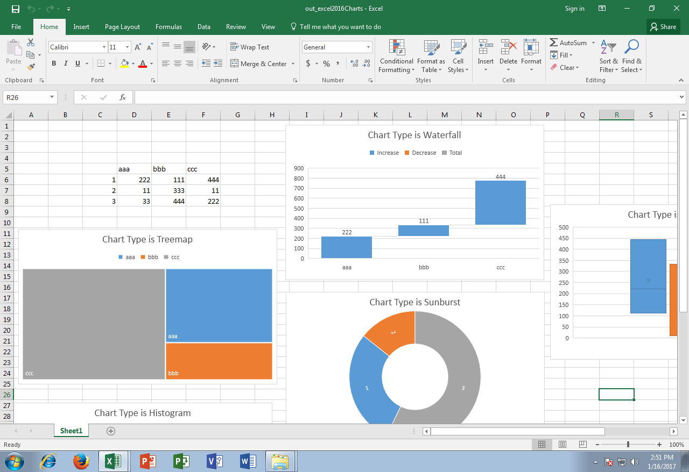

## **Possible Usage Scenarios**  
Aspose.Cells now supports the reading and manipulation of Microsoft Excel 2016 charts which are not present in Microsoft Excel 2013 or earlier versions.  
## **Read and Manipulate Excel 2016 Charts**  
The following sample code loads the [source excel file](22774101.xlsx) which contains Excel 2016 charts in the first worksheet. It reads all charts one by one and changes its title as per its chart type. The following screenshot shows the source excel file before the execution of code. As you can see, chart title is the same for all charts.


The following screenshot shows the [output excel file](22774104.xlsx) after the execution of code. As you can see, the chart title is changed as per its chart type.

  
## **Sample Code**  
```html
<!DOCTYPE html>
<html>
    <head>
        <title>Aspose.Cells Example</title>
    </head>
    <body>
        <h1>Aspose.Cells Example - Read and Update Chart Titles</h1>
        <input type="file" id="fileInput" accept=".xls,.xlsx,.csv" />
        <button id="runExample">Run Example</button>
        <a id="downloadLink" style="display: none;">Download Result</a>
        <div id="result"></div>
    </body>

    <script src="aspose.cells.js.min.js"></script>
    <script type="text/javascript">
        const { Workbook, SaveFormat } = AsposeCells;
        
        AsposeCells.onReady({
            license: "/lic/aspose.cells.enc",
            fontPath: "/fonts/",
            fontList: [
                "arial.ttf",
                "NotoSansSC-Regular.ttf"
            ]
        }).then(() => {
            console.log("Aspose.Cells initialized");
        });

        document.getElementById('runExample').addEventListener('click', async () => {
            const fileInput = document.getElementById('fileInput');
            const resultDiv = document.getElementById('result');

            if (!fileInput.files.length) {
                resultDiv.innerHTML = '<p style="color: red;">Please select an Excel file.</p>';
                return;
            }

            // Read selected file
            const file = fileInput.files[0];
            const arrayBuffer = await file.arrayBuffer();

            // Instantiating a Workbook object from uploaded file
            const workbook = new Workbook(new Uint8Array(arrayBuffer));

            // Access the first worksheet which contains the charts
            const sheet = workbook.worksheets.get(0);

            // Access all charts one by one and read their types
            const chartsCount = sheet.charts.count;
            let logHtml = '<ul>';
            for (let i = 0; i < chartsCount; i++) {
                // Access the chart
                const ch = sheet.charts.get(i);

                // Read chart type
                const typeStr = ch.type.toString();
                console.log(typeStr);

                // Change the title of the chart
                ch.title.text = "Chart Type is " + typeStr;

                logHtml += `<li>Chart ${i}: ${typeStr}</li>`;
            }
            logHtml += '</ul>';

            // Save the workbook to a downloadable file
            const outputData = workbook.save(SaveFormat.Xlsx);
            const blob = new Blob([outputData]);
            const downloadLink = document.getElementById('downloadLink');
            downloadLink.href = URL.createObjectURL(blob);
            downloadLink.download = 'out_excel2016Charts.xlsx';
            downloadLink.style.display = 'block';
            downloadLink.textContent = 'Download Modified Excel File';

            resultDiv.innerHTML = '<p style="color: green;">Charts updated successfully! Click the download link to get the modified file.</p>' + logHtml;
        });
    </script>
</html>
```  
## **Console Output**  


  

 Waterfall  

Treemap  

Sunburst  

Histogram  

BoxWhisker  

  

## **Advance topics**  
- [Creating Waterfall Chart](/cells/javascript-cpp/creating-waterfall-chart/)  
- [Creating TreeMap Chart](/cells/javascript-cpp/creating-treemap-chart/)  
- [Creating Sunburst Chart](/cells/javascript-cpp/creating-sunburst-chart/)