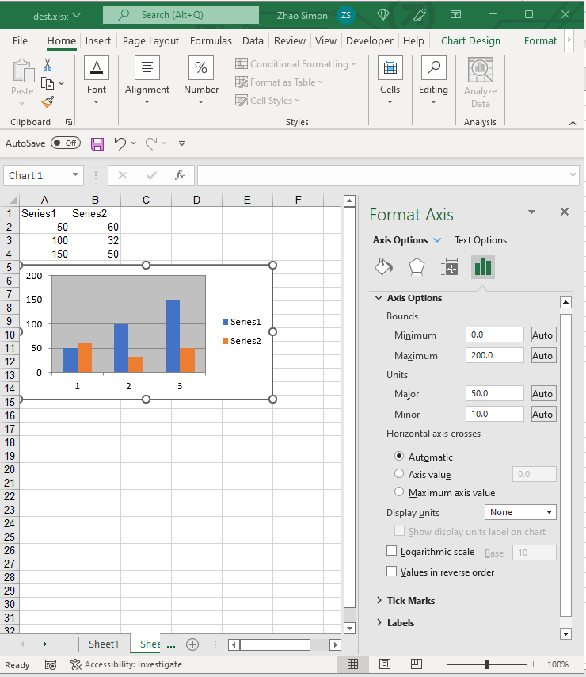

{}  

In Excel charts, there are 3 kinds of Axes:  
1. Horizontal(Category) Axis : X Axis  
1. Vertical(Value) Axis : Y Axis  
1. Depth(Series) Axis : Z Axis  

{}  

## **Axis Options**  
Aspose.Cells for JavaScript via C++ also allows you to manage chart's axes at runtime. With the [Axis](https://reference.aspose.com/cells/javascript-cpp/axis/) object, you can change all options of Axis as done in Excel.  

||  

## **Manage X and Y Axes**  
In Excel chart, horizontal and vertical axes are the two most popular axes to use.  

The following code snippet demonstrates how to set the options of X and Y axes.  

```html
<!DOCTYPE html>
<html>
    <head>
        <title>Aspose.Cells Example - Chart Axes</title>
    </head>
    <body>
        <h1>Chart Axes Example</h1>
        <input type="file" id="fileInput" accept=".xls,.xlsx,.csv" />
        <button id="runExample">Run Example</button>
        <a id="downloadLink" style="display: none;">Download Result</a>
        <div id="result"></div>
    </body>

    <script src="aspose.cells.js.min.js"></script>
    <script type="text/javascript">
        const { Workbook, SaveFormat, ChartType } = AsposeCells;
        
        AsposeCells.onReady({
            license: "/lic/aspose.cells.enc",
            fontPath: "/fonts/",
            fontList: [
                "arial.ttf",
                "NotoSansSC-Regular.ttf"
            ]
        }).then(() => {
            console.log("Aspose.Cells initialized");
        });

        document.getElementById('runExample').addEventListener('click', async () => {
            const fileInput = document.getElementById('fileInput');

            // Instantiate a new Workbook
            const workbook = new Workbook();

            // Adding a new worksheet to the Workbook object
            const sheetIndex = workbook.worksheets.add();

            // Obtaining the reference of the newly added worksheet by passing its sheet index
            const worksheet = workbook.worksheets.get(sheetIndex);

            // Adding sample values to cells
            worksheet.cells.get("A1").value = "Series1";
            worksheet.cells.get("A2").value = 50;
            worksheet.cells.get("A3").value = 100;
            worksheet.cells.get("A4").value = 150;
            worksheet.cells.get("B1").value = "Series2";
            worksheet.cells.get("B2").value = 60;
            worksheet.cells.get("B3").value = 32;
            worksheet.cells.get("B4").value = 50;

            // Adding a chart to the worksheet
            const chartIndex = worksheet.charts.add(ChartType.Column, 5, 0, 15, 5);

            // Accessing the instance of the newly added chart
            const chart = worksheet.charts.get(chartIndex);

            // Adding SeriesCollection (chart data source) to the chart ranging from "A1" cell to "B4"
            chart.chartDataRange = ["A1:B4", true];

            // Hiding X axis
            chart.categoryAxis.isVisible = false;

            // Setting max value of Y axis
            chart.valueAxis.maxValue = 200;
            // Setting major unit
            chart.valueAxis.majorUnit = 50;

            // Save the file and provide download link
            const outputData = workbook.save(SaveFormat.Xlsx);
            const blob = new Blob([outputData]);
            const downloadLink = document.getElementById('downloadLink');
            downloadLink.href = URL.createObjectURL(blob);
            downloadLink.download = 'chart_axes.xlsx';
            downloadLink.style.display = 'block';
            downloadLink.textContent = 'Download Excel File';

            document.getElementById('result').innerHTML = '<p style="color: green;">Workbook created successfully. Click the download link to download the file.</p>';
        });
    </script>
</html>
```  

## **Advance topics**  
- [Change Tick Label Direction](/cells/javascript-cpp/change-tick-label-direction/)  
- [Determine which Axis exists in the Chart](/cells/javascript-cpp/determine-which-axis-exists-in-the-chart/)  
- [Handle Automatic Units of Chart Axis like Microsoft Excel](/cells/javascript-cpp/handle-automatic-units-of-chart-axis-like-microsoft-excel/)  
- [Read Axis Labels after Calculating the Chart](/cells/javascript-cpp/read-axis-labels-after-calculating-the-chart/)  
- [How to Set Category Axis in Excel Chart](/cells/javascript-cpp/how-to-set-category-axis/)