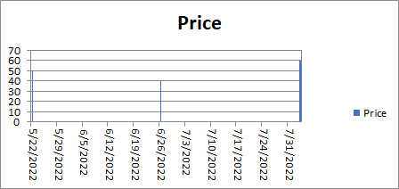

---  
title: Date Axis with JavaScript via C++  
description: Learn how to manage the date axis in Aspose.Cells for JavaScript via C++. Our guide will help you understand how to work with various date formats, time scales, and tick label frequencies.  
keywords: Aspose.Cells for JavaScript via C++, date axis, manage, date formats, time scales, tick label frequencies.  
type: docs  
weight: 200  
url: /javascript-cpp/date-axis/  
---  

## **Possible Usage Scenarios**  
When you create a chart from worksheet data that uses dates and the dates are plotted along the horizontal (category) axis in the chart, Aspose.Cells for JavaScript via C++ automatically changes the category axis to a date (time‑scale) axis.  
A date axis displays dates in chronological order at specific intervals or base units, such as the number of days, months, or years, even if the dates on the worksheet are not in sequential order or in the same base units.  
By default, Aspose.Cells determines the base units for the date axis based on the smallest difference between any two dates in the worksheet data. For example, if you have data for stock prices where the smallest difference between dates is seven days, Excel sets the base unit to days, but you can change the base unit to months or years if you want to see the performance of the stock over a longer period of time.  

## **Handle Date Axis Like Microsoft Excel**  
Please see the following sample code that creates a new Excel file and puts the chart values in the first worksheet.  
Then we add a chart and set the type of the axis to **Axis.categoryType** and set the base unit to days.  

  

## **Sample Code**  
```html
<!DOCTYPE html>
<html>
    <head>
        <title>Aspose.Cells Date Axis Chart Example</title>
    </head>
    <body>
        <h1>Date Axis Chart Example</h1>
        <input type="file" id="fileInput" accept=".xls,.xlsx,.csv" />
        <button id="runExample">Run Example</button>
        <a id="downloadLink" style="display: none;">Download Result</a>
        <div id="result"></div>
    </body>

    <script src="aspose.cells.js.min.js"></script>
    <script type="text/javascript">
        const { Workbook, SaveFormat, ChartType, CategoryType, TimeUnit, ChartTextDirectionType, FillType } = AsposeCells;
        
        AsposeCells.onReady({
            license: "/lic/aspose.cells.enc",
            fontPath: "/fonts/",
            fontList: [
                "arial.ttf",
                "NotoSansSC-Regular.ttf"
            ]
        }).then(() => {
            console.log("Aspose.Cells initialized");
        });

        document.getElementById('runExample').addEventListener('click', async () => {
            const fileInput = document.getElementById('fileInput');
            if (!fileInput.files.length) {
                document.getElementById('result').innerHTML = '<p style="color: red;">Please select an Excel file.</p>';
                return;
            }

            const file = fileInput.files[0];
            const arrayBuffer = await file.arrayBuffer();

            // Instantiating a Workbook object from the uploaded file
            const workbook = new Workbook(new Uint8Array(arrayBuffer));

            // Get the first worksheet
            const worksheet = workbook.worksheets.get(0);

            // Shortcut to cells collection
            const cells = worksheet.cells;

            // Add the sample values to cells
            cells.get("A1").value = "Date";

            // 14 means datetime format
            const style = cells.style;
            style.number = 14;

            // Put values to cells for creating the chart
            const cellA2 = cells.get("A2");
            cellA2.style = style;
            cellA2.value = new Date(Date.UTC(2022, 5, 26));

            const cellA3 = cells.get("A3");
            cellA3.style = style;
            cellA3.value = new Date(Date.UTC(2022, 4, 22));

            const cellA4 = cells.get("A4");
            cellA4.style = style;
            cellA4.value = new Date(Date.UTC(2022, 7, 3));

            cells.get("B1").value = "Price";
            cells.get("B2").value = 40;
            cells.get("B3").value = 50;
            cells.get("B4").value = 60;

            // Add a chart to the worksheet
            const chartIndex = worksheet.charts.add(ChartType.Column, 9, 6, 21, 13);
            // Access the instance of the newly added chart
            const chart = worksheet.charts.get(chartIndex);

            // Add SeriesCollection (chart data source) to the chart for cells A1:B4
            // Converted setter to property assignment (range and boolean passed as array)
            chart.chartDataRange = ["A1:B4", true];

            // Set the Axis type to DateTime
            chart.categoryAxis.categoryType = CategoryType.TimeScale;
            // Set the base unit for CategoryAxis to days
            chart.categoryAxis.baseUnitScale = TimeUnit.Days;
            // Set the direction for the axis text to be vertical
            chart.categoryAxis.tickLabels.directionType = ChartTextDirectionType.Vertical;
            // Fill the PlotArea with no fill
            chart.plotArea.area.fillFormat.fillType = FillType.None;
            // Set max value of Y axis
            chart.valueAxis.maxValue = 70;
            // Set major unit
            chart.valueAxis.majorUnit = 10;

            // Save the modified Excel file and provide a download link
            const outputData = workbook.save(SaveFormat.Xlsx);
            const blob = new Blob([outputData]);
            const downloadLink = document.getElementById('downloadLink');
            downloadLink.href = URL.createObjectURL(blob);
            downloadLink.download = 'DateAxis.xlsx';
            downloadLink.style.display = 'block';
            downloadLink.textContent = 'Download Excel File';

            document.getElementById('result').innerHTML = '<p style="color: green;">Chart created successfully! Click the download link to get the modified file.</p>';
        });
    </script>
</html>
```