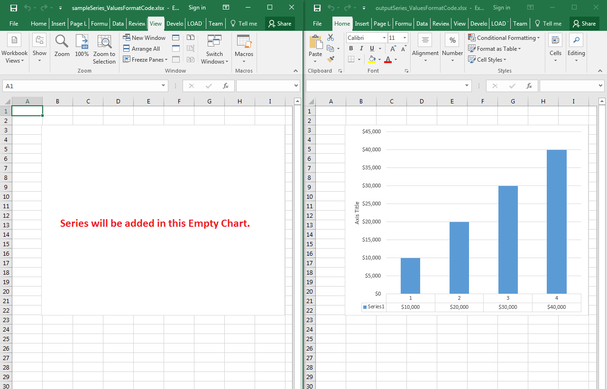

## **Possible Usage Scenarios**
You can set the values format code of chart series using the [Series.valuesFormatCode](https://reference.aspose.com/cells/javascript-cpp/series/#valuesFormatCode--) property. This property is not only useful for the series which is based on the range inside the worksheet but also works well for the series created with an array of values.

## **Set the Values Format Code of Chart Series**
The following sample code adds a series in the empty chart which has no series before. It adds the series using the array of values. Once it adds the series, it formats it with the code $#,##0 using the [Series.valuesFormatCode](https://reference.aspose.com/cells/javascript-cpp/series/#valuesFormatCode--) property and the number 10000 becomes $10,000. The screenshot shows the effect of code on the [sample Excel file](51740712.xlsx) and [output Excel file](51740713.xlsx) after execution.



## **Sample Code**
```html
<!DOCTYPE html>
<html>
    <head>
        <title>Aspose.Cells Example</title>
    </head>
    <body>
        <h1>Aspose.Cells Chart Series Example</h1>
        <input type="file" id="fileInput" accept=".xls,.xlsx,.csv" />
        <button id="runExample">Run Example</button>
        <a id="downloadLink" style="display: none;">Download Result</a>
        <div id="result"></div>
    </body>

    <script src="aspose.cells.js.min.js"></script>
    <script type="text/javascript">
        const { Workbook, SaveFormat, Utils } = AsposeCells;
        
        AsposeCells.onReady({
            license: "/lic/aspose.cells.enc",
            fontPath: "/fonts/",
            fontList: [
                "arial.ttf",
                "NotoSansSC-Regular.ttf"
            ]
        }).then(() => {
            console.log("Aspose.Cells initialized");
            
            document.getElementById('runExample').addEventListener('click', async () => {
                const fileInput = document.getElementById('fileInput');
                if (!fileInput.files.length) {
                    document.getElementById('result').innerHTML = '<p style="color: red;">Please select an Excel file.</p>';
                    return;
                }

                const file = fileInput.files[0];
                const arrayBuffer = await file.arrayBuffer();

                // Instantiating a Workbook object from the uploaded file
                const workbook = new Workbook(new Uint8Array(arrayBuffer));

                // Access first worksheet
                const worksheet = workbook.worksheets.get(0);

                // Access first chart
                const chart = worksheet.charts.get(0);

                // Add series using an array of values
                chart.nSeries.add("{10000, 20000, 30000, 40000}", true);

                // Access the series and set its values format code
                const series = chart.nSeries.get(0);
                series.valuesFormatCode = "$#,##0";

                // Saving the modified Excel file
                const outputData = workbook.save(SaveFormat.Xlsx);
                const blob = new Blob([outputData]);
                const downloadLink = document.getElementById('downloadLink');
                downloadLink.href = URL.createObjectURL(blob);
                downloadLink.download = '51740713.xlsx';
                downloadLink.style.display = 'block';
                downloadLink.textContent = 'Download Modified Excel File';

                document.getElementById('result').innerHTML = '<p style="color: green;">Operation completed successfully! Click the download link to get the modified file.</p>';
            });
        });
    </script>
</html>
```