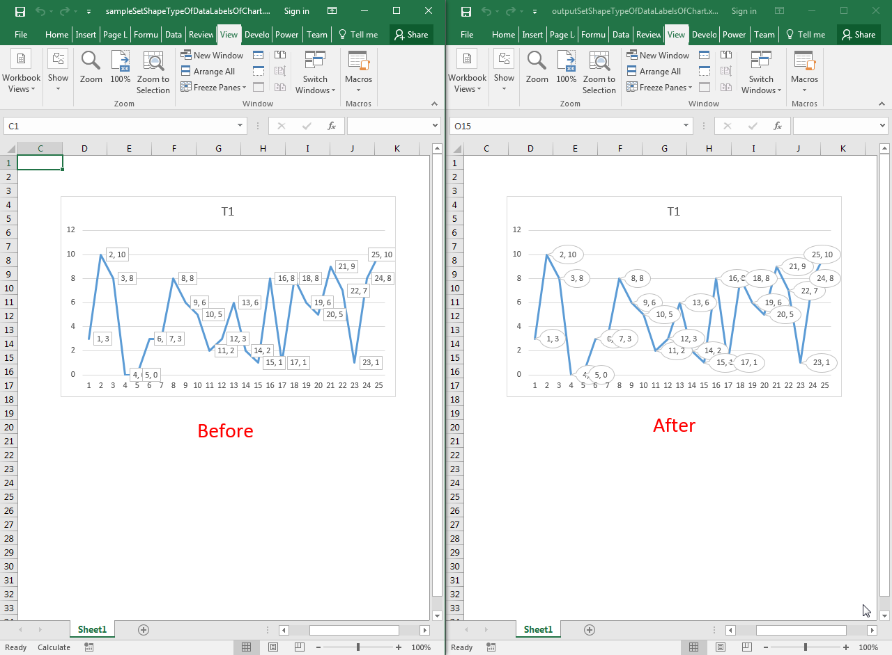

## **Possible Usage Scenarios**
You can change the shape type of data labels of the chart using the `DataLabels.shapeType` property. It takes a value from the `DataLabelShapeType` enumeration and changes the shape type of data labels accordingly. Some of its values include:


DataLabelShapeType.BentLineCallout
DataLabelShapeType.DownArrowCallout
DataLabelShapeType.Ellipse
DataLabelShapeType.LineCallout
DataLabelShapeType.Rect
etc.


## **Set the Shape Type of Data Labels of Chart**
The following sample code changes the shape type of data labels of the chart to `DataLabelShapeType.WedgeEllipseCallout`. Please see the [sample Excel file](60489778.xlsx) used in this code and the [output Excel file](60489779.xlsx) generated by it. The screenshot shows the effect of the code on the sample Excel file.



## **Sample Code**
```html
<!DOCTYPE html>
<html>
    <head>
        <title>Set Shape Type of Data Labels of Chart Example</title>
    </head>
    <body>
        <h1>Set Shape Type of Data Labels of Chart Example</h1>
        <input type="file" id="fileInput" accept=".xls,.xlsx,.csv" />
        <button id="runExample">Run Example</button>
        <a id="downloadLink" style="display: none;">Download Result</a>
        <div id="result"></div>
    </body>

    <script src="aspose.cells.js.min.js"></script>
    <script type="text/javascript">
        const { Workbook, SaveFormat, Worksheet, Cell, Utils } = AsposeCells;
        
        AsposeCells.onReady({
            license: "/lic/aspose.cells.enc",
            fontPath: "/fonts/",
            fontList: [
                "arial.ttf",
                "NotoSansSC-Regular.ttf"
            ]
        }).then(() => {
            console.log("Aspose.Cells initialized");
        });

        document.getElementById('runExample').addEventListener('click', async () => {
            const fileInput = document.getElementById('fileInput');
            const resultDiv = document.getElementById('result');
            const downloadLink = document.getElementById('downloadLink');

            if (!fileInput.files.length) {
                resultDiv.innerHTML = '<p style="color: red;">Please select an Excel file.</p>';
                return;
            }

            const file = fileInput.files[0];
            const arrayBuffer = await file.arrayBuffer();

            // Instantiating a Workbook object from the uploaded file
            const workbook = new Workbook(new Uint8Array(arrayBuffer));

            // Accessing the first worksheet in the Excel file
            const worksheet = workbook.worksheets.get(0);

            // Accessing the first chart
            const chart = worksheet.charts.get(0);

            // Accessing the first series
            const series = chart.nSeries.get(0);

            // Set the shape type of data labels, i.e., Speech Bubble Oval
            series.dataLabels.shapeType = AsposeCells.DataLabelShapeType.WedgeEllipseCallout;

            // Saving the modified Excel file
            const outputData = workbook.save(SaveFormat.Xlsx);
            const blob = new Blob([outputData]);
            downloadLink.href = URL.createObjectURL(blob);
            downloadLink.download = 'outputSetShapeTypeOfDataLabelsOfChart.xlsx';
            downloadLink.style.display = 'block';
            downloadLink.textContent = 'Download Excel File';

            resultDiv.innerHTML = '<p style="color: green;">Shape type set successfully! Click the download link to get the modified file.</p>';
        });
    </script>
</html>
```