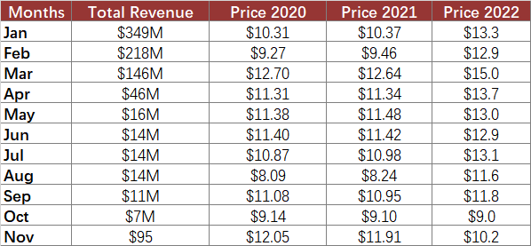

## **Possible Usage Scenarios**
Combo charts in Excel let you take advantage of this option because you can easily combine two or more chart types to make your data more understandable. Combo charts are helpful when your data contains multiple kinds of values, including price and volume. Moreover, combo charts are useful when your data values vary widely across series.

Taking the following dataset as an example, we can observe that these data are quite similar to the data mentioned in [**VHCL**](https://docs.aspose.com/cells/javascript-cpp/create-volume-high-low-close-stock-chart/). If we want to visualize series0, which corresponds to "Total Revenue," as a Line chart, how should we proceed?



## **Combo chart**
After running the code below, you will see the Combo chart as shown below.


## **Sample Code**
The following sample code loads the [sample Excel file](combo.xlsx) and generates the [output Excel file](out.xlsx).

```html
<!DOCTYPE html>
<html>
    <head>
        <title>Aspose.Cells Example</title>
    </head>
    <body>
        <h1>Combo Chart Example</h1>
        <input type="file" id="fileInput" accept=".xls,.xlsx,.csv" />
        <button id="runExample">Run Example</button>
        <a id="downloadLink" style="display: none;">Download Result</a>
        <div id="result"></div>
    </body>

    <script src="aspose.cells.js.min.js"></script>
    <script type="text/javascript">
        const { Workbook, SaveFormat } = AsposeCells;
        
        AsposeCells.onReady({
            license: "/lic/aspose.cells.enc",
            fontPath: "/fonts/",
            fontList: [
                "arial.ttf",
                "NotoSansSC-Regular.ttf"
            ]
        }).then(() => {
            console.log("Aspose.Cells initialized");
        });

        document.getElementById('runExample').addEventListener('click', async () => {
            const fileInput = document.getElementById('fileInput');
            if (!fileInput.files.length) {
                document.getElementById('result').innerHTML = '<p style="color: red;">Please select an Excel file.</p>';
                return;
            }

            const file = fileInput.files[0];
            const arrayBuffer = await file.arrayBuffer();
            
            // Create the workbook from uploaded file
            const workbook = new Workbook(new Uint8Array(arrayBuffer));
            // Access the first worksheet
            const worksheet = workbook.worksheets.get(0);
            // Add a stock volume (VHLC)
            const pieIdx = worksheet.charts.add(AsposeCells.ChartType.StockVolumeHighLowClose, 15, 0, 34, 12);
            // Retrieve the Chart object
            const chart = worksheet.charts.get(pieIdx);
            // Set the legend to be shown
            chart.showLegend = true;
            // Set the chart title
            chart.title.text = "Combo Chart";
            // Set the Legend at the bottom of the chart area
            chart.legend.position = AsposeCells.LegendPositionType.Bottom;
            // Set data range (preserving both args as an array)
            chart.chartDataRange = ["A1:E12", true];
            // Set category data 
            chart.nSeries.get(0).xValues = "A2:A12";  // Corrected method

            // Set Series[1], Series[2], and Series[3] to different marker styles
            for (let j = 0; j < chart.nSeries.count; j++) {
                switch (j) {
                    case 1:
                        chart.nSeries.get(j).marker.markerStyle = AsposeCells.ChartMarkerType.Circle;
                        chart.nSeries.get(j).marker.markerSize = 15;
                        chart.nSeries.get(j).marker.area.formatting = AsposeCells.FormattingType.Custom;
                        chart.nSeries.get(j).marker.area.foregroundColor = AsposeCells.Color.Pink;
                        chart.nSeries.get(j).border.isVisible = false;
                        break;
                    case 2:
                        chart.nSeries.get(j).marker.markerStyle = AsposeCells.ChartMarkerType.Dash;
                        chart.nSeries.get(j).marker.markerSize = 15;
                        chart.nSeries.get(j).marker.area.formatting = AsposeCells.FormattingType.Custom;
                        chart.nSeries.get(j).marker.area.foregroundColor = AsposeCells.Color.Orange;
                        chart.nSeries.get(j).border.isVisible = false;
                        break;
                    case 3:
                        chart.nSeries.get(j).marker.markerStyle = AsposeCells.ChartMarkerType.Square;
                        chart.nSeries.get(j).marker.markerSize = 15;
                        chart.nSeries.get(j).marker.area.formatting = AsposeCells.FormattingType.Custom;
                        chart.nSeries.get(j).marker.area.foregroundColor = AsposeCells.Color.LightBlue;
                        chart.nSeries.get(j).border.isVisible = false;
                        break;
                }
            }

            // Set the chart type for Series[0] 
            chart.nSeries.get(0).type = AsposeCells.ChartType.Line;
            // Set style for the border of first series
            chart.nSeries.get(0).border.style = AsposeCells.LineType.Solid;
            // Set color for the first series
            chart.nSeries.get(0).border.color = AsposeCells.Color.DarkBlue;
            // Fill the PlotArea with no formatting 
            chart.plotArea.area.formatting = AsposeCells.FormattingType.None;

            // Save the Excel file and provide download link
            const outputData = workbook.save(SaveFormat.Xlsx);
            const blob = new Blob([outputData]);
            const downloadLink = document.getElementById('downloadLink');
            downloadLink.href = URL.createObjectURL(blob);
            downloadLink.download = 'out.xlsx';
            downloadLink.style.display = 'block';
            downloadLink.textContent = 'Download Result';

            document.getElementById('result').innerHTML = '<p style="color: green;">Chart updated successfully! Click the download link to get the modified file.</p>';
        });
    </script>
</html>
```