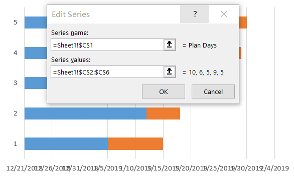
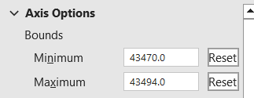
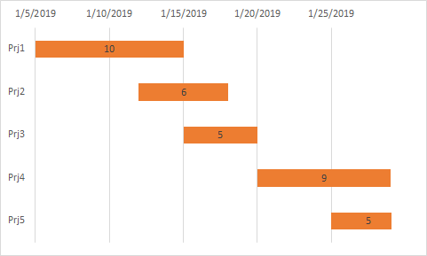

## **What is Gantt chart**

A Gantt chart is a type of bar chart that illustrates a project schedule. It shows the start and finish dates of the various elements of a project. Each task or activity is represented by a bar, with its length corresponding to its duration. Gantt charts also indicate dependencies between tasks, allowing project managers to visualize the sequence in which tasks need to be completed. They are widely used in project management to plan, schedule, and track projects effectively.

## **How to Create a Gantt Chart in Excel**

You can create a Gantt chart in Excel by following these steps:
1. Add some data for Gantt chart. 
<br>

1. Select the data and go to Insert --> Charts --> Insert Column or Bar Chart --> Stacked Bar Chart. In our example, that’s B1:B7, and then Insert **Stacked Bar** chart.
<br>


1. Select the chart, **Select Data** -> **Add**, set the **Series name** and **Series values** as following.
<br>


1. Select the chart, edit the **Horizontal(Category) Axis Labels**.
<br>


1. **Format Axis** the Y Axis, select **Categories in reverse order**.
1. Select the **Blue Series** and set the **Fill -> NO Fill**.
1. **Format Axis** the X Axis, set the **Minimum and Maximum** (1/5/2019:43470, 1/30/2019:43494).
<br>


1. **Add Data labels** for the chart, now you will get a Gantt chart.
<br>



## **How to Add a Gantt Chart in Aspose.Cells**
Please see the following sample code. It loads the [sample Excel file](sample.xlsx) that contains some sample data. It then creates the stacked bar chart based on the initial data and sets relevant properties. Finally, it saves the workbook to [output XLSX format](result.xlsx). The following screenshot shows the Gantt chart created by Aspose.Cells in the output Excel file.
<br>


### **Sample Code**

```html
<!DOCTYPE html>
<html>
    <head>
        <title>Aspose.Cells Chart Example</title>
    </head>
    <body>
        <h1>Aspose.Cells Chart Example</h1>
        <input type="file" id="fileInput" accept=".xls,.xlsx,.csv" />
        <button id="runExample">Run Example</button>
        <a id="downloadLink" style="display: none;">Download Result</a>
        <div id="result"></div>
    </body>

    <script src="aspose.cells.js.min.js"></script>
    <script type="text/javascript">
        const { Workbook, SaveFormat } = AsposeCells;
        
        AsposeCells.onReady({
            license: "/lic/aspose.cells.enc",
            fontPath: "/fonts/",
            fontList: [
                "arial.ttf",
                "NotoSansSC-Regular.ttf"
            ]
        }).then(() => {
            console.log("Aspose.Cells initialized");
        });

        document.getElementById('runExample').addEventListener('click', async () => {
            const fileInput = document.getElementById('fileInput');
            if (!fileInput.files.length) {
                document.getElementById('result').innerHTML = '<p style="color: red;">Please select an Excel file.</p>';
                return;
            }

            const file = fileInput.files[0];
            const arrayBuffer = await file.arrayBuffer();

            // Instantiating a Workbook object from the uploaded file
            const workbook = new Workbook(new Uint8Array(arrayBuffer));

            // Access the first worksheet
            const worksheet = workbook.worksheets.get(0);

            // Create BarStacked Chart
            const i = worksheet.charts.add(AsposeCells.ChartType.BarStacked, 5, 6, 20, 15);

            // Retrieve the Chart object
            const chart = worksheet.charts.get(i);

            // Set the chart title name 
            chart.title.text = "Gantt Chart";

            // Set the chart title is Visible
            chart.title.isVisible = true;

            // Set data range
            chart.chartDataRange = "B1:B6";

            // Add series data range
            chart.nSeries.add("C2:C6", true);

            // No fill for one serie
            chart.nSeries.get(0).area.fillFormat.fillType = AsposeCells.FillType.None;

            // Set the Horizontal(Category) Axis
            chart.nSeries.setCategoryData("A2:A6");

            // Reverse the Horizontal(Category) Axis
            chart.categoryAxis.isPlotOrderReversed = true;

            // Set the value axis's MinValue and MaxValue
            const minValue = parseFloat(worksheet.cells.get("B2").value);
            const maxValue = parseFloat(worksheet.cells.get("D6").value);
            chart.valueAxis.minValue = isNaN(minValue) ? 0 : minValue;
            chart.valueAxis.maxValue = isNaN(maxValue) ? 0 : maxValue;

            chart.plotArea.area.fillFormat.fillType = AsposeCells.FillType.None;

            // Show the DataLabels
            chart.nSeries.get(1).dataLabels.showValue = true;

            // Disable the Legend
            chart.showLegend = false;

            // Save the result
            const outputData = workbook.save(SaveFormat.Xlsx);
            const blob = new Blob([outputData]);
            const downloadLink = document.getElementById('downloadLink');
            downloadLink.href = URL.createObjectURL(blob);
            downloadLink.download = 'result.xlsx';
            downloadLink.style.display = 'block';
            downloadLink.textContent = 'Download Excel File';

            document.getElementById('result').innerHTML = '<p style="color: green;">Chart created successfully! Click the download link to get the modified file.</p>';
        });
    </script>
</html>
```