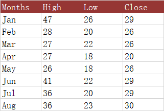

## **Possible Usage Scenarios**  
The High-Low-Close (HLC) stock chart uses four columns of data. The first column is a category, usually a date but stock names can also be used. The next three columns in order are for high, low, and closing prices. The range of price for each category is indicated by a vertical line from low to high, and closing price is shown using a tick mark extending to the right of this line.  

  
## **Visibility improvements in the chart**  
Sometimes, to make the chart look more intuitive, we can modify the appearance of the marker (close), or make it display on the secondary axis.  

  
## **Sample Code**  
The following sample code loads the [sample Excel file](High-Low-Close.xlsx) and generates the [output Excel file](out.xlsx).  

```html
<!DOCTYPE html>
<html>
    <head>
        <title>Aspose.Cells Example</title>
    </head>
    <body>
        <h1>High-Low-Close Stock Chart Example</h1>
        <input type="file" id="fileInput" accept=".xls,.xlsx,.csv" />
        <button id="runExample">Run Example</button>
        <a id="downloadLink" style="display: none;">Download Result</a>
        <div id="result"></div>
    </body>

    <script src="aspose.cells.js.min.js"></script>
    <script type="text/javascript">
        const { Workbook, SaveFormat, Worksheet, Cell, Utils } = AsposeCells;
        
        AsposeCells.onReady({
            license: "/lic/aspose.cells.enc",
            fontPath: "/fonts/",
            fontList: [
                "arial.ttf",
                "NotoSansSC-Regular.ttf"
            ]
        }).then(() => {
            console.log("Aspose.Cells initialized");
        });

        document.getElementById('runExample').addEventListener('click', async () => {
            const fileInput = document.getElementById('fileInput');
            if (!fileInput.files.length) {
                document.getElementById('result').innerHTML = '<p style="color: red;">Please select an Excel file.</p>';
                return;
            }

            const file = fileInput.files[0];
            const arrayBuffer = await file.arrayBuffer();

            // Create an instance of Workbook from the uploaded file
            const workbook = new Workbook(new Uint8Array(arrayBuffer));

            // Access the first worksheet.
            const worksheet = workbook.worksheets.get(0);

            // Create High-Low-Close-Stock Chart
            const pieIdx = worksheet.charts.add(AsposeCells.ChartType.StockHighLowClose, 5, 6, 20, 12);

            // Retrieve the Chart object
            const chart = worksheet.charts.get(pieIdx);

            // Set the legend can be showed
            chart.showLegend = true;

            // Set the chart title name 
            chart.title.text = "High-Low-Close Stock";

            // Set the Legend at the bottom of the chart area
            chart.legend.position = AsposeCells.LegendPositionType.Bottom;

            // Set data range (range and orientation)
            chart.chartDataRange = ["A1:D9", true];

            // Set category data 
            chart.nSeries.categoryData = "A2:A9";

            // Set the marker with the built-in data for the 3rd series (index 2)
            const series2 = chart.nSeries.get(2);
            const marker = series2.marker;
            marker.markerStyle = AsposeCells.ChartMarkerType.Dash;
            marker.markerSize = 20;
            marker.area.formatting = AsposeCells.FormattingType.Custom;
            marker.area.foregroundColor = AsposeCells.Color.Maroon;

            // Fill the PlotArea area with nothing 
            chart.plotArea.area.fillFormat.fillType = AsposeCells.FillType.None;

            // Saving the modified Excel file
            const outputData = workbook.save(SaveFormat.Xlsx);
            const blob = new Blob([outputData]);
            const downloadLink = document.getElementById('downloadLink');
            downloadLink.href = URL.createObjectURL(blob);
            downloadLink.download = 'out.xlsx';
            downloadLink.style.display = 'block';
            downloadLink.textContent = 'Download Excel File';

            document.getElementById('result').innerHTML = '<p style="color: green;">Chart created successfully! Click the download link to get the modified file.</p>';
        });
    </script>
</html>
```