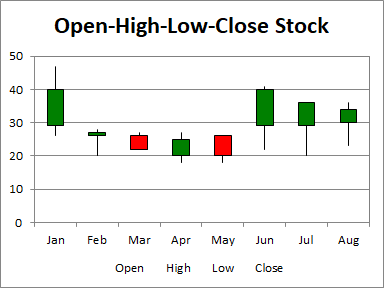

## **Possible Usage Scenarios**
The Open-High-Low-Close (OHLC) chart uses five columns of data, in order: category, open, high, low, and close. The range of prices in each category is indicated by a vertical line, while the range between open and close is given by a wider floating bar; if the price increases in the category (close is higher than open), the bar is filled with one color, while if the price decreases, the bar is filled with another. This type of chart is often called a candlestick chart.


## **Visibility improvements in the chart**
We often use colors rather than black and white to indicate increasing and decreasing prices. In the first set of candlesticks below, red shows increasing and green decreasing prices.



## **Sample Code**
The following sample code loads the [sample Excel file](Open-High-Low-Close.xlsx) and generates the [output Excel file](out.xlsx).

```html
<!DOCTYPE html>
<html>
    <head>
        <title>Aspose.Cells Example</title>
    </head>
    <body>
        <h1>Open-High-Low-Close Stock Chart Example</h1>
        <input type="file" id="fileInput" accept=".xls,.xlsx,.csv" />
        <button id="runExample">Run Example</button>
        <a id="downloadLink" style="display: none;">Download Result</a>
        <div id="result"></div>
    </body>

    <script src="aspose.cells.js.min.js"></script>
    <script type="text/javascript">
        const { Workbook, SaveFormat, Utils } = AsposeCells;
        
        AsposeCells.onReady({
            license: "/lic/aspose.cells.enc",
            fontPath: "/fonts/",
            fontList: [
                "arial.ttf",
                "NotoSansSC-Regular.ttf"
            ]
        }).then(() => {
            console.log("Aspose.Cells initialized");
        });

        document.getElementById('runExample').addEventListener('click', async () => {
            const fileInput = document.getElementById('fileInput');
            if (!fileInput.files.length) {
                document.getElementById('result').innerHTML = '<p style="color: red;">Please select an Excel file.</p>';
                return;
            }

            const file = fileInput.files[0];
            const arrayBuffer = await file.arrayBuffer();

            // Instantiating a Workbook object from the uploaded file
            const workbook = new Workbook(new Uint8Array(arrayBuffer));

            // Accessing the first worksheet.
            const worksheet = workbook.worksheets.get(0);

            // Create Open-High-Low-Close Stock Chart
            const chartIdx = worksheet.charts.add(AsposeCells.ChartType.StockOpenHighLowClose, 5, 6, 20, 12);

            // Retrieve the Chart object
            const chart = worksheet.charts.get(chartIdx);

            // Set the legend to be shown
            chart.showLegend = true;

            // Set the chart title
            chart.title.text = "Open-High-Low-Close Stock";

            // Set the legend at the bottom of the chart area
            chart.legend.position = AsposeCells.LegendPositionType.Bottom;

            // Set the data range
            chart.chartDataRange = ["A1:E9", true];

            // Set category data 
            chart.nSeries.categoryData = "A2:A9";

            // Set the DownBars and UpBars with different colors
            chart.nSeries.get(0).downBars.area.foregroundColor = AsposeCells.Color.Green;
            chart.nSeries.get(0).upBars.area.foregroundColor = AsposeCells.Color.Red;

            // Set the PlotArea fill to none 
            chart.plotArea.area.fillFormat.fillType = AsposeCells.FillType.None;

            // Saving the modified Excel file
            const outputData = workbook.save(SaveFormat.Xlsx);
            const blob = new Blob([outputData]);
            const downloadLink = document.getElementById('downloadLink');
            downloadLink.href = URL.createObjectURL(blob);
            downloadLink.download = 'out.xlsx';
            downloadLink.style.display = 'block';
            downloadLink.textContent = 'Download Excel File';

            document.getElementById('result').innerHTML = '<p style="color: green;">Chart created successfully! Click the download link to get the modified file.</p>';
        });
    </script>
</html>
```