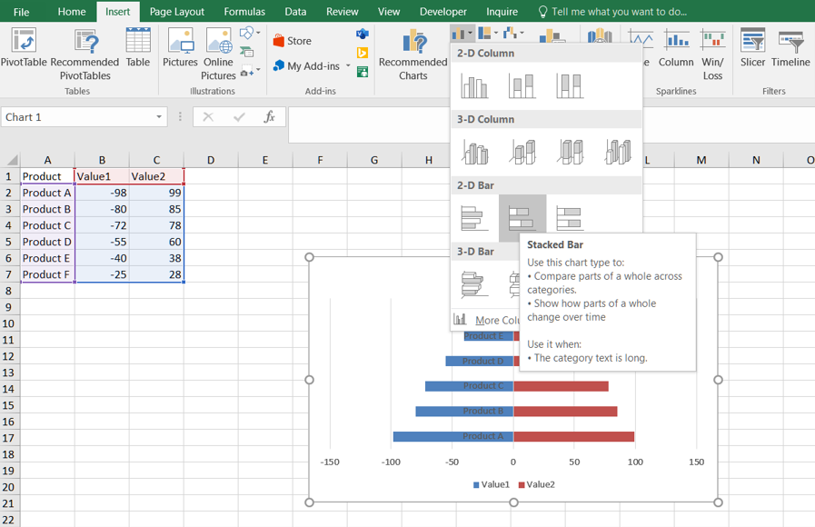
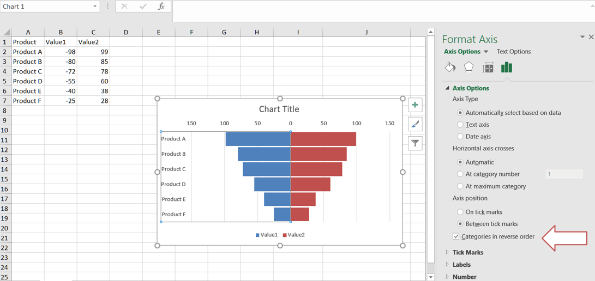

## **Introduction**
A tornado chart, also known as a tornado diagram or tornado graph, is a type of data visualization that is often used for sensitivity analysis in Excel. It helps you understand the impact of changing variables on a particular outcome or result.

## **How to Create a Tornado Chart in Excel**
You can create a tornado chart in Excel by following these steps:
1. Select the data and go to Insert --> Charts --> Insert Column or Bar Chart --> Stacked Bar Chart. Click on it.
<br>

2. Change the Y-axis: Right-click on the y-axis. Click on the format axis. In labels, click on label position drop-down and select Low item.
<br>

3. Select any bar and go to formatting. Set an appropriate gap width.
<br>

4. Let's remove the minus sign (-) from the tornado chart. Select the x-axis. Go to formatting. In the axis options, click on the number. In category, select custom. In format code write ###0,###0. Click on add.
<br>

5. click on the y-axis and go to the axis options. In the Axis options, check Categories in reverse order.
<br>


## **How to Add a Tornado Chart in Aspose.Cells for JavaScript via C++**
Please see the following sample code. It loads the [sample Excel file](sample.xlsx) that contains some sample data. It then creates the stacked bar chart based on the initial data and sets relevant properties. Finally, it saves the workbook to [output XLSX format](out.xlsx). The following screenshot shows the tornado chart created by Aspose.Cells in the output Excel file.
<br>


### **Sample Code**

```html
<!DOCTYPE html>
<html>
    <head>
        <title>Aspose.Cells Example</title>
    </head>
    <body>
        <h1>Aspose.Cells Example</h1>
        <input type="file" id="fileInput" accept=".xlsx" />
        <button id="runExample">Run Example</button>
        <a id="downloadLink" style="display: none;">Download Result</a>
        <div id="result"></div>
    </body>

    <script src="aspose.cells.js.min.js"></script>
    <script type="text/javascript">
        const { Workbook, SaveFormat } = AsposeCells;
        
        AsposeCells.onReady({
            license: "/lic/aspose.cells.enc",
            fontPath: "/fonts/",
            fontList: [
                "arial.ttf",
                "NotoSansSC-Regular.ttf"
            ]
        }).then(() => {
            console.log("Aspose.Cells initialized");
        });

        document.getElementById('runExample').addEventListener('click', async () => {
            const fileInput = document.getElementById('fileInput');
            const resultDiv = document.getElementById('result');
            if (!fileInput.files.length) {
                resultDiv.innerHTML = '<p style="color: red;">Please select an Excel file.</p>';
                return;
            }

            const file = fileInput.files[0];
            const arrayBuffer = await file.arrayBuffer();
            
            // Instantiating a Workbook object from uploaded file
            const workbook = new Workbook(new Uint8Array(arrayBuffer));
            
            // Accessing the first worksheet in the Excel file
            const sheet = workbook.worksheets.get(0);
            const charts = sheet.charts;
            
            // Add bar chart
            const index = charts.add(AsposeCells.ChartType.BarStacked, 8, 1, 24, 8);
            const chart = charts.get(index);
            
            // Set data for bar chart
            chart.chartDataRange = "A1:C7";
            
            // Set properties for bar chart
            chart.title.text = "Tornado chart";
            chart.style = 2;
            chart.plotArea.area.foregroundColor = AsposeCells.Color.White;
            chart.plotArea.border.color = AsposeCells.Color.White;
            chart.legend.position = AsposeCells.LegendPositionType.Bottom;
            
            chart.categoryAxis.tickLabelPosition = AsposeCells.TickLabelPositionType.Low;
            chart.category```html
<!DOCTYPE html>
<html>
    <head>
        <title>Aspose.Cells Example</title>
    </head>
    <body>
        <h1>Aspose.Cells Example</h1>
        <input type="file" id="fileInput" accept=".xlsx" />
        <button id="runExample">Run Example</button>
        <a id="downloadLink" style="display: none;">Download Result</a>
        <div id="result"></div>
    </body>

    <script src="aspose.cells.js.min.js"></script>
    <script type="text/javascript">
        const { Workbook, SaveFormat } = AsposeCells;
        
        AsposeCells.onReady({
            license: "/lic/aspose.cells.enc",
            fontPath: "/fonts/",
            fontList: [
                "arial.ttf",
                "NotoSansSC-Regular.ttf"
            ]
        }).then(() => {
            console.log("Aspose.Cells initialized");
        });

        document.getElementById('runExample').addEventListener('click', async () => {
            const fileInput = document.getElementById('fileInput');
            const resultDiv = document.getElementById('result');
            if (!fileInput.files.length) {
                resultDiv.innerHTML = '<p style="color: red;">Please select an Excel file.</p>';
                return;
            }

            const file = fileInput.files[0];
            const arrayBuffer = await file.arrayBuffer();
            
            // Instantiating a Workbook object from uploaded file
            const workbook = new Workbook(new Uint8Array(arrayBuffer));
            
            // Accessing the first worksheet in the Excel file
            const sheet = workbook.worksheets.get(0);
            const charts = sheet.charts;
            
            // Add bar chart
            const index = charts.add(AsposeCells.ChartType.BarStacked, 8, 1, 24, 8);
            const chart = charts.get(index);
            
            // Set data for bar chart
            chart.chartDataRange = "A1:C7";
            
            // Set properties for bar chart
            chart.title.text = "Tornado chart";
            chart.style = 2;
            chart.plotArea.area.foregroundColor = AsposeCells.Color.White;
            chart.plotArea.border.color = AsposeCells.Color.White;
            chart.legend.position = AsposeCells.LegendPositionType.Bottom;
            
            chart.categoryAxis.tickLabelPosition = AsposeCells.TickLabelPositionType.Low;
            chart.categoryAxis.isPlotOrderReversed = true;
            
            chart.gapWidth = 10;
            
            const valueAxis = chart.valueAxis;
            valueAxis.tickLabels.numberFormat = "#,##0;#,##0";
            
            const outputData = workbook.save(SaveFormat.Xlsx);
            const blob = new Blob([outputData]);
            const downloadLink = document.getElementById('downloadLink');
            downloadLink.href = URL.createObjectURL(blob);
            downloadLink.download = 'out.xlsx';
            downloadLink.style.display = 'block';
            downloadLink.textContent = 'Download Excel File';
            
            resultDiv.innerHTML = '<p style="color: green;">Operation completed successfully! Click the download link to get the modified file.</p>';
        });
    </script>
</html>
```