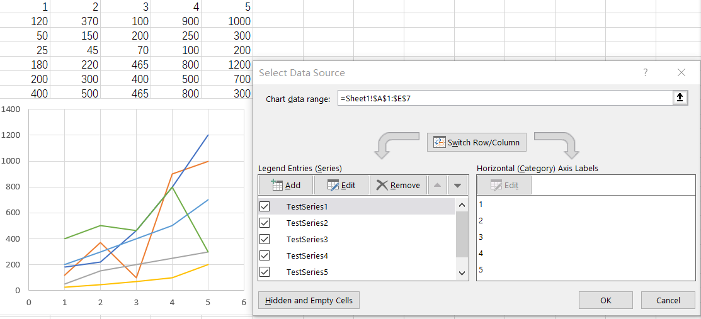

## **1. Filtering out series to render a chart**

### **Steps to filter series from a chart in Excel**
In Excel, we can filter out specific series from a chart, causing those filtered series not to be displayed in the chart. The original chart is shown in **Figure 1**. However, when we filter out **Testseries2** and **Testseries4**, the chart will appear as shown in **Figure 2**.

In Aspose.Cells for JavaScript via C++, we can perform a similar operation. For a [sample](seriesFiltered.xlsx) file like this, if we want to filter out **Testseries2** and **Testseries4**, we can execute the following code. Additionally, we will maintain two lists: one ([Chart.nSeries](https://reference.aspose.com/cells/javascript-cpp/chart/#nSeries--)) list to store all the selected series.




### **Sample Code**
The following sample code loads the [sample Excel file](seriesFiltered.xlsx).

```html
<!DOCTYPE html>
<html>
    <head>
        <title>Aspose.Cells Example</title>
    </head>
    <body>
        <h1>Series Filter Example</h1>
        <input type="file" id="fileInput" accept=".xls,.xlsx,.csv" />
        <button id="runExample">Run Example</button>
        <a id="downloadLink" style="display: none;">Download Result</a>
        <div id="result"></div>
    </body>

    <script src="aspose.cells.js.min.js"></script>
    <script type="text/javascript">
        const { Workbook, SaveFormat } = AsposeCells;
        
        AsposeCells.onReady({
            license: "/lic/aspose.cells.enc",
            fontPath: "/fonts/",
            fontList: [
                "arial.ttf",
                "NotoSansSC-Regular.ttf"
            ]
        }).then(() => {
            console.log("Aspose.Cells initialized");
        });

        document.getElementById('runExample').addEventListener('click', async () => {
            const fileInput = document.getElementById('fileInput');
            if (!fileInput.files.length) {
                document.getElementById('result').innerHTML = '<p style="color: red;">Please select an Excel file.</p>';
                return;
            }

            const file = fileInput.files[0];
            const arrayBuffer = await file.arrayBuffer();
            // Instantiate workbook from uploaded file
            const workbook = new Workbook(new Uint8Array(arrayBuffer));

            // Access first worksheet and chart
            const worksheet = workbook.worksheets.get(0);
            const chart = worksheet.charts.get("Chart 1");

            // Get filtered series list and visible series list
            const nSeriesFiltered = chart.filteredNSeries;
            const nSeries = chart.nSeries;

            // Initial counts
            const initialFilteredCount = nSeriesFiltered.count;
            const initialVisibleCount = nSeries.count;

            console.log("Filtered Series count: " + initialFilteredCount);
            console.log("Visible Series count: " + initialVisibleCount);

            // Process from the end to the beginning - mark series as filtered
            nSeries.get(1).isFiltered = true;
            nSeries.get(0).isFiltered = true;

            // Counts after filtering
            const afterFilteredCount = nSeriesFiltered.count;
            const afterVisibleCount = nSeries.count;

            console.log("Filtered Series count: " + afterFilteredCount);
            console.log("Visible Series count: " + afterVisibleCount);

            // Save the modified workbook and provide download link
            const outputData = workbook.save(SaveFormat.Xlsx);
            const blob = new Blob([outputData]);
            const downloadLink = document.getElementById('downloadLink');
            downloadLink.href = URL.createObjectURL(blob);
            downloadLink.download = 'seriesFiltered-out.xlsx';
            downloadLink.style.display = 'block';
            downloadLink.textContent = 'Download Modified Excel File';

            // Re-open the saved workbook from the in-memory output to validate counts
            const reopenedWorkbook = new Workbook(outputData);
            const reopenedWorksheet = reopenedWorkbook.worksheets.get(0);
            const reopenedChart = reopenedWorksheet.charts.get("Chart 1");
            const reopenedFiltered = reopenedChart.filteredNSeries;
            const reopenedVisible = reopenedChart.nSeries;

            const reopenedFilteredCount = reopenedFiltered.count;
            const reopenedVisibleCount = reopenedVisible.count;

            console.log("Filtered Series count: " + reopenedFilteredCount);
            console.log("Visible Series count: " + reopenedVisibleCount);

            // Display results to user
            document.getElementById('result').innerHTML =
                `<p style="color: green;">Initial - Filtered Series count: ${initialFilteredCount}, Visible Series count: ${initialVisibleCount}</p>` +
                `<p style="color: green;">After Marking - Filtered Series count: ${afterFilteredCount}, Visible Series count: ${afterVisibleCount}</p>` +
                `<p style="color: green;">After Reopen - Filtered Series count: ${reopenedFilteredCount}, Visible Series count: ${reopenedVisibleCount}</p>`;
        });
    </script>
</html>
```

## **2. Filter the data and let the chart change**

Filtering your data is a great way to handle chart filters with a lot of data. When you filter the data, the chart will change. One issue we're going to have to address is making sure the chart stays on the screen. When you filter, you get hidden rows, and occasionally, the chart will be in those hidden rows.


### **Steps to use Data Filters to change the chart in Excel**

1. Click inside your data range.
2. Click the **Data** tab, and turn on Filters by clicking Filters. Your header row will have drop down arrows.
3. Create a chart by going to **Insert** tab and selecting a columns chart.
4. Now filter your data using the drop down arrows in the data. Don't use the Chart Filters.

### **Sample Code**
The following sample code shows the same feature using Aspose.Cells.

```html
<!DOCTYPE html>
<html>
    <head>
        <title>Aspose.Cells Example</title>
    </head>
    <body>
        <h1>Autofilter and Chart Example</h1>
        <input type="file" id="fileInput" accept=".xls,.xlsx,.csv" />
        <button id="runExample">Run Example</button>
        <a id="downloadLink" style="display: none;">Download Result</a>
        <a id="imageDownloadLink" style="display: none; margin-left: 10px;">Download Chart Image</a>
        <div id="result"></div>
    </body>

    <script src="aspose.cells.js.min.js"></script>
    <script type="text/javascript">
        const { Workbook, SaveFormat } = AsposeCells;
        
        AsposeCells.onReady({
            license: "/lic/aspose.cells.enc",
            fontPath: "/fonts/",
            fontList: [
                "arial.ttf",
                "NotoSansSC-Regular.ttf"
            ]
        }).then(() => {
            console.log("Aspose.Cells initialized");
        });

        document.getElementById('runExample').addEventListener('click', async () => {
            const fileInput = document.getElementById('fileInput');
            const resultDiv = document.getElementById('result');
            const downloadLink = document.getElementById('downloadLink');
            const imageDownloadLink = document.getElementById('imageDownloadLink');

            if (!fileInput.files.length) {
                resultDiv.innerHTML = '<p style="color: red;">Please select an Excel file.</p>';
                return;
            }

            // Ensure Aspose.Cells is initialized
            await AsposeCells.onReady();

            const file = fileInput.files[0];
            const arrayBuffer = await file.arrayBuffer();

            // Instantiate workbook from uploaded file
            const workbook = new Workbook(new Uint8Array(arrayBuffer));

            // Access the worksheet named "Sheet1"
            const sheet = workbook.worksheets.get("Sheet1");

            // Add data into detail cells
            sheet.cells.get(0, 0).putValue("Fruits Name");
            sheet.cells.get(0, 1).putValue("Fruits Price");
            sheet.cells.get(1, 0).putValue("Apples");
            sheet.cells.get(2, 0).putValue("Bananas");
            sheet.cells.get(3, 0).putValue("Grapes");
            sheet.cells.get(4, 0).putValue("Oranges");
            sheet.cells.get(1, 1).putValue(5);
            sheet.cells.get(2, 1).putValue(2);
            sheet.cells.get(3, 1).putValue(1);
            sheet.cells.get(4, 1).putValue(4);

            // Add a chart to the worksheet
            const chartIndex = sheet.charts.add(AsposeCells.ChartType.Column, 7, 7, 15, 15);
            const chart = sheet.charts.get(chartIndex);

            // Set data range (converted from setChartDataRange -> chartDataRange property)
            chart.chartDataRange = "A1:B5";

            // Set AutoFilter range (converted from setRange -> range property)
            sheet.autoFilter.range = "A1:B5";

            // Add filters for a filter column.
            sheet.autoFilter.addFilter(0, "Bananas");
            sheet.autoFilter.addFilter(0, "Oranges");

            // Apply the filters
            sheet.autoFilter.refresh();

            // Export chart image (returns image data)
            const imageData = chart.toImage("Autofilter.png");

            // Save the modified workbook
            const outputData = workbook.save(SaveFormat.Xlsx);

            // Prepare Excel download link
            const blob = new Blob([outputData]);
            downloadLink.href = URL.createObjectURL(blob);
            downloadLink.download = 'Autofilter.xlsx';
            downloadLink.style.display = 'inline-block';
            downloadLink.textContent = 'Download Excel File';

            // Prepare image download link if image data exists
            if (imageData) {
                const imgBlob = new Blob([imageData], { type: 'image/png' });
                imageDownloadLink.href = URL.createObjectURL(imgBlob);
                imageDownloadLink.download = 'Autofilter.png';
                imageDownloadLink.style.display = 'inline-block';
                imageDownloadLink.textContent = 'Download Chart Image';
            } else {
                imageDownloadLink.style.display = 'none';
            }

            resultDiv.innerHTML = '<p style="color: green;">Operation completed successfully! Use the download links to get the modified files.</p>';
        });
    </script>
</html>
```

## **3. Filter the data using a Table and let the chart change**

Using a Table is similar to Method 2, using a range, but you have advantages with tables over ranges. When you change your range to a Table and add data, the chart automatically updates. With a range, you will have to change the data source.

### **Format as table in Excel**

Click inside your data and use **CTRL + T** or use the Home tab, **Format as Table**


### **Sample Code**
The following sample code loads the [sample Excel file](TableFilters.xlsx) shows the same feature using Aspose.Cells.

```html
<!DOCTYPE html>
<html>
    <head>
        <title>Aspose.Cells Example</title>
    </head>
    <body>
        <h1>Example Title</h1>
        <input type="file" id="fileInput" accept=".xls,.xlsx,.csv" />
        <button id="runExample">Run Example</button>
        <a id="downloadLink" style="display: none;">Download Result</a>
        <a id="downloadLinkBefore" style="display: none;">Download Before Image</a>
        <a id="downloadLinkAfter" style="display: none;">Download After Image</a>
        <div id="result"></div>
    </body>

    <script src="aspose.cells.js.min.js"></script>
    <script type="text/javascript">
        const { Workbook, SaveFormat } = AsposeCells;
        
        AsposeCells.onReady({
            license: "/lic/aspose.cells.enc",
            fontPath: "/fonts/",
            fontList: [
                "arial.ttf",
                "NotoSansSC-Regular.ttf"
            ]
        }).then(() => {
            console.log("Aspose.Cells initialized");
        });

        document.getElementById('runExample').addEventListener('click', async () => {
            const fileInput = document.getElementById('fileInput');
            if (!fileInput.files.length) {
                document.getElementById('result').innerHTML = '<p style="color: red;">Please select an Excel file.</p>';
                return;
            }

            const file = fileInput.files[0];
            const arrayBuffer = await file.arrayBuffer();

            // Instantiating a Workbook object from uploaded file
            const workbook = new Workbook(new Uint8Array(arrayBuffer));

            // Access first worksheet
            const sheet = workbook.worksheets.get(0);

            // Access the instance of the newly added chart
            const chartIndex = sheet.charts.add(AsposeCells.ChartType.Column, 7, 7, 15, 15);
            const chart = sheet.charts.get(chartIndex);

            // Set data range (converted from setter to property)
            chart.chartDataRange = { range: "A1:B7", isVertical: true };

            // Convert the chart to image (before)
            const beforeImageData = chart.toImage(SaveFormat.Png);
            const beforeBlob = new Blob([beforeImageData]);
            const beforeLink = document.getElementById('downloadLinkBefore');
            beforeLink.href = URL.createObjectURL(beforeBlob);
            beforeLink.download = 'TableFilters.before.png';
            beforeLink.style.display = 'block';
            beforeLink.textContent = 'Download Chart Before Image';

            // Add a new List Object to the worksheet
            const listObjectIndex = sheet.listObjects.add("A1", "B7", true);
            const listObject = sheet.listObjects.get(listObjectIndex);

            // Add default style to the table
            listObject.tableStyleType = AsposeCells.TableStyleType.TableStyleMedium10;

            // Show Total
            listObject.showTotals = false;

            // Add filters for a filter column.
            listObject.autoFilter.addFilter(0, "James");

            // Apply the filters
            listObject.autoFilter.refresh();

            // After adding new value the chart will change
            listObject.putCellValue(7, 0, "Me");
            listObject.putCellValue(7, 1, 1000);

            // Check the changed images (after)
            const afterImageData = chart.toImage(SaveFormat.Png);
            const afterBlob = new Blob([afterImageData]);
            const afterLink = document.getElementById('downloadLinkAfter');
            afterLink.href = URL.createObjectURL(afterBlob);
            afterLink.download = 'TableFilters.after.png';
            afterLink.style.display = 'block';
            afterLink.textContent = 'Download Chart After Image';

            // Saving the Excel file
            const outputData = workbook.save(SaveFormat.Xlsx);
            const blob = new Blob([outputData]);
            const downloadLink = document.getElementById('downloadLink');
            downloadLink.href = URL.createObjectURL(blob);
            downloadLink.download = 'TableFilter.out.xlsx';
            downloadLink.style.display = 'block';
            downloadLink.textContent = 'Download Excel File';

            document.getElementById('result').innerHTML = '<p style="color: green;">Operation completed successfully! Use the download links to get the result files.</p>';
        });
    </script>
</html>
```