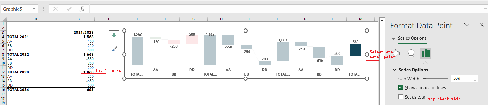

## What is "Set point as total" in Excel Chart

In some Excel charts, for example, a waterFall chart, some point data are the sum of the previous points, and you may need to "set point as total". We will show the sample code and the illustration below.

## A waterFall Chart needs to "Set point as total" 



This picture shows a waterFall chart in Excel. We can see that there are four data points starting with "Total", and they are used to count all the previous data points. In this picture, the settings are not exactly right. When we select a point "Total 2024", we can see that the "Set as total" option is not checked in Excel. Attached below is the [sample Excel file](SampleSheet.xlsx) that needs to be modified, and we will use Aspose.Cells for JavaScript via C++ to set it up correctly.

## Use Aspose.Cells for JavaScript via C++ to "Set point as total" 

We use the following code to get the file set up correctly:

```html
<!DOCTYPE html>
<html>
    <head>
        <title>Set Chart Subtotals Example</title>
    </head>
    <body>
        <h1>Set Chart Subtotals Example</h1>
        <input type="file" id="fileInput" accept=".xls,.xlsx,.csv" />
        <button id="runExample">Run Example</button>
        <a id="downloadLink" style="display: none;">Download Result</a>
        <div id="result"></div>
    </body>

    <script src="aspose.cells.js.min.js"></script>
    <script type="text/javascript">
        const { Workbook, SaveFormat, Worksheet, Cell } = AsposeCells;
        
        AsposeCells.onReady({
            license: "/lic/aspose.cells.enc",
            fontPath: "/fonts/",
            fontList: [
                "arial.ttf",
                "NotoSansSC-Regular.ttf"
            ]
        }).then(() => {
            console.log("Aspose.Cells initialized");
        });

        document.getElementById('runExample').addEventListener('click', async () => {
            const fileInput = document.getElementById('fileInput');
            const resultDiv = document.getElementById('result');
            if (!fileInput.files.length) {
                resultDiv.innerHTML = '<p style="color: red;">Please select an Excel file.</p>';
                return;
            }

            const file = fileInput.files[0];
            const arrayBuffer = await file.arrayBuffer();

            // Instantiating a Workbook object from the uploaded file
            const workbook = new Workbook(new Uint8Array(arrayBuffer));

            // Accessing the first worksheet in the Excel file
            const worksheet = workbook.worksheets.get(0);

            // Accessing the chart named "Graphiq5"
            const chart = worksheet.charts.get("Graphiq5");

            // set some points as total column 
            // In this example, we set points 0, 4, 8, 12 as total
            chart.nSeries.get(0).layoutProperties.subtotals = [0, 4, 8, 12];

            // Saving the modified Excel file
            const outputData = workbook.save(SaveFormat.Xlsx);
            const blob = new Blob([outputData]);
            const downloadLink = document.getElementById('downloadLink');
            downloadLink.href = URL.createObjectURL(blob);
            downloadLink.download = 'output.xlsx';
            downloadLink.style.display = 'block';
            downloadLink.textContent = 'Download Excel File';

            resultDiv.innerHTML = '<p style="color: green;">Operation completed successfully! Click the download link to get the modified file.</p>';
        });
    </script>
</html>
```

You can get the following correct [output file](output.xlsx)

As shown in the figure below, the four "Total" data points are set correctly, and you can see the difference from the previous chart.

