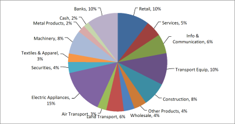

{}

This article explains how to create a pie chart with leader lines from scratch while using Aspose.Cells for JavaScript via C++ API. In Excel, the **‘Show leader lines’** option is set by default, so when you create a pie chart in Excel, the leader lines are shown. However, while creating a similar chart with Aspose.Cells APIs, you have to explicitly set the [**Series.hasLeaderLines**](https://reference.aspose.com/cells/javascript-cpp/series/#hasLeaderLines--) property.

{}

To demonstrate the usage of Aspose.Cells for JavaScript via C++ API to create a pie chart with leader lines, we will first create a new [**Workbook**](https://reference.aspose.com/cells/javascript-cpp/workbook) and input some data that will serve as the series data source. Once the data is in place, we will add a [**Chart**](https://reference.aspose.com/cells/javascript-cpp/chart) of type [**ChartType.Pie**](https://reference.aspose.com/cells/javascript-cpp/charttype) to the collection of charts and set its different aspects to get the desired chart view.

```html
<!DOCTYPE html>
<html>
    <head>
        <title>Create Pie Chart Example</title>
    </head>
    <body>
        <h1>Create Pie Chart Example</h1>
        <input type="file" id="fileInput" accept=".xls,.xlsx,.csv" />
        <button id="runExample">Run Example</button>
        <a id="downloadLink" style="display: none;">Download Result</a>
        <div id="result"></div>
    </body>

    <script src="aspose.cells.js.min.js"></script>
    <script type="text/javascript">
        const { Workbook, SaveFormat, ChartType, LabelPositionType, DataLabelsSeparatorType } = AsposeCells;
        
        AsposeCells.onReady({
            license: "/lic/aspose.cells.enc",
            fontPath: "/fonts/",
            fontList: [
                "arial.ttf",
                "NotoSansSC-Regular.ttf"
            ]
        }).then(() => {
            console.log("Aspose.Cells initialized");
        });

        document.getElementById('runExample').addEventListener('click', async () => {
            const fileInput = document.getElementById('fileInput');
            const resultDiv = document.getElementById('result');
            if (!fileInput.files.length) {
                resultDiv.innerHTML = '<p style="color: red;">Please select an Excel file.</p>';
                return;
            }

            const file = fileInput.files[0];
            const arrayBuffer = await file.arrayBuffer();

            // Instantiating a Workbook object from the uploaded file
            const workbook = new Workbook(new Uint8Array(arrayBuffer));

            // Access the first worksheet
            const worksheet = workbook.worksheets.get(0);

            // Add two columns of data
            worksheet.cells.get("A1").putValue("Retail");
            worksheet.cells.get("A2").putValue("Services");
            worksheet.cells.get("A3").putValue("Info & Communication");
            worksheet.cells.get("A4").putValue("Transport Equip");
            worksheet.cells.get("A5").putValue("Construction");
            worksheet.cells.get("A6").putValue("Other Products");
            worksheet.cells.get("A7").putValue("Wholesale");
            worksheet.cells.get("A8").putValue("Land Transport");
            worksheet.cells.get("A9").putValue("Air Transport");
            worksheet.cells.get("A10").putValue("Electric Appliances");
            worksheet.cells.get("A11").putValue("Securities");
            worksheet.cells.get("A12").putValue("Textiles & Apparel");
            worksheet.cells.get("A13").putValue("Machinery");
            worksheet.cells.get("A14").putValue("Metal Products");
            worksheet.cells.get("A15").putValue("Cash");
            worksheet.cells.get("A16").putValue("Banks");

            worksheet.cells.get("B1").putValue(10.4);
            worksheet.cells.get("B2").putValue(5.2);
            worksheet.cells.get("B3").putValue(6.4);
            worksheet.cells.get("B4").putValue(10.4);
            worksheet.cells.get("B5").putValue(7.9);
            worksheet.cells.get("B6").putValue(4.1);
            worksheet.cells.get("B7").putValue(3.5);
            worksheet.cells.get("B8").putValue(5.7);
            worksheet.cells.get("B9").putValue(3);
            worksheet.cells.get("B10").putValue(14.7);
            worksheet.cells.get("B11").putValue(3.6);
            worksheet.cells.get("B12").putValue(2.8);
            worksheet.cells.get("B13").putValue(7.8);
            worksheet.cells.get("B14").putValue(2.4);
            worksheet.cells.get("B15").putValue(1.8);
            worksheet.cells.get("B16").putValue(10.1);

            // Create a pie chart and add it to the collection of charts
            const id = worksheet.charts.add(ChartType.Pie, 3, 3, 23, 13);

            // Access newly created Chart instance
            const chart = worksheet.charts.get(id);

            // Set series data range
            chart.nSeries.add("B1:B16", true);

            // Set category data range
            chart.nSeries.categoryData = "A1:A16";

            // Turn off legend
            chart.showLegend = false;

            // Access data labels
            const dataLabels = chart.nSeries.get(0).dataLabels;

            // Turn on category names
            dataLabels.showCategoryName = true;

            // Turn on percentage format
            dataLabels.showPercentage = true;

            // Set position
            dataLabels.position = LabelPositionType.OutsideEnd;

            // Set separator
            dataLabels.separatorType = DataLabelsSeparatorType.Comma;

            // Saving the modified Excel file
            const outputData = workbook.save(SaveFormat.Xlsx);
            const blob = new Blob([outputData]);
            const downloadLink = document.getElementById('downloadLink');
            downloadLink.href = URL.createObjectURL(blob);
            downloadLink.download = 'output.xlsx';
            downloadLink.style.display = 'block';
            downloadLink.textContent = 'Download Excel File';

            resultDiv.innerHTML = '<p style="color: green;">Operation completed successfully! Click the download link to get the modified file.</p>';
        });
    </script>
</html>
```

So far we have created a pie chart and set its different aspects. Now we are going to turn on the leader lines for the chart. Please note that to show the leader lines, we have to move the data labels slightly.

The following piece of code turns on the leader lines, refreshes the chart, and then calculates the data labels' positions to move them accordingly.

```html
<!DOCTYPE html>
<html>
    <head>
        <title>Aspose.Cells Pie Chart Example</title>
    </head>
    <body>
        <h1>Aspose.Cells Pie Chart Example</h1>
        <input type="file" id="fileInput" accept=".xls,.xlsx,.csv" />
        <button id="runExample">Run Example</button>
        <a id="downloadLink" style="display: none;">Download Result</a>
        <div id="result"></div>
    </body>

    <script src="aspose.cells.js.min.js"></script>
    <script type="text/javascript">
        const { Workbook, SaveFormat, ChartType, LabelPositionType, DataLabelsSeparatorType } = AsposeCells;
        
        const initPromise = AsposeCells.onReady({
            license: "/lic/aspose.cells.enc",
            fontPath: "/fonts/",
            fontList: [
                "arial.ttf",
                "NotoSansSC-Regular.ttf"
            ]
        }).then(() => {
            console.log("Aspose.Cells initialized");
        });

        document.getElementById('runExample').addEventListener('click', async () => {
            const fileInput = document.getElementById('fileInput');
            if (!fileInput.files.length) {
                document.getElementById('result').innerHTML = '<p style="color: red;">Please select an Excel file.</p>';
                return;
            }

            await initPromise;

            const file = fileInput.files[0];
            const arrayBuffer = await file.arrayBuffer();

            // Instantiating a Workbook object by opening the uploaded file
            const workbook = new Workbook(new Uint8Array(arrayBuffer));

            // Access the first worksheet
            const worksheet = workbook.worksheets.get(0);

            const cells = worksheet.cells;

            // Add two columns of data
            cells.get("A1").value = "Retail";
            cells.get("A2").value = "Services";
            cells.get("A3").value = "Info & Communication";
            cells.get("A4").value = "Transport Equip";
            cells.get("A5").value = "Construction";
            cells.get("A6").value = "Other Products";
            cells.get("A7").value = "Wholesale";
            cells.get("A8").value = "Land Transport";
            cells.get("A9").value = "Air Transport";
            cells.get("A10").value = "Electric Appliances";
            cells.get("A11").value = "Securities";
            cells.get("A12").value = "Textiles & Apparel";
            cells.get("A13").value = "Machinery";
            cells.get("A14").value = "Metal Products";
            cells.get("A15").value = "Cash";
            cells.get("A16").value = "Banks";

            cells.get("B1").value = 10.4;
            cells.get("B2").value = 5.2;
            cells.get("B3").value = 6.4;
            cells.get("B4").value = 10.4;
            cells.get("B5").value = 7.9;
            cells.get("B6").value = 4.1;
            cells.get("B7").value = 3.5;
            cells.get("B8").value = 5.7;
            cells.get("B9").value = 3;
            cells.get("B10").value = 14.7;
            cells.get("B11").value = 3.6;
            cells.get("B12").value = 2.8;
            cells.get("B13").value = 7.8;
            cells.get("B14").value = 2.4;
            cells.get("B15").value = 1.8;
            cells.get("B16").value = 10.1;

            // Create a pie chart and add it to the collection of charts
            const id = worksheet.charts.add(ChartType.Pie, 3, 3, 23, 13);

            // Access newly created Chart instance
            const chart = worksheet.charts.get(id);

            // Set series data range
            chart.nSeries.add("B1:B16", true);

            // Set category data range
            chart.nSeries.categoryData = "A1:A16";

            // Turn off legend
            chart.showLegend = false;

            // Access data labels
            const dataLabels = chart.nSeries.get(0).dataLabels;

            // Turn on category names
            dataLabels.showCategoryName = true;

            // Turn on percentage format
            dataLabels.showPercentage = true;

            // Set position
            dataLabels.position = LabelPositionType.OutsideEnd;

            // Set separator
            dataLabels.separatorType = DataLabelsSeparatorType.Comma;

            // Turn on leader lines
            chart.nSeries.get(0).hasLeaderLines = true;

            // Calculate chart
            chart.calculate();

            // You need to move data labels a little leftward or rightward depending on their position to show leader lines
            const DELTA = 100;
            const series0 = chart.nSeries.get(0);
            for (let i = 0; i < series0.points.count; i++) {
                const pt = series0.points.get(i);
                let X = pt.dataLabels.x;
                // If it is greater than 2000, then move the X position a little right; otherwise move it a little left
                if (X > 2000)
                    pt.dataLabels.x = X + DELTA;
                else
                    pt.dataLabels.x = X - DELTA;
            }

            // Save the modified Excel file and provide download link
            const outputData = workbook.save(SaveFormat.Xlsx);
            const blob = new Blob([outputData]);
            const downloadLink = document.getElementById('downloadLink');
            downloadLink.href = URL.createObjectURL(blob);
            downloadLink.download = 'output.xlsx';
            downloadLink.style.display = 'block';
            downloadLink.textContent = 'Download Excel File';

            document.getElementById('result').innerHTML = '<p style="color: green;">Operation completed successfully! Click the download link to get the modified file.</p>';
        });
    </script>
</html>
```

Finally, the following code saves the chart in image format and the workbook in XLSX format.

```html
<!DOCTYPE html>
<html>
    <head>
        <title>Aspose.Cells Example</title>
    </head>
    <body>
        <h1>Create Pie Chart Example</h1>
        <input type="file" id="fileInput" accept=".xls,.xlsx,.csv" />
        <button id="runExample">Run Example</button>
        <a id="downloadLink" style="display: none; margin-right: 10px;">Download Excel File</a>
        <a id="downloadImageLink" style="display: none;">Download Chart Image</a>
        <div id="result"></div>
    </body>

    <script src="aspose.cells.js.min.js"></script>
    <script type="text/javascript">
        const { Workbook, SaveFormat } = AsposeCells;
        
        AsposeCells.onReady({
            license: "/lic/aspose.cells.enc",
            fontPath: "/fonts/",
            fontList: [
                "arial.ttf",
                "NotoSansSC-Regular.ttf"
            ]
        }).then(() => {
            console.log("Aspose.Cells initialized");
        });

        document.getElementById('runExample').addEventListener('click', async () => {
            const fileInput = document.getElementById('fileInput');
            const resultDiv = document.getElementById('result');
            resultDiv.innerHTML = '';

            // If a file is provided, load it. Otherwise create a new workbook in XLSX format.
            let workbook;
            if (fileInput.files && fileInput.files.length > 0) {
                const file = fileInput.files[0];
                const arrayBuffer = await file.arrayBuffer();
                workbook = new Workbook(new Uint8Array(arrayBuffer));
            } else {
                workbook = new Workbook(AsposeCells.FileFormatType.Xlsx);
            }

            // Access the first worksheet
            const worksheet = workbook.worksheets.get(0);

            // Add two columns of data
            worksheet.cells.get("A1").putValue("Retail");
            worksheet.cells.get("A2").putValue("Services");
            worksheet.cells.get("A3").putValue("Info & Communication");
            worksheet.cells.get("A4").putValue("Transport Equip");
            worksheet.cells.get("A5").putValue("Construction");
            worksheet.cells.get("A6").putValue("Other Products");
            worksheet.cells.get("A7").putValue("Wholesale");
            worksheet.cells.get("A8").putValue("Land Transport");
            worksheet.cells.get("A9").putValue("Air Transport");
            worksheet.cells.get("A10").putValue("Electric Appliances");
            worksheet.cells.get("A11").putValue("Securities");
            worksheet.cells.get("A12").putValue("Textiles & Apparel");
            worksheet.cells.get("A13").putValue("Machinery");
            worksheet.cells.get("A14").putValue("Metal Products");
            worksheet.cells.get("A15").putValue("Cash");
            worksheet.cells.get("A16").putValue("Banks");

            worksheet.cells.get("B1").putValue(10.4);
            worksheet.cells.get("B2").putValue(5.2);
            worksheet.cells.get("B3").putValue(6.4);
            worksheet.cells.get("B4").putValue(10.4);
            worksheet.cells.get("B5").putValue(7.9);
            worksheet.cells.get("B6").putValue(4.1);
            worksheet.cells.get("B7").putValue(3.5);
            worksheet.cells.get("B8").putValue(5.7);
            worksheet.cells.get("B9").putValue(3);
            worksheet.cells.get("B10").putValue(14.7);
            worksheet.cells.get("B11").putValue(3.6);
            worksheet.cells.get("B12").putValue(2.8);
            worksheet.cells.get("B13").putValue(7.8);
            worksheet.cells.get("B14").putValue(2.4);
            worksheet.cells.get("B15").putValue(1.8);
            worksheet.cells.get("B16").putValue(10.1);

            // Create a pie chart and add it to the collection of charts
            const id = worksheet.charts.add(AsposeCells.ChartType.Pie, 3, 3, 23, 13);

            // Access newly created Chart instance
            const chart = worksheet.charts.get(id);

            // Set series data range
            chart.nSeries.add("B1:B16", true);

            // Set category data range
            chart.nSeries.categoryData = "A1:A16";

            // Turn off legend
            chart.showLegend = false;

            // Access data labels
            const dataLabels = chart.nSeries.get(0).dataLabels;

            // Turn on category names
            dataLabels.showCategoryName = true;

            // Turn on percentage format
            dataLabels.showPercentage = true;

            // Set position
            dataLabels.position = AsposeCells.LabelPositionType.OutsideEnd;

            // Set separator
            dataLabels.separatorType = AsposeCells.DataLabelsSeparatorType.Comma;

            // In order to save the chart image, create an instance of ImageOrPrintOptions
            const anOption = new AsposeCells.ImageOrPrintOptions();

            // Set image format
            anOption.imageType = AsposeCells.ImageType.Png;

            // Set resolution
            anOption.horizontalResolution = 200;
            anOption.verticalResolution = 200;

            // Render chart to image (returns image byte array in browser)
            const imageData = chart.toImage(anOption);
            const imageBlob = new Blob([imageData], { type: 'image/png' });
            const downloadImageLink = document.getElementById('downloadImageLink');
            downloadImageLink.href = URL.createObjectURL(imageBlob);
            downloadImageLink.download = 'output_out.png';
            downloadImageLink.style.display = 'inline-block';
            downloadImageLink.textContent = 'Download Chart Image';

            // Save the workbook to see chart inside the Excel
            const outputData = workbook.save(SaveFormat.Xlsx);
            const blob = new Blob([outputData], { type: 'application/vnd.openxmlformats-officedocument.spreadsheetml.sheet' });
            const downloadLink = document.getElementById('downloadLink');
            downloadLink.href = URL.createObjectURL(blob);
            downloadLink.download = 'output_out.xlsx';
            downloadLink.style.display = 'inline-block';
            downloadLink.textContent = 'Download Excel File';

            resultDiv.innerHTML = '<p style="color: green;">Chart created and files are ready. Click the download links to get the results.</p>';
        });
    </script>
</html>
```

| **Resultant Pie Chart** |
| :- |
|  |

## **Advanced topics**
- [Custom Slice or Sector Colors in Pie Chart](/cells/javascript-cpp/custom-slice-or-sector-colors-in-pie-chart/)
- [Find if Data Points are in the Second Pie or Bar on a Pie of Pie or Bar of Pie Chart](/cells/javascript-cpp/find-if-data-points-are-in-the-second-pie-or-bar-on-a-pie-of-pie-or-bar-of-pie-chart/)

## Related Articles

- [Creating Charts](/cells/javascript-cpp/creating-charts/)
- [Customizing Charts](/cells/javascript-cpp/customizing-charts/)
- [Data Formatting in Charts](/cells/javascript-cpp/data-formatting-in-charts/)
- [Setting Chart Appearance](/cells/javascript-cpp/setting-chart-appearance/)