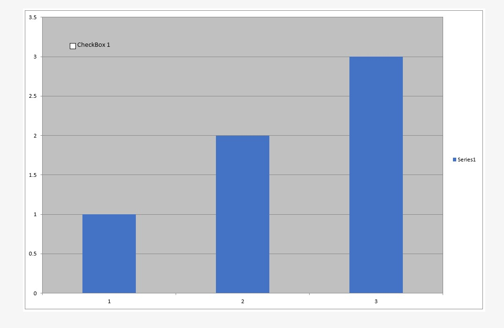

{}
Sometimes you need to insert drawing objects like labels, text boxes, pictures, and so on into a chart. Aspose.Cells can add the controls to a chart at runtime.
{}

## **Adding Label Control to the Chart**

Labels provide a means for giving information to users about a spreadsheet's content. Aspose.Cells allows you to add and manipulate labels even into charts.

The [**ShapeCollection**](https://reference.aspose.com/cells/javascript-cpp/shapecollection/) class provides a method named [**addLabelInChart(number, number, number, number)**](https://reference.aspose.com/cells/javascript-cpp/shapecollection/#addLabelInChart-number-number-number-number-), used to add a label control to a chart. Below is a list of the parameters used for the method:

- **top** – the vertical offset of the label from the upper left corner in units of 1/4000 of the chart area.
- **left** – the horizontal offset of the label from the upper left corner in units of 1/4000 of the chart area.
- **height** – the height of the label, in units of 1/4000 of the chart area.
- **width** – the width of the label, in units of 1/4000 of the chart area.

The method returns [**Label**](https://reference.aspose.com/cells/javascript-cpp/label/) object. The [**Label**](https://reference.aspose.com/cells/javascript-cpp/label/) class represents a label in the chart. It has some important members:

- [**text**](https://reference.aspose.com/cells/javascript-cpp/shape/#text--) (property) – specifies a label's caption string.
- [**fill**](https://reference.aspose.com/cells/javascript-cpp/shape/#fill--) (property) – specifies the fill color attributes.

The following example shows how to add a label to the chart. The example uses a designer file (**exp_piechart.xls**) which has a chart in it. We use this file to insert a label into the chart. Below is the original code for adding a label to the chart. The following output is generated when executing the code.

```html
<!DOCTYPE html>
<html>
    <head>
        <title>Add Label In Chart Example</title>
    </head>
    <body>
        <h1>Add Label In Chart Example</h1>
        <input type="file" id="fileInput" accept=".xls,.xlsx,.csv" />
        <button id="runExample">Run Example</button>
        <a id="downloadLink" style="display: none;">Download Result</a>
        <div id="result"></div>
    </body>

    <script src="aspose.cells.js.min.js"></script>
    <script type="text/javascript">
        const { Workbook, SaveFormat } = AsposeCells;
        
        AsposeCells.onReady({
            license: "/lic/aspose.cells.enc",
            fontPath: "/fonts/",
            fontList: [
                "arial.ttf",
                "NotoSansSC-Regular.ttf"
            ]
        }).then(() => {
            console.log("Aspose.Cells initialized");
        });

        document.getElementById('runExample').addEventListener('click', async () => {
            const fileInput = document.getElementById('fileInput');
            if (!fileInput.files.length) {
                document.getElementById('result').innerHTML = '<p style="color: red;">Please select an Excel file.</p>';
                return;
            }

            const file = fileInput.files[0];
            const arrayBuffer = await file.arrayBuffer();

            // Instantiating a Workbook object by opening the Excel file from the uploaded file
            const workbook = new Workbook(new Uint8Array(arrayBuffer));

            // Get the designer chart in the second sheet.
            const sheet = workbook.worksheets.get(1);
            const chart = sheet.charts.get(0);

            // Add a new label to the chart.
            const label = chart.shapes.addLabelInChart(100, 100, 350, 900);

            // Set the caption of the label.
            label.text = "A Label In Chart";

            // Set the Placement Type, the way the Label is attached to the cells.
            label.placement = AsposeCells.PlacementType.FreeFloating;

            // Save the excel file and provide a download link.
            const outputData = workbook.save(SaveFormat.Excel97To2003);
            const blob = new Blob([outputData]);
            const downloadLink = document.getElementById('downloadLink');
            downloadLink.href = URL.createObjectURL(blob);
            downloadLink.download = 'chart.out.xls';
            downloadLink.style.display = 'block';
            downloadLink.textContent = 'Download Modified Excel File';

            document.getElementById('result').innerHTML = '<p style="color: green;">Label added successfully! Click the download link to get the modified file.</p>';
        });
    </script>
</html>
```

## **Adding TextBox Control to the Chart**

One way to highlight important information in a report is to use a text box. For example, enter text to highlight the company name or to indicate the geographic region with the highest sales. The [**ShapeCollection**](https://reference.aspose.com/cells/javascript-cpp/shapecollection/) class provides a method named [**addTextBoxInChart(number, number, number, number)**](https://reference.aspose.com/cells/javascript-cpp/shapecollection/#addTextBoxInChart-number-number-number-number-), which is used to add a text box control to a chart. Following is the parameters list used for the method:

- **top** – the vertical offset of the text box from the upper left corner in units of 1/4000 of the chart area.
- **left** – the horizontal offset of the text box from the upper left corner in units of 1/4000 of the chart area.
- **height** – the height of the text box, in units of 1/4000 of the chart area.
- **width** – the width of the text box, in units of 1/4000 of the chart area.

The method returns [**TextBox**](https://reference.aspose.com/cells/javascript-cpp/textbox/) object. The [**TextBox**](https://reference.aspose.com/cells/javascript-cpp/textbox/) class represents a text box in the chart.

The following example shows how to add a text box to a chart. The example uses the previous designer file (**exp_piechart.xls**) which has a chart in it. We use this file to insert a text box into the chart to show the chart title. Below is the original code for adding a text box to the chart.

```html
<!DOCTYPE html>
<html>
    <head>
        <title>Aspose.Cells Example</title>
    </head>
    <body>
        <h1>Aspose.Cells Example</h1>
        <input type="file" id="fileInput" accept=".xls,.xlsx,.csv" />
        <button id="runExample">Run Example</button>
        <a id="downloadLink" style="display: none;">Download Result</a>
        <div id="result"></div>
    </body>

    <script src="aspose.cells.js.min.js"></script>
    <script type="text/javascript">
        const { Workbook, SaveFormat } = AsposeCells;
        
        AsposeCells.onReady({
            license: "/lic/aspose.cells.enc",
            fontPath: "/fonts/",
            fontList: [
                "arial.ttf",
                "NotoSansSC-Regular.ttf"
            ]
        }).then(() => {
            console.log("Aspose.Cells initialized");
        });

        document.getElementById('runExample').addEventListener('click', async () => {
            const fileInput = document.getElementById('fileInput');
            if (!fileInput.files.length) {
                document.getElementById('result').innerHTML = '<p style="color: red;">Please select an Excel file.</p>';
                return;
            }

            const file = fileInput.files[0];
            const arrayBuffer = await file.arrayBuffer();

            // Opening the Excel file through the file stream
            const workbook = new Workbook(new Uint8Array(arrayBuffer));

            // Get the designer chart in the second sheet.
            const sheet = workbook.worksheets.get(1);
            const chart = sheet.charts.get(0);

            // Add a new textbox to the chart.
            const textbox0 = chart.shapes.addTextBoxInChart(100, 1100, 350, 2550);

            // Fill the text.
            textbox0.text = "Sales By Region";

            // Get the textbox text frame.
            // const textframe0 = textbox0.textFrame;

            // Set the textbox to adjust it according to its contents.
            // textframe0.autoSize = true;

            // Set the font color.
            textbox0.font.color = AsposeCells.Color.Maroon;

            // Set the font to bold.
            textbox0.font.isBold = true;

            // Set the font size.
            textbox0.font.size = 14;

            // Set font attribute to italic.
            textbox0.font.isItalic = true;

            // Get the fill format of the textbox.
            const fillformat = textbox0.fill;

            // Get the line format type of the textbox.
            const lineformat = textbox0.line;

            // Set the line weight.
            lineformat.weight = 2;

            // Set the dash style to solid.
            lineformat.dashStyle = AsposeCells.MsoLineDashStyle.Solid;

            // Save the excel file.
            const outputData = workbook.save(SaveFormat.Excel97To2003);
            const blob = new Blob([outputData]);
            const downloadLink = document.getElementById('downloadLink');
            downloadLink.href = URL.createObjectURL(blob);
            downloadLink.download = 'chart.out.xls';
            downloadLink.style.display = 'block';
            downloadLink.textContent = 'Download Modified Excel File';

            document.getElementById('result').innerHTML = '<p style="color: green;">Operation completed successfully! Click the download link to get the modified file.</p>';
        });
    </script>
</html>
```

## **Adding Picture to the Chart**

Aspose.Cells allows you to insert images into a chart. For example, add a picture to emphasize or give more meaning to a chart or its contents, or insert a brand image file.

The [**ShapeCollection**](https://reference.aspose.com/cells/javascript-cpp/shapecollection/) class provides a method named [**addPictureInChart(number, number, Uint8Array, number, number)**](https://reference.aspose.com/cells/javascript-cpp/shapecollection/#addPictureInChart-number-number-uint8array-number-number-), which is used to add a picture object to the chart. Following is the parameters list used for the method:

- **top** – the vertical offset of the picture from the upper left corner in units of 1/4000 of the chart area.
- **left** – the horizontal offset of the picture from the upper left corner in units of 1/4000 of the chart area.
- **stream** – a stream object that contains the image data.
- **widthScale** – the scale of the image width, a percentage value.
- **heightScale** – the scale of the image height, a percentage value.

The method returns an [**Picture**](https://reference.aspose.com/cells/javascript-cpp/picture/) object. The [**Picture**](https://reference.aspose.com/cells/javascript-cpp/picture/) class represents a picture object in the chart.

The following example shows how to add a picture to the chart. The example utilizes the previous designer file (**exp_piechart.xls**) which has a chart in it. We use this file to insert an image into the chart. Below is the original code for adding a picture to the chart.

```html
<!DOCTYPE html>
<html>
    <head>
        <title>Aspose.Cells Example - Add Picture to Chart</title>
    </head>
    <body>
        <h1>Add Picture to Chart Example</h1>
        <p>Select an Excel file and an image to add to the first chart in the first worksheet.</p>
        <input type="file" id="fileInput" accept=".xls,.xlsx,.csv" />
        <input type="file" id="imageInput" accept="image/*" />
        <button id="runExample">Run Example</button>
        <a id="downloadLink" style="display: none;">Download Result</a>
        <div id="result"></div>
    </body>

    <script src="aspose.cells.js.min.js"></script>
    <script type="text/javascript">
        const { Workbook, SaveFormat } = AsposeCells;
        
        AsposeCells.onReady({
            license: "/lic/aspose.cells.enc",
            fontPath: "/fonts/",
            fontList: [
                "arial.ttf",
                "NotoSansSC-Regular.ttf"
            ]
        }).then(() => {
            console.log("Aspose.Cells initialized");
        });

        document.getElementById('runExample').addEventListener('click', async () => {
            const fileInput = document.getElementById('fileInput');
            const imageInput = document.getElementById('imageInput');
            if (!fileInput.files.length || !imageInput.files.length) {
                document.getElementById('result').innerHTML = '<p style="color: red;">Please select an Excel file and an image file.</p>';
                return;
            }

            const file = fileInput.files[0];
            const imageFile = imageInput.files[0];

            const arrayBuffer = await file.arrayBuffer();
            const imageBuffer = await imageFile.arrayBuffer();

            // Instantiating a Workbook object from the uploaded Excel file
            const workbook = new Workbook(new Uint8Array(arrayBuffer));

            // Get the designer chart in the first sheet.
            const sheet = workbook.worksheets.get(0);
            const chart = sheet.charts.get(0);

            // Add a new picture to the chart.
            const pic0 = chart.shapes.addPictureInChart(50, 50, new Uint8Array(imageBuffer), 40, 40);

            // Get the lineformat type of the picture.
            const lineformat = pic0.line;

            // Set the dash style.
            lineformat.dashStyle = AsposeCells.MsoLineDashStyle.Solid;

            // Set the line weight.
            lineformat.weight = 4;

            // Save the modified Excel file and provide a download link.
            const outputData = workbook.save(SaveFormat.Excel97To2003);
            const blob = new Blob([outputData]);
            const downloadLink = document.getElementById('downloadLink');
            downloadLink.href = URL.createObjectURL(blob);
            downloadLink.download = 'chart.out.xls';
            downloadLink.style.display = 'block';
            downloadLink.textContent = 'Download Modified Excel File';

            document.getElementById('result').innerHTML = '<p style="color: green;">Picture added to chart successfully! Click the download link to get the modified file.</p>';
        });
    </script>
</html>
```

## **Adding a Checkbox to the Chart**

Aspose.Cells allows you to insert checkboxes into a chart sheet by using the [**MsoDrawingType**](https://reference.aspose.com/cells/javascript-cpp/msodrawingtype/) enumeration. The following example demonstrates adding a checkbox to a chart sheet.

The following image shows the chart sheet with the checkbox in the output file.



The [output file](101089316.xlsx) generated by the following code snippet is attached for your reference.

```html
<!DOCTYPE html>
<html>
    <head>
        <title>Insert Checkbox in Chart Sheet Example</title>
        <meta charset="utf-8" />
        <style>
            body { font-family: Arial, sans-serif; margin: 20px; }
            #downloadLink { display: none; margin-top: 10px; display: inline-block; }
            #result p { margin: 8px 0; }
        </style>
    </head>
    <body>
        <h1>Insert Checkbox in Chart Sheet Example</h1>
        <input type="file" id="fileInput" accept=".xls,.xlsx,.csv" />
        <button id="runExample">Run Example</button>
        <a id="downloadLink">Download Result</a>
        <div id="result"></div>
    </body>

    <script src="aspose.cells.js.min.js"></script>
    <script type="text/javascript">
        const { Workbook, SaveFormat } = AsposeCells;
        
        AsposeCells.onReady({
            license: "/lic/aspose.cells.enc",
            fontPath: "/fonts/",
            fontList: [
                "arial.ttf",
                "NotoSansSC-Regular.ttf"
            ]
        }).then(() => {
            console.log("Aspose.Cells initialized");
        });

        document.getElementById('runExample').addEventListener('click', async () => {
            const resultDiv = document.getElementById('result');
            resultDiv.innerHTML = '';
            // This example creates a new workbook and inserts a chart sheet with a checkbox in the chart.
            // The file input is optional for this example (a new workbook is created regardless).
            
            // Instantiating a Workbook object
            const workbook = new Workbook();
            
            // Adding a chart sheet to the workbook
            const index = workbook.worksheets.add(AsposeCells.SheetType.Chart);
            
            // Access the newly added chart sheet
            const sheet = workbook.worksheets.get(index);
            
            // Add a floating column chart to the chart sheet
            sheet.charts.addFloatingChart(AsposeCells.ChartType.Column, 0, 0, 1024, 960);
            
            // Add an nSeries to the chart (single series with values 1,2,3)
            sheet.charts.get(0).nSeries.add("{1,2,3}", false);
            
            // Add checkbox to the chart
            sheet.charts.get(0).shapes.addShapeInChart(AsposeCells.MsoDrawingType.CheckBox, AsposeCells.PlacementType.Move, 400, 400, 1000, 600);
            
            // Set text of the checkbox shape
            sheet.charts.get(0).shapes.get(0).text = "CheckBox 1";
            
            // Save the workbook to XLSX format and provide a download link
            const outputData = workbook.save(SaveFormat.Xlsx);
            const blob = new Blob([outputData], { type: "application/vnd.openxmlformats-officedocument.spreadsheetml.sheet" });
            const downloadLink = document.getElementById('downloadLink');
            downloadLink.href = URL.createObjectURL(blob);
            downloadLink.download = 'InsertCheckboxInChartSheet_out.xlsx';
            downloadLink.style.display = 'inline-block';
            downloadLink.textContent = 'Download Excel File';
            
            resultDiv.innerHTML = '<p style="color: green;">Chart sheet with checkbox created successfully! Click the download link to get the file.</p>';
        });
    </script>
</html>
```

## **Advanced Topics**
- [Add WordArt Watermark to Chart](/cells/javascript-cpp/add-wordart-watermark-to-chart/)