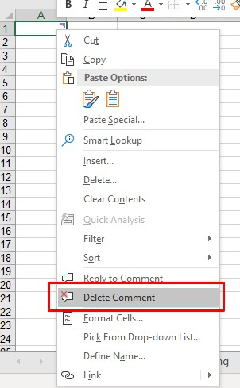

## **Threaded Comments**

MS Excel 365 provides a feature to add threaded comments. These comments work as conversations and can be used for discussions. The comments now come with a Reply box that allows for threaded conversations. The old comments are called Notes in Excel 365. The screenshot below shows how threaded comments are displayed when opened in Excel.


Threaded comments are shown like this in older versions of Excel. The following images have been taken by opening the sample file in Excel 2016.


Aspose.Cells also provides the feature to manage threaded comments.

## **Add Threaded Comments**

### **Add Threaded comment with Excel**

To add threaded comments in Excel 365, follow the following steps.

- Method 1
  - Click the **Review** Tab
  - Click the **New Comment** button
  - This will open a dialogue to enter comments in the active cell.
  - 
- Method 2
  - Right click on the cell where you want to insert the comment.
  - Click the **New Comment** option.
  - This will open a dialogue to enter comments in the active cell.
  - 

### **Add Threaded Comment using Aspose.Cells**

Aspose.Cells provides [**Comments.AddThreadedComment**](https://reference.aspose.com/cells/javascript-cpp/commentcollection/#addthreadedcomment-string-string-ThreadedCommentAuthor-) method to add threaded comments. The [**Comments.AddThreadedComment**](https://reference.aspose.com/cells/javascript-cpp/commentcollection/#addthreadedcomment-string-string-ThreadedCommentAuthor-) method accepts the following three parameters.

- Cell Name: The name of the cell where the comment will be inserted.
- Comment Text: The text of the comment.
- [**ThreadedCommentAuthor**](https://reference.aspose.com/cells/javascript-cpp/threadedcommentauthor): The author of the comment

The following code sample demonstrates the use of [**Comments.AddThreadedComment**](https://reference.aspose.com/cells/javascript-cpp/commentcollection/#addthreadedcomment-string-string-ThreadedCommentAuthor-) method to add a threaded comment to cell A1. Please see the [output Excel file](89849859.xlsx) generated by the code for reference.

#### **Sample Code**

```html
<!DOCTYPE html>
<html>
    <head>
        <title>Aspose.Cells Example - Add Threaded Comment</title>
    </head>
    <body>
        <h1>Add Threaded Comment Example</h1>
        <input type="file" id="fileInput" accept=".xls,.xlsx,.csv" />
        <button id="runExample">Run Example</button>
        <a id="downloadLink" style="display: none;">Download Result</a>
        <div id="result"></div>
    </body>

    <script src="aspose.cells.js.min.js"></script>
    <script type="text/javascript">
        const { Workbook, SaveFormat } = AsposeCells;
        
        AsposeCells.onReady({
            license: "/lic/aspose.cells.enc",
            fontPath: "/fonts/",
            fontList: [
                "arial.ttf",
                "NotoSansSC-Regular.ttf"
            ]
        }).then(() => {
            console.log("Aspose.Cells initialized");
        });

        document.getElementById('runExample').addEventListener('click', async () => {
            // Create a new workbook
            const workbook = new Workbook();

            // Add Author
            const authorIndex = workbook.worksheets.threadedCommentAuthors.add("Aspose Test", "", "");
            const author = workbook.worksheets.threadedCommentAuthors.get(authorIndex);

            // Add Threaded Comment to cell A1 in the first worksheet
            const worksheet = workbook.worksheets.get(0);
            worksheet.comments.addThreadedComment("A1", "Test Threaded Comment", author);

            // Save the modified workbook and provide download link
            const outputData = workbook.save(SaveFormat.Xlsx);
            const blob = new Blob([outputData]);
            const downloadLink = document.getElementById('downloadLink');
            downloadLink.href = URL.createObjectURL(blob);
            downloadLink.download = 'AddThreadedComments_out.xlsx';
            downloadLink.style.display = 'block';
            downloadLink.textContent = 'Download Excel File';

            document.getElementById('result').innerHTML = '<p style="color: green;">Threaded comment added successfully! Click the download link to get the file.</p>';
        });
    </script>
</html>
```

## **Read Threaded Comments**

### **Read Threaded comments with Excel**

To read threaded comments in Excel, simply hover your mouse over the cell containing comments to view the comments. The comments view will look like the view in the following image.


### **Read Threaded comments using Aspose.Cells**

Aspose.Cells provides [**Comments.threadedComments**](https://reference.aspose.com/cells/javascript-cpp/commentcollection/#threadedComments-string-) method to retrieve threaded comments for the specified column. [**Comments.threadedComments**](https://reference.aspose.com/cells/javascript-cpp/commentcollection/#threadedComments-string-) method accepts the column name as a parameter and returns the [**ThreadedCommentCollection**](https://reference.aspose.com/cells/javascript-cpp/threadedcommentcollection). You can iterate over the [**ThreadedCommentCollection**](https://reference.aspose.com/cells/javascript-cpp/threadedcommentcollection) to view the comments.

The following example demonstrates reading comments from column A1 by loading the [sample Excel File](89849861.xlsx). Please see the console output generated by the code for reference.

#### **Sample Code**

```html
<!DOCTYPE html>
<html>
    <head>
        <title>Aspose.Cells Threaded Comments Example</title>
    </head>
    <body>
        <h1>Threaded Comments Example</h1>
        <input type="file" id="fileInput" accept=".xls,.xlsx,.csv" />
        <button id="runExample">Run Example</button>
        <a id="downloadLink" style="display: none;">Download Result</a>
        <div id="result"></div>
    </body>

    <script src="aspose.cells.js.min.js"></script>
    <script type="text/javascript">
        const { Workbook, SaveFormat, Worksheet, Cell } = AsposeCells;
        
        AsposeCells.onReady({
            license: "/lic/aspose.cells.enc",
            fontPath: "/fonts/",
            fontList: [
                "arial.ttf",
                "NotoSansSC-Regular.ttf"
            ]
        }).then(() => {
            console.log("Aspose.Cells initialized");
        });

        document.getElementById('runExample').addEventListener('click', async () => {
            const fileInput = document.getElementById('fileInput');
            const resultDiv = document.getElementById('result');
            if (!fileInput.files.length) {
                resultDiv.innerHTML = '<p style="color: red;">Please select an Excel file.</p>';
                return;
            }

            const file = fileInput.files[0];
            const arrayBuffer = await file.arrayBuffer();

            // Instantiating a Workbook object from uploaded file
            const workbook = new Workbook(new Uint8Array(arrayBuffer));

            // Access first worksheet
            const worksheet = workbook.worksheets.get(0);

            // Get Threaded Comments for cell A1
            const threadedComments = worksheet.comments.threadedComments("A1");

            const count = threadedComments.count;
            let html = '<h2>Threaded Comments</h2>';
            if (count === 0) {
                html += '<p>No threaded comments found for A1.</p>';
            } else {
                html += '<ul>';
                for (let i = 0; i < count; i++) {
                    const comment = threadedComments.get(i);
                    const notes = comment.notes;
                    const authorName = comment.author.name;
                    html += `<li><strong>Author:</strong> ${authorName} <br/><strong>Comment:</strong> ${notes}</li>`;
                }
                html += '</ul>';
            }

            resultDiv.innerHTML = html;
        });
    </script>
</html>
```

#### **Console Output**



Comment: Test Threaded Comment

Author: Aspose Test



### **Read Created Time of threaded comments**

Aspose.Cells provides [**Comments.threadedComments**](https://reference.aspose.com/cells/javascript-cpp/commentcollection/#threadedComments-string-) method to retrieve threaded comments for the specified column. [**Comments.threadedComments**](https://reference.aspose.com/cells/javascript-cpp/commentcollection/#threadedComments-string-) method accepts the column name as a parameter and returns the [**ThreadedCommentCollection**](https://reference.aspose.com/cells/javascript-cpp/threadedcommentcollection). You can iterate over the [**ThreadedCommentCollection**](https://reference.aspose.com/cells/javascript-cpp/threadedcommentcollection) and use the [**ThreadedComment.createdTime**](https://reference.aspose.com/cells/javascript-cpp/threadedcomment/#createdTime--) property.

The following example demonstrates reading the created time of threaded comments by loading the [sample Excel File](89849861.xlsx). Please see the console output generated by the code for reference.

#### **Sample Code**

```html
<!DOCTYPE html>
<html>
    <head>
        <title>Aspose.Cells Threaded Comments Example</title>
    </head>
    <body>
        <h1>Threaded Comments Example</h1>
        <input type="file" id="fileInput" accept=".xls,.xlsx,.csv" />
        <button id="runExample">Run Example</button>
        <a id="downloadLink" style="display: none;">Download Result</a>
        <div id="result"></div>
    </body>

    <script src="aspose.cells.js.min.js"></script>
    <script type="text/javascript">
        const { Workbook, SaveFormat, Worksheet, Cell } = AsposeCells;
        
        AsposeCells.onReady({
            license: "/lic/aspose.cells.enc",
            fontPath: "/fonts/",
            fontList: [
                "arial.ttf",
                "NotoSansSC-Regular.ttf"
            ]
        }).then(() => {
            console.log("Aspose.Cells initialized");
        });

        document.getElementById('runExample').addEventListener('click', async () => {
            const fileInput = document.getElementById('fileInput');
            const resultDiv = document.getElementById('result');
            const downloadLink = document.getElementById('downloadLink');

            if (!fileInput.files.length) {
                resultDiv.innerHTML = '<p style="color: red;">Please select an Excel file.</p>';
                return;
            }

            // No try-catch: allow errors to propagate for testing
            const file = fileInput.files[0];
            const arrayBuffer = await file.arrayBuffer();

            // Loads the workbook from the uploaded file
            const workbook = new Workbook(new Uint8Array(arrayBuffer));

            // Access first worksheet
            const worksheet = workbook.worksheets.get(0);

            // Get Threaded Comments for cell A1
            const threadedComments = worksheet.comments.threadedComments("A1");

            const count = threadedComments.count;

            let html = '<h2>Threaded Comments (Cell A1)</h2>';
            if (count === 0) {
                html += '<p>No threaded comments found in cell A1.</p>';
            } else {
                html += '<ul>';
                for (let i = 0; i < count; i++) {
                    const comment = threadedComments.get(i);
                    const notes = comment.notes;
                    const authorName = comment.author.name;
                    const createdTime = comment.createdTime;

                    console.log("Comment: " + notes);
                    console.log("Author: " + authorName);
                    console.log("Created Time: " + createdTime);

                    html += `<li><strong>Author:</strong> ${authorName} <br/><strong>Created:</strong> ${createdTime} <br/><strong>Comment:</strong> ${notes}</li>`;
                }
                html += '</ul>';
            }

            resultDiv.innerHTML = html;

            // No file modifications or save in this example; hide download link
            downloadLink.style.display = 'none';
        });
    </script>
</html>
```

#### **Console Output**



Comment: Test Threaded Comment

Author: Aspose Test

Created Time: 5/15/2019 12:46:23 PM



## **Edit Threaded Comments**

### **Edit Threaded comment with Excel**

To edit a threaded comment in Excel, click the **Edit** link on the comment as shown in the following image.


### **Edit Threaded comment using Aspose.Cells**

Aspose.Cells provides [**Comments.threadedComments**](https://reference.aspose.com/cells/javascript-cpp/commentcollection/#threadedComments-string-) method to retrieve threaded comments for the specified column. [**Comments.threadedComments**](https://reference.aspose.com/cells/javascript-cpp/commentcollection/#threadedComments-string-) method accepts the column name as a parameter and returns the [**ThreadedCommentCollection**](https://reference.aspose.com/cells/javascript-cpp/threadedcommentcollection). You can update the required comment in the [**ThreadedCommentCollection**](https://reference.aspose.com/cells/javascript-cpp/threadedcommentcollection) and save the workbook.

The following example demonstrates editing the first threaded comment in column A1 by loading the [sample Excel File](89849861.xlsx). Please see the [output Excel file](89849862.xlsx) generated by the code showing the updated comment for reference.

#### **Sample Code**

```html
<!DOCTYPE html>
<html>
    <head>
        <title>Aspose.Cells Example</title>
    </head>
    <body>
        <h1>Edit Threaded Comments Example</h1>
        <input type="file" id="fileInput" accept=".xls,.xlsx,.csv" />
        <button id="runExample">Run Example</button>
        <a id="downloadLink" style="display: none;">Download Result</a>
        <div id="result"></div>
    </body>

    <script src="aspose.cells.js.min.js"></script>
    <script type="text/javascript">
        const { Workbook, SaveFormat } = AsposeCells;
        
        AsposeCells.onReady({
            license: "/lic/aspose.cells.enc",
            fontPath: "/fonts/",
            fontList: [
                "arial.ttf",
                "NotoSansSC-Regular.ttf"
            ]
        }).then(() => {
            console.log("Aspose.Cells initialized");
        });

        document.getElementById('runExample').addEventListener('click', async () => {
            const fileInput = document.getElementById('fileInput');
            const resultDiv = document.getElementById('result');
            if (!fileInput.files.length) {
                resultDiv.innerHTML = '<p style="color: red;">Please select an Excel file.</p>';
                return;
            }

            const file = fileInput.files[0];
            const arrayBuffer = await file.arrayBuffer();

            // Instantiating a Workbook object by opening the Excel file from the file input
            const workbook = new Workbook(new Uint8Array(arrayBuffer));

            // Access first worksheet
            const worksheet = workbook.worksheets.get(0);

            // Get Threaded Comment from cell A1
            const comment = worksheet.comments.threadedComments("A1").get(0);

            // Update the threaded comment notes
            comment.notes = "Updated Comment";

            // Save the modified Excel file
            const outputData = workbook.save(SaveFormat.Xlsx);
            const blob = new Blob([outputData]);
            const downloadLink = document.getElementById('downloadLink');
            downloadLink.href = URL.createObjectURL(blob);
            downloadLink.download = 'EditThreadedComments.xlsx';
            downloadLink.style.display = 'block';
            downloadLink.textContent = 'Download Edited Excel File';

            resultDiv.innerHTML = '<p style="color: green;">Threaded comment updated successfully! Click the download link to get the modified file.</p>';
        });
    </script>
</html>
```

## **Remove Threaded Comments**

### **Remove Threaded comments with Excel**

To remove threaded comments in Excel, right click on the cell containing the comments and click the **Delete Comment** option as shown in the following image.

